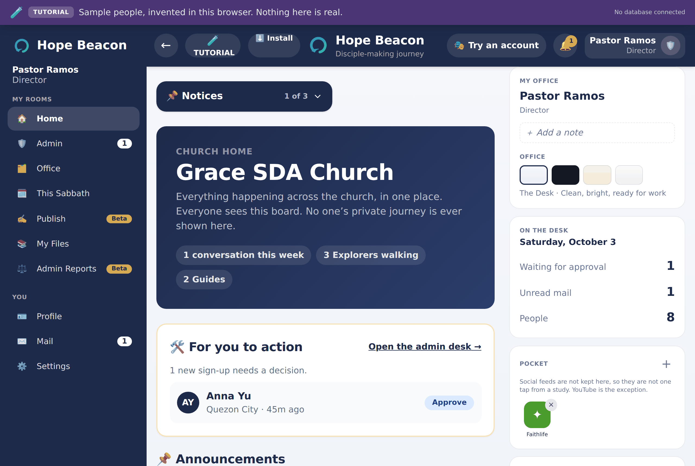
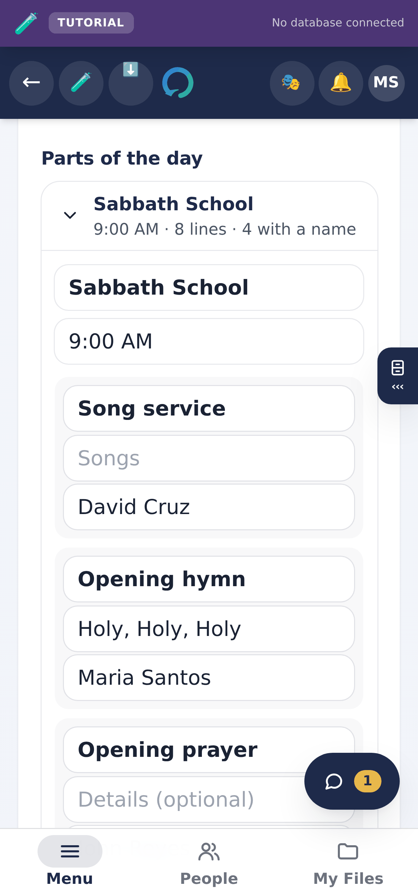
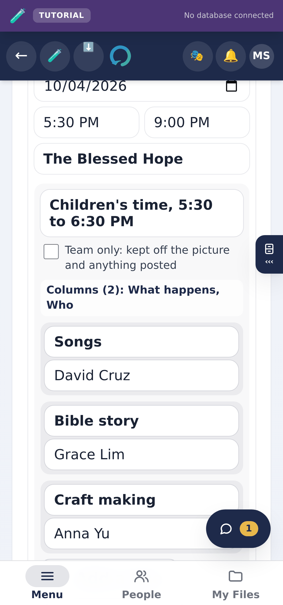
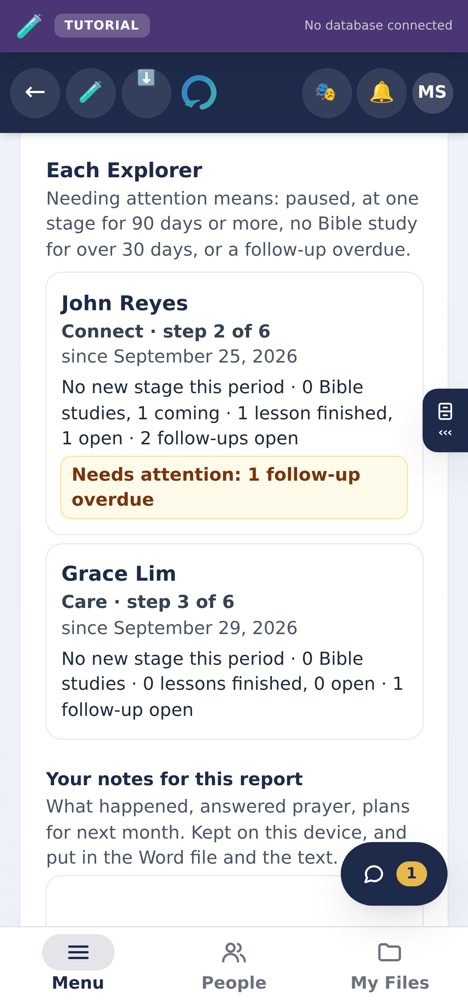
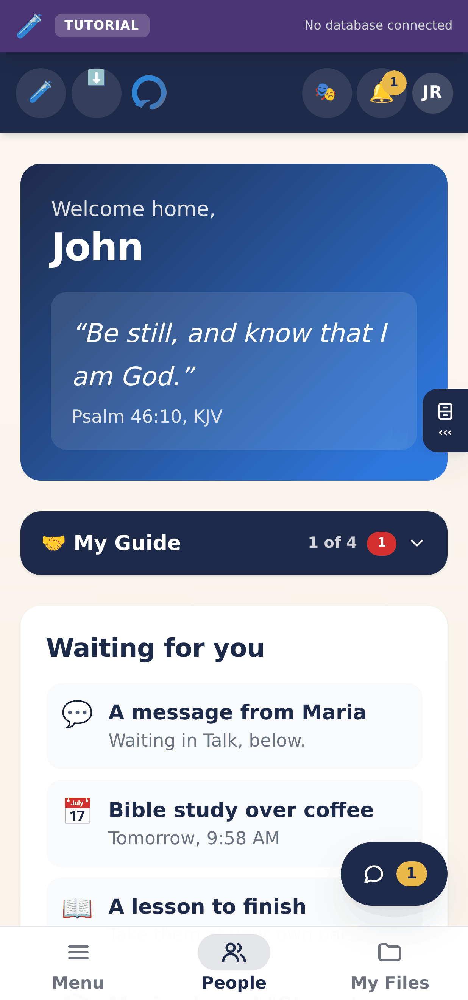
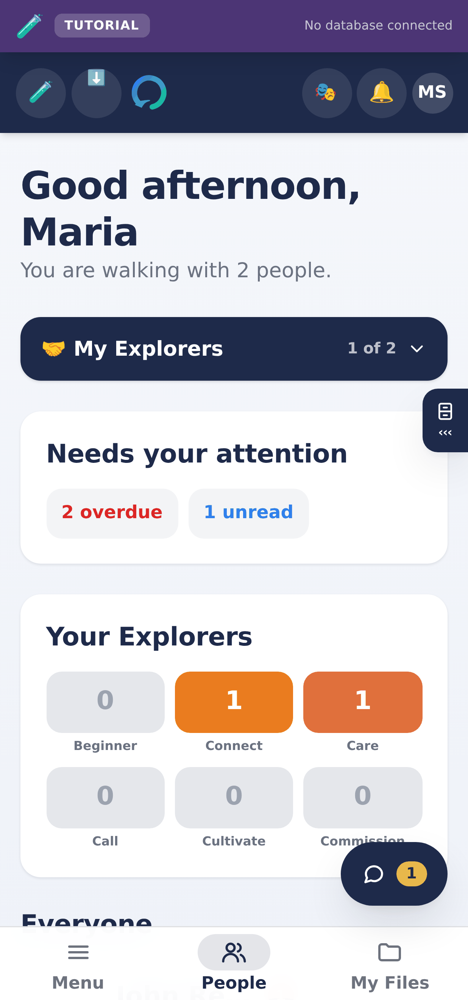

# Open Sentry Beacon

**A disciple-making journey app for local churches. Free, open source, and yours
to change.**

A church meets someone who wants to know more. What happens next usually depends
on a card in a folder and somebody's memory. Open Sentry Beacon gives the church
one place for that, and gives each person involved exactly the part of it they
need.

It runs entirely in your browser. **No sign-up, no database, no configuration.**
Clone it, start it, and you are looking at a working church with sample people in
it.

---

## What it looks like

Real screenshots of the app running with its own built-in sample people, taken
on 3 October 2026. Nothing here is a mockup, and nothing is assembled from parts
that never appeared together. Regenerate them any time with
`node scripts/screenshots.mjs`.

### A Guide's desk

Who you are walking with, what needs you today, and where each person is on the
six-stage journey. On a computer your rooms are down the left side; on a phone
and a tablet they are behind the bar along the bottom (Menu, People, My Files).
Settings, Look switches a computer to **Classic**, with the bar, if you prefer it.


### One person, one conversation

Everything about that relationship in one place: where they are on the journey,
meetings to arrange, care and the resources shared. The conversation opens in
its own bubble and goes with you to every other screen. Reply to one message,
react to it, or record a voice message. Only the two people walking together
can read it; the church's leaders cannot.


### The church, without anybody's private journey

Leaders see counts and what needs a decision. They do not see conversations, and
the screen says so in as many words.



### The Office, where the week's work is done

Guides and leaders plan the Sabbath, a series of evangelistic meetings, and the
month's report in one room. Everything is kept on the device first, so it works
with no signal, and in a church's own app it follows you to every phone or
computer you sign in on.

| The Sabbath program | Evangelistic meetings | The progress report |
|---|---|---|
|  |  |  |

### On a phone, which is where it is actually used

The same app. Installs from the browser with no app store, and keeps working
with the signal off.

| An Explorer's home | A Guide's home |
|---|---|
|  |  |

**Look at what is missing from the Explorer's screen.** There is no stage, no
progress bar, no label about how far along they are. A stage is a note the
church keeps to organise its work, not a grade to show somebody about
themselves, and the database will not hand it to them even if a future screen
asks.

---

## Try it in two minutes

```bash
git clone https://github.com/Klydo131/Open-Sentry-Beacon
cd Open-Sentry-Beacon
npm install
npm run dev
```

Open http://localhost:3000 and pick who you are. There is a guided walk for each
role that shows you your own job in about ten minutes.

Needs [Node 22 or newer](https://nodejs.org). Nothing else.

## Then make it real, in four steps

That demo keeps everything in your browser. To run this for an actual church,
with real accounts, real sign-in, and two people on two phones seeing the same
thing:

```bash
npm run setup      # asks two questions, writes your settings
```

Then run the migrations in `supabase/migrations/`, restart, and make yourself an
administrator. **There is no code to write.** The schema, the security rules
and the sign-in gateway all ship in this repository.

Start the app and open **[/setup](http://localhost:3000/setup)**: it checks the
connection, tells you which step you are on, and names what is missing instead
of leaving you to guess. The written version is
**[docs/SETUP.md](docs/SETUP.md)**.

---

## What it does

Four kinds of people, each seeing a different app built from the same data.

| | What they see |
|---|---|
| **Explorer** | Messages from the person walking with them, their lessons, how far through a course they are, the Sabbath program and meetings their church posts, and a way to ask for prayer and to pray for their Guide. |
| **Guide** | Their own people and nobody else's. Conversations, lessons to share, meetings to arrange, private notes, and prayer both ways. An Office for the Sabbath program, evangelistic meetings, and a progress report on the people they walk with. |
| **Director** | Who gets in, who walks with whom, what is on the library shelf, and a progress report on every Explorer in the church, by stage and by Guide. |
| **Executive Director** | The church in numbers, and how those numbers are changing. Never anybody's conversations. |

Underneath is a six-stage journey, **Beginner, Connect, Care, Call, Cultivate,
Commission**, which ends by turning around: the last stage is the point where
somebody being walked with starts walking with somebody else. (The first stage
is still `create` in the database; the screens say Beginner, which is where the
person is rather than what the church is doing.)

**An Explorer never sees their own stage.** A stage is a note the church keeps to
organise its work, not a label to show a person about themselves. A test enforces
this, and it should survive anything you build on top.

Conversations carry **replies, reactions and attachments**: answer one message
by quoting it, react with one of six, or send a photo, a voice message recorded
in the app, a video or a document. An attachment is visible to exactly the two
people in that conversation, with no Director exception. In this browser-only
version the files stay on the device, in IndexedDB, and never go into the saved
database.

**The Office holds the week's work.** A Sabbath program starts from the whole
day (Sabbath School, the Divine Service, the afternoon and vespers) and leaves as
a Word file, a picture, text for a group chat, or a post the people you walk with
find on **This Sabbath**, which opens with no signal. Evangelistic meetings are
planned night by night, from blocks and columns of your own. The progress report
counts, for a month or a quarter, what a Sabbath School class record and a Bible
worker's report already count: Bible studies, lessons, decisions, and who needs a
visit this week. Folders keep many programs in order, and **Add to calendar**
puts them on a phone's calendar.

**Nobody can change a shared thing on everybody else's behalf.** The church
publishes example studies and a shelf of links, and anybody may edit or remove
them — for themselves. Edit a study and you get your own copy; everybody else
still sees the original. Remove a link somebody else added and it comes off your
shelf and stays on theirs, with a way to put it back. Whoever added a thing, and
whoever leads the church, can still change or delete it for real; that is the
moderation, and it is the database that decides which of the two happens, not
the button.

It runs on Windows, macOS, Linux, Android and iPhone, and CI proves the first
three on every push. `docs/PLATFORMS.md` says exactly what is tested and what is
only expected, including the one thing worth checking yourself on a real iPhone.

Open the app in **two windows and they stay in step live**: send a message in one
and it appears in the other with no refresh. That works between windows on one
device, which is all an app with no server can honestly do. Add a backend and the
same code syncs between devices, because the transport is a seam you swap
(`lib/realtime.ts`).

---

## Why it might suit your church

- **Nothing to buy and nothing to sign up for.** It is licensed under the
  AGPL-3.0. Run it, study it, change it, run it for your church, free and for
  good. The one condition is that improvements stay open: see
  [Licence](#licence-agpl-30) below.
- **It works without signal.** Installs on a phone from the browser, and every
  screen keeps working offline. Church halls and rural areas were the assumption,
  not an afterthought.
- **It teaches itself.** Each role has a guided walk, written for somebody who
  has never used it and does not enjoy new software.
- **It is small enough to read.** React, Next.js and almost nothing else. One
  person can audit the whole thing.
- **It is honest about privacy.** Leaders get numbers; Guides get the
  relationship. Private notes are private to one person, and there is no screen
  anywhere that shows a pastor somebody's conversation.

---

## Making it yours

**Change the words.** Roles, stages and sample data are ordinary files:
`lib/types.ts`, `lib/demo/seed.ts`. Nothing is hard-coded into the framework.

**Deploy it anywhere.** It is a standard Next.js app. Vercel, Netlify, Cloudflare
or your own server all work. There is nothing platform-specific in it.

---

## "It says no backend. So how do I make it real?"

Fair question, and it is the one everybody asks. Here is the short answer.

When Supabase variables are present, the front door becomes a live
e-mail/password gateway. Invitations, password setup, approval, role routing,
pairing and the private conversation between a Guide and an Explorer all use
that church's database.
The sample tutorial and sample personas remain available only in the separate
unconfigured build.

**Nothing is missing from the app.** Every screen works: messages send, lessons
assign, stages advance. They just read and write a store that lives in your
browser, so the data never leaves your device and two people cannot share it.

**Adding a backend means replacing what is under the app, not rebuilding it.**
There is exactly one file that touches storage, `lib/demo/store.tsx`, and its
`Ctx` interface is the complete list of everything the app can do. Satisfy that
interface with your own database and **every screen keeps working unchanged**,
because no screen knows the difference.

```
Your screens  →  the store  →  browser storage    ← today
Your screens  →  the store  →  your database      ← after
     ↑
  unchanged
```

### The smallest real example

Two lines of concept: the demo writes to memory, yours writes to a database.

```ts
// Today: lib/demo/store.tsx
sendMessage: (pairingId, body) => {
  setDb((d) => ({ ...d, messages: [...d.messages, { pairing_id: pairingId, body }] }));
},

// With a backend: the screen calling it does not change at all
sendMessage: async (pairingId, body) => {
  await db.from('messages').insert({
    pairing_id: pairingId,
    body,
    sender_id: currentUser.id,   // from the verified session, never the browser
  });
  await refresh();
},
```

### Swapping the store in

```tsx
// app/layout.tsx, one line changes
import { DemoContext, type Ctx } from '@/lib/demo/store';

function RealProvider({ children }: { children: React.ReactNode }) {
  const value: Ctx = useYourBackend();   // TypeScript lists what is missing
  return <DemoContext.Provider value={value}>{children}</DemoContext.Provider>;
}
```

Type your object as `Ctx` and the compiler becomes the checklist: it names every
function you have not written yet.

### Want a fifteen-minute warm-up first?

Point feedback at a real server. Same pattern, one twentieth the size, works end
to end:

```ts
import { setFeedbackSink } from '@/lib/backend/feedback';

setFeedbackSink({
  describe: 'sent to the church office',
  async send(message) {
    const res = await fetch('/api/feedback', {
      method: 'POST',
      body: JSON.stringify(message),
    });
    return { ok: res.ok };
  },
});
```

And there is a worked one in this repository to read alongside it:
`lib/live/feedback-sink.ts` is that same interface implemented against a real
database, installed in `lib/live/session.tsx` and read in
`components/LiveFeedbackInbox.tsx`. About forty lines, and it falls back to the
on-device sink on every failing path so a message is never lost to a bad
connection.

### The one rule that matters most

Your screens decide what to **show**. Your database decides what somebody is
**allowed to have**, because anybody can send a request without using your
screens at all. Put the permission rules with the data, not in the interface.

### Then read the full instructions

| Guide | For |
|---|---|
| **[docs/BUILD-YOUR-OWN.md](docs/BUILD-YOUR-OWN.md)** | **Start here.** Front end and backend, end to end: the tables with real SQL, accounts and invitations, the permission rules, wiring it up, deploying, and a checklist to work through before real people are in it. No backend experience assumed. |
| [docs/BACKENDS.md](docs/BACKENDS.md) | The two seams in more detail, and the fifteen-minute feedback warm-up. |
| [docs/DEPLOY-ANYWHERE.md](docs/DEPLOY-ANYWHERE.md) | Four worked ways to run it: your computer with no accounts, Vercel and Supabase, your computer with a real database, and other hosts. Each says what has been tested. |
| [docs/EMAIL.md](docs/EMAIL.md) | Sending invitations by mail. Any provider, or none. |
| [docs/SECURITY.md](docs/SECURITY.md) | What you become responsible for the day you connect one. |

---

## Before you put real people in it

Read **[docs/SECURITY.md](docs/SECURITY.md)**. The short version: as shipped
there is nothing to breach, because there is no backend and no data leaves the
browser. The day you connect one, the security of what you connected is yours,
and the two things people get wrong are putting authorisation in the screens
instead of the database, and putting a key somewhere the browser can read it.

---

## Where to read next

| | |
|---|---|
| **[docs/BUILD-YOUR-OWN.md](docs/BUILD-YOUR-OWN.md)** | Build your own Beacon with a real backend, end to end: tables, accounts, permission rules, wiring, deploying, and the checklist before real people. No backend experience assumed. |
| **[ARCHITECTURE.md](ARCHITECTURE.md)** | How it is built, and where everything lives. Start here if you are about to change something. |
| **[docs/BACKENDS.md](docs/BACKENDS.md)** | The two seams in detail, and the fifteen-minute feedback warm-up. |
| **[docs/DEPLOY-ANYWHERE.md](docs/DEPLOY-ANYWHERE.md)** | Run it on Vercel and Supabase, on your own computer, or on another host, with what has been tested for each. |
| **[docs/EMAIL.md](docs/EMAIL.md)** | Sending invitations by mail. Any provider, or none, since the app works without it. |
| **[docs/ONBOARDING.md](docs/ONBOARDING.md)** | How a church actually uses it: who does what, in what order. |
| **[docs/SECURITY.md](docs/SECURITY.md)** | Read before you put real people in it. |
| **[docs/UPDATES.md](docs/UPDATES.md)** | How an installed copy updates itself. |
| **[CONTRIBUTING.md](CONTRIBUTING.md)** | Setup, house style, and what a good pull request looks like. |
| **[CODE_OF_CONDUCT.md](CODE_OF_CONDUCT.md)** | Short, and the standard is ordinary decency. |

---

## Contributing

Please do. See **[CONTRIBUTING.md](CONTRIBUTING.md)**.

The bar is not "does it work" but "will the next person understand why it is like
that". Comments here explain *why* rather than *what*, and that is deliberate:
this project is meant to be inherited.

One thing worth knowing before you write code rather than after: pull requests
carry a short
**[Contributor Licence Agreement](CONTRIBUTING.md#contributor-licence-agreement)**.
You keep your copyright. You also allow the maintainer to license the project,
your part included, under terms other than AGPL-3.0, so that a church whose
organisation bans AGPL outright can still be handed a private licence. This
repository stays AGPL-3.0 either way, and so does everything you receive from it.

```bash
npm test          # every check that does not need a browser
npm run test:all  # the above, plus real-browser suites
```

---

## What it is called, and what you should call yours

**Open Sentry Beacon** is the name of the software. That is what you clone, and
it does not change.

**Hope Beacon** is the name one church runs it under. It is the example that
ships in the box — the demo and the first live congregation both use it — so
that every screen, e-mail and phone icon has a real name on it rather than a
placeholder nobody notices is still a placeholder.

**Your church's name is what you should put there.** Open
[`lib/brand.ts`](lib/brand.ts), change two lines, and the browser tab, the
installed app on a phone, the invitation e-mails and the sign-in screen all
follow. Nothing else needs touching.

The build refuses a name that is **blank**, and refuses the project's own name
leaking onto a screen a member reads. It does not care what you choose. An open
source project whose tests reject the rename it advertises would be worse than
one with no tests, and this one used to pin the example by mistake.

## Where this came from

Open Sentry Beacon is the open-source release of Hope Beacon, an app built for a
local church. Their request was that other churches should be able to make their
own, on whatever platform suits them. Everything specific to that church's
deployment was removed: its database, its keys, its hosting. A test keeps it
that way.

## Licence: AGPL-3.0

Open Sentry Beacon is free software, licensed under the
**[GNU Affero General Public License, version 3](LICENSE)** (AGPL-3.0-only).
The full licence text in [LICENSE](LICENSE) governs. The summary below is for
convenience only, is not legal advice, and does not modify the licence.

### Permissions

Subject to the licence, you may:

- **Use** the software, for any purpose, including commercial use, without fee
  or notice to the copyright holder.
- **Study and modify** the source code.
- **Distribute** the software, modified or unmodified.

### Conditions

- **Copyleft (sections 4 to 6).** Any distribution of the software, or of a
  work based on it, must be under AGPL-3.0, with the Corresponding Source, and
  with the copyright and licence notices preserved.
- **Remote network interaction (section 13).** If you modify the software and
  make it available to users over a network, you must offer those users the
  Corresponding Source of your modified version.
- **Notices.** Third-party components remain under their own licences, listed
  in [NOTICES.md](NOTICES.md) and in the app.

| Use | Obligation |
|---|---|
| Deploying this repository unmodified | Preserve the licence and notices. Changing the name in `lib/brand.ts` is a modification. |
| Deploying a modified version for any users, including your own congregation | Offer those users the Corresponding Source (section 13). |
| Distributing the software or a derived work | Distribute it under AGPL-3.0, with source. |
| Charging for hosting, support or setup | No additional obligation. AGPL-3.0 permits commercial use. |
| Modifying it privately, with no users over a network and no distribution | None. |

### Disclaimer of warranty and limitation of liability

The software is provided **"as is", without warranty of any kind**, and in no
event will the copyright holder or any contributor be liable for damages
arising from its use, as set out in sections 15 and 16 of the licence.

### Compliance with section 13 in this repository

The app links to its source from its front door and from **Settings → General**,
both reading `SOURCE_URL` in `lib/brand.ts`. A deployment of a modified version
must set `SOURCE_URL` to the Corresponding Source of that version.

The same card in Settings → General links **"Code from other projects"**: the
licence of every open-source package the app is built from, generated at each
build by `scripts/third-party-notices.mjs` and delivered with the app.

### Alternative licensing

Organisations unable to accept AGPL-3.0 may request a separate licence from
the copyright holder, on terms agreed case by case. Any such licence is a
private arrangement between its parties and does not change the licence of
this repository, which remains AGPL-3.0. Enquiries: open an issue titled
"Licensing enquiry", or contact the maintainer through GitHub.

### Contributions

Contributions are accepted under AGPL-3.0. Contributors retain the copyright
in their contributions and license them to all recipients under the terms of
AGPL-3.0.

Full text: [LICENSE](LICENSE). Third-party code and its terms: [NOTICES.md](NOTICES.md).
