# Hope Beacon: The Complete Handbook

Everything needed to run Hope Beacon, move it to a new project, and keep it working. Written for the people who run a church, and for the AI tools that will be asked to continue the work.

**Version:** 1 October 2026 · **Applies to:** migrations through `20261001120000` · **Licence:** AGPL-3.0-only · **Source:** `github.com/Klydo131/Open-Sentry-Beacon` (a church's own copy points this at its own repository: `SOURCE_URL` in `lib/brand.ts`)

> **NOTE** · How to read this
>
> **Running a church?** Parts 1 to 5 are yours. They assume no technical knowledge and nothing needs installing.
>
> **Setting the app up, or moving it?** Parts 6 to 12. Follow them in order; each one checks the one before it.
>
> **Copying it for your own church?** Part 7 opens with what a copy gets, how to stand it up, and the one thing the licence asks of it.
>
> **An AI tool picking this up?** Part 13 is written for you and states the invariants you must not break.
>
> **Handing this to a member rather than an administrator?** Give them `HOW-TO-USE` instead, printed as `Hope-Beacon-How-To-Use.pdf`. It is the same app explained in pictures, phone-shaped, with nothing in it about databases or deployment.
>
> **The pictures** are the real app, photographed in its sample church: the people in them (Maria Santos, John Reyes, Pastor Ramos and the rest) are invented, and nobody real appears anywhere in this handbook. Where the sample church differs from a church's own app, the caption says so.

1. [What the app is](#1-what-the-app-is)
2. [The four roles](#2-the-four-roles)
3. [The journey](#3-the-journey)
4. [Running it, week to week](#4-running-it-week-to-week)
5. [Getting it onto a phone](#5-getting-it-onto-a-phone)
6. [Email, end to end](#6-email-end-to-end)
7. [Moving to a new project](#7-moving-to-a-new-project)
8. [Every setting, in one place](#8-every-setting-in-one-place)
9. [The database and its rules](#9-the-database-and-its-rules)
10. [What it costs](#10-what-it-costs)
11. [Data protection](#11-data-protection)
12. [When something breaks](#12-when-something-breaks)
13. [For an AI tool continuing this](#13-for-an-ai-tool-continuing-this)
14. [What is not finished](#14-what-is-not-finished)

## 1. What the app is

Hope Beacon is a discipleship app for one church. A member of that church walks alongside one other person at a time, and the app carries what that takes: the conversation, the readings, the prayer requests, and a quiet record of how far along the journey somebody has come.

Three things define it, and every decision in the rest of this handbook comes back to one of them.

### It is invitation only

There is no public sign-up and there never will be. Somebody at the church enters a name and an email address, the app sends an invitation, and that is the only door. A stranger who finds the web address sees a sign-in screen and a tutorial, and nothing else.

### A conversation belongs to two people

What an Explorer says to their Guide is readable by those two and nobody else. Not other Guides, not Directors, not the person who owns the server. The only exception is a safeguarding report, which a Director may read in place, and the app says so plainly on the screen where a report is made.

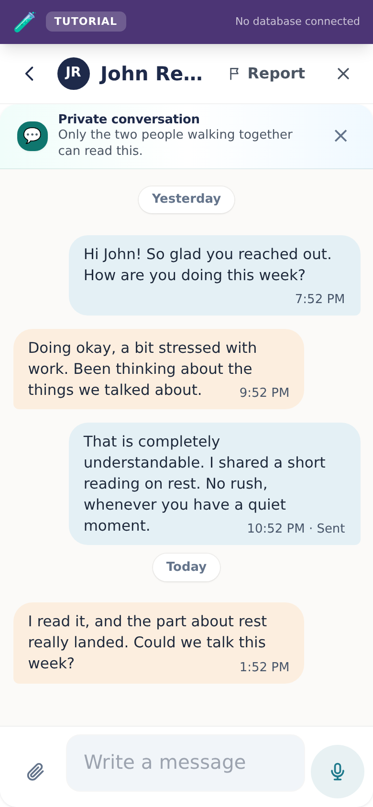

### A message can be corrected, or taken back

**You can edit or delete your own messages, and only your own.** An edited one is marked **edited**, because the other person read the first version and a silent rewrite is a way to make somebody doubt what they remember. A deleted one leaves a line saying **"You deleted a message"** or **"Maria deleted a message"** — never a gap, because a message that vanishes without trace reads as one that was never sent, and the other person is left believing they imagined it.

**Deleting removes the words from the conversation, not from the record.** What the message said is kept where neither of you can read it, and a Director sees it only when a safeguarding report is being looked at. This is the same rule as the Guild Room, where a reported post's words are copied into the report before anybody can remove them: the first thing somebody does after being reported is delete. Take back a message you regret and it is gone from the screen; it is not gone from the account of what happened.

> **CAUTION** · Until 9 September 2026, either person could rewrite the other's words
>
> The rule that lets a recipient mark a message as read was written in a way that also permitted editing the whole message, including one you did not write, with nothing shown on screen. Nobody appears to have used it. It is closed, and the conversation is now the one thing in this app that only its author can change.

### A reply, a reaction, a voice message

Since 1 October 2026 a conversation does what the messaging apps people already use do. **Reply** to one message so the answer carries a quote of it, **react** with one of six (praying first, because "I'm praying for you" is the reaction a Guide and an Explorer reach for most), and **speak** a voice message of up to two minutes. Part 4, *The conversation*, says how. The same rule covers all three: they belong to the two people in the conversation and nobody else.

All three need the database update that came with them (migration `20261001120000`). On a database without it the conversation is exactly what it was, the words, the photos and the live refresh, and the three are simply not offered. Part 9 says why that matters.

### Nobody can flood a room

**One account can send forty messages a minute and no more**, across the conversation, the Guild wall and the Guides' room. That is two a second held for a full minute, which nobody types; it is set to stop a script rather than a person, and somebody who somehow reaches it is told plainly to wait a moment rather than shown an error code.

**Files and reactions have their own ceilings.** Ten files a minute into a conversation, because forty ten-megabyte photos a minute is not a limit, it is a storage bill. Thirty reaction changes a minute, because a reaction is one tap and every change wakes the other person's screen.

**It bounds the machine, not the behaviour.** Forty unkind messages a minute is still forty unkind messages, and the answer to that is the report route and a Director — the same answer as everywhere else in this app. No counter substitutes for a person whose job it is to look.

### The limit is people, not computers

A Guide walks with at most as many Explorers as the church has set, and the database enforces it rather than the screen. The figure started at five, which is roughly what one person can actually walk with; this congregation has raised it to a hundred. The app will run a church of a hundred without complaint, on the plan it is on today and with room to spare. See [What it costs](./WHAT-IT-COSTS.md) for the measured figures. What it cannot do is find you a sixth Guide. Growth here means recruiting and training people, and the app is built to keep that constraint visible rather than hide it behind a number that keeps rising.

## 2. The four roles

A person's role is chosen when they are approved, and it decides everything they can see for as long as they are in the church. **Nobody can change their own role, including the Executive Director.** That is enforced in the database, not in the app.

| Role | What they do | What they can see |
| --- | --- | --- |
| **Explorer** | Walks the journey. Reads what their Guide sends, talks with them, asks for prayer. | Their own journey, and their conversation with their Guide. Nothing about anybody else. |
| **Guide** | Walks with up to the church's own limit of Explorers. Chooses what to share and when. Recommends new people, but cannot invite them. | Only the Explorers paired with them. Never another Guide's people. |
| **Director** | Runs the church. Invites, approves, pairs, and reads safeguarding reports. | Everyone in their church and the counts behind them. Not private conversations, except inside a report. |
| **Executive Director** | Oversees one or more churches, and appoints Directors. | Everything a Director sees, across every church they oversee. |

> **NOTE** · The Head Executive Director
>
> One account is the root of authority. It cannot be suspended or removed by anybody, including itself, so a church can never lock itself out of its own app. Guard the password for that account the way you would guard the keys to the building.

### What an Explorer's shelf opens with

The starter shelf is the same nineteen resources for everybody, but an Explorer is shown eight of them first, in this order:

> A Bible they can read on a phone · Jesus 101 · The Desire of Ages · Steps to Christ · BibleProject · Discover Bible Guides · What Seventh-day Adventists Believe · Sabbath School this quarter

**One doctrinal page, deliberately.** Somebody deciding whether to follow Jesus is not helped by being handed the twenty-eight fundamental beliefs and the full prophetic history on their first day, and the Guide walking with them is the right way to meet the rest.

Nothing is hidden. The Great Controversy, the collected writings of Ellen G. White, the quarterly archive and the General Conference publications are all still in the shelf for everyone else, and for an Explorer the moment they go looking. What changed is only what is put in front of somebody first.

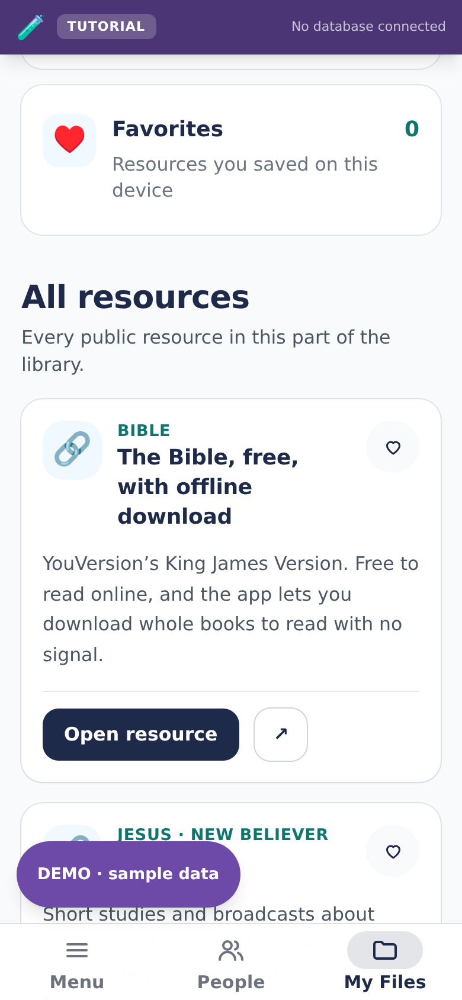

The shelf is a constant in `lib/starter-kit.ts`, not a table, so it costs no storage and no query. `tests/the-explorer-starts-with-jesus.mjs` keeps the short list short. The twenty links point at other people's websites, so `links.yml` checks weekly that every one of them still opens.

## 3. The journey

Five stages, and an Explorer moves through them at their own pace. The stage is a note for the Guide, not a score, and nothing in the app hurries anybody along.

| Stage | What it means |
| --- | --- |
| **Beginner** | Just beginning. Somebody has said yes to being walked with. |
| **Connect** | Building rapport. Getting to know each other. |
| **Care** | Walking alongside. The longest stage, and usually the most valuable. |
| **Call** | A point of decision. |
| **Cultivate** | Growing in faith after that decision. |

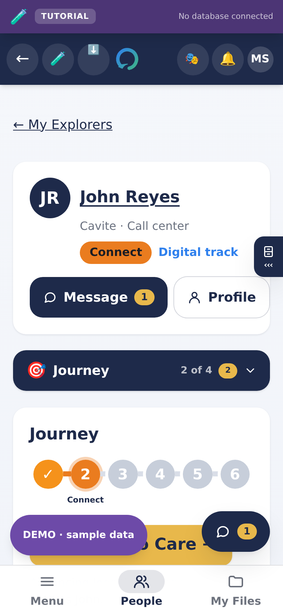

The first stage was called *Create* until August 2026. That named what the church was doing; *Beginner* names where the Explorer is, which is whose journey it is. Nothing changed in the database, so no history moved.

A sixth idea sits behind these: **Commission**. An Explorer who has been walked with becomes a Guide, and walks with somebody else. That is the whole point of the design, and it is the only kind of growth that does not run out.

## 4. Running it, week to week

### Inviting somebody

**Step 1.** Sign in as a Director, open **Admin**, then the **Approvals** room.

**Step 2.** Enter their name and email address, choose the role, and press **Send invitation**.

**Step 3.** They receive an email written for that role. An Explorer, a Guide and a Director each get a different message, because each is being asked for something different.

**Step 4.** They choose a password. That is what finishes the sign-up.

**Step 5.** They appear under **Awaiting approval**. Approve them, and they can enter.

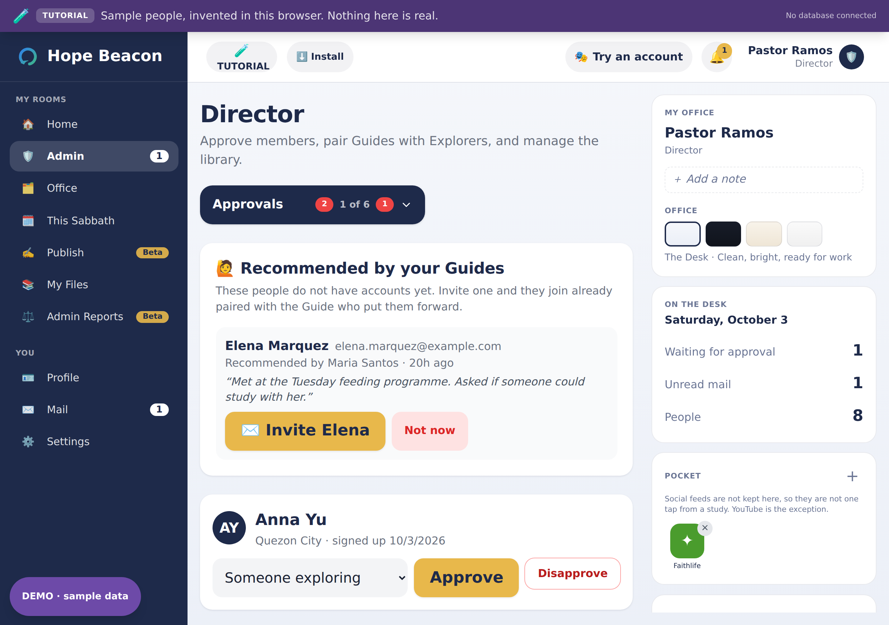

> **CAUTION** · One live invitation per person
>
> Sending a second invitation to the same address switches off the first. If somebody says the link does not work, ask whether they have two emails, and tell them to use the newest one. Never open somebody else's invitation link yourself: it works once, and opening it signs you out and starts their sign-up on your device.

### Pairing a Guide with an Explorer

Open the **Pairings** room, choose one of each, and press **Create pairing**. They can talk from that moment. A Guide already carrying five will not appear in the list, because the database will not allow a sixth.

**The ceiling is the church's, and a church can move it.** A Guide walks with as many Explorers as the congregation has set, enforced by the database. It may be raised in Church settings, up to a hundred. Only a Director or an Executive Director can, and only for their own church: a Guide can never give themselves more people.

Five was the original figure and the number the discipleship shape was designed around. Raising it does not make one person able to walk with more people; it makes the app stop refusing. What the cap protects is not the servers, it is the Explorer at the bottom of a long list.

Raising it is a decision, not a drift. Five is the number the design is built around because it is how many people one person can actually walk with.

**The one number worth watching is unpaired Explorers.** An Explorer with no Guide has been invited into an app where nothing happens. Your dashboard opens on that number for exactly this reason.

### Seeing an Explorer's profile

A Guide opens an Explorer from **People**, and their page has **Profile** beside **Message**: what that person chose to say about themselves, with their picture. A Director opens anybody from the rooms of people in **Admin**, where every row has **Profile** too. Faces are shown wherever a Guide or a Director reads a list of names, when the person has chosen one; everybody else is two initials on a circle.

Nothing new is shown to anybody by this. A Guide sees the profile of the people they walk with and nobody else's, and the address somebody was invited at and the day they arrived stay with the Directors, as they always did.

### Your Guide is a real person

An Explorer's screen opens with the person walking with them: their picture, their name, their city and what they said they care about. All of it is what that Guide typed on their own profile.

It was a name on a line, and everything else on that screen is generated (the greeting, the stages, the notices), so a name in the same typeface as the rest proved nothing. Somebody who has been handed a stranger's name by an app has no way to tell whether anybody is really on the other end, and the whole product rests on them believing there is.

> **IMPORTANT** · Ask your Guides to set a picture
>
> Almost none have one. Where there is no photograph and no icon the card falls back to two initials on a coloured circle, which is exactly the problem it was built to solve. A Guide's own screen now asks them for one and stops asking the moment either is set. An icon is a single tap, on **Profile**.

Nothing else about the Guide reaches the Explorer: no birthday, no contact details, nothing anybody else recorded about them.

### Finding one person

The approved list gets long. Once it passes five accounts a search box appears above it: type any part of a name and the list narrows as you type, showing "4 of 37" so a short list is never mistaken for a lost account.

Past six accounts the list gets a scroll bar of its own rather than growing down the page. Forty accounts is roughly four thousand pixels, and every control above the list, the search box and the bulk buttons, used to scroll out of sight the moment somebody started reading names. Now the roll and the things you do to it stay on screen together.

### The "New" mark

Anybody who finished signing up in the last seven days carries a green **New** badge on the rosters and on a Guide's cards. It works out the answer from the date every time it draws, so it can never be left on somebody by mistake, and it counts from when they chose a password rather than when a Director typed their address.

The badge gives a soft ring twice when the screen draws, then stops. A mark that pulses forever is a mark people stop seeing, and then it is only noise on somebody's name. Every role gets the same badge, which is deliberate: a different mark for a new Explorer would tell everybody who can see the list which members are Explorers, and the app takes care elsewhere not to say that.

A device set to reduce motion gets a still outline instead of the ring.

### Disapprove, or delete

These are different acts and the difference matters.

|  | Disapprove | Delete |
| --- | --- | --- |
| **What happens** | The account is switched off. They cannot enter, but they and their history stay. | The account, its messages and its pairings are removed for good. |
| **Reversible** | Yes. Approve them again. | No. |
| **Their email** | Still in use by that account. | Freed. They can be invited again as a brand new member, in any role. |
| **Use it when** | Somebody is away, or you are looking into something. | Somebody has left, or an account was created by mistake. |

Delete asks a second time in the row itself rather than through a browser pop-up, because on a phone that dialog appears under the thumb that just tapped Delete and the button dismissing it is the one that agrees. It says what will go before it goes. The removal is recorded in a log that outlives the person it describes, so a church can always answer who removed whom and when.

**The dangerous buttons are smaller and red, and they are the only red in the app.** Delete, Remove, Disconnect and Disapprove are drawn one size down from an ordinary button, in red on white rather than filled. They are still a full touch target, because discouraged is not the same as fiddly, but they no longer look like the thing to press.

A Director asked for this. Disconnect was larger than the thing beside it and read as the more inviting of the two. The thing beside it was not a button at all: *Connect* is the name of the second stage of the journey. The screen now says **Stage · Connect** in that stage's own colour, and a status can no longer be mistaken for an action.

Both presses of a two-step removal are red: the first says the path is dangerous, the second is the act itself. That was backwards in one place, where the harmless first press was red and the irreversible confirmation was grey.

### Acting on several accounts at once

Every row in the approved list has a tick box. Tick a few, or use **Select all**, and two buttons appear: **Disapprove selected** and **Delete selected**.

Three things about it are worth knowing before you use it on twenty people.

- **Select all means what you can see.** With a search showing four of thirty-seven, it takes those four. It never quietly reaches the rows the search is hiding.
- **The confirmation names everybody.** Not "delete 12 accounts", but the twelve names, because there is no way to check afterwards and no way to undo.
- **One refusal does not undo the rest.** If the database refuses one person, for instance a Director you may not act on, everybody else is still done and you are told which one failed and why.

> **NOTE** · Who may delete whom
>
> Decided by the database, not the screen. An Executive Director may act on anyone in a church they oversee. A Director may act on Guides and Explorers only, never another Director. Nobody may act on themselves, and nobody at all may act on the Head Executive Director. If an action is refused you are told why, in a sentence.

### The conversation

**Open it with Message** on a Guide's page for one Explorer or on an Explorer's own screen, or with the round **Talk** bubble in the corner of every screen, which carries a number when somebody has written. On a phone it fills the screen; on a computer it opens beside the page. **Report** is in its header, in words, far from Send.

**What you see.** Your messages on the right in a soft blue, theirs on the left in a warm sand. Messages sent close together sit together, with the day written between days and the time inside each bubble. **Seen** appears once, under your own latest message, when the other person has opened it: once, and never beside every line, because a receipt on everything is pressure on whoever has not answered yet. There is deliberately no "typing..." and no "online now": nobody here should feel watched, or watched for a reply.

**Tap a message for what you can do with it.** Holding it, right-clicking it on a computer, or the **⋯** beside it on a computer do the same. A panel rises from the bottom with the message quoted at the top, the six reactions, and then:

| Choice | What it does |
| --- | --- |
| **Reply** | The message box shows what you are answering. Send, and your message carries a quote of it; tapping the quote takes you to the original. **Swiping a message to the right** does the same. |
| **Copy** | Copies the words, and says so. |
| **Edit** | Your own messages only. The words go back into the box; Save, and the message shows **edited**. |
| **Delete** | Your own only, after asking. A line remains saying the message was deleted, never a gap. |
| **Open**, **Remove** | For a photo or a file: open it, or (if you sent it) take it back. |

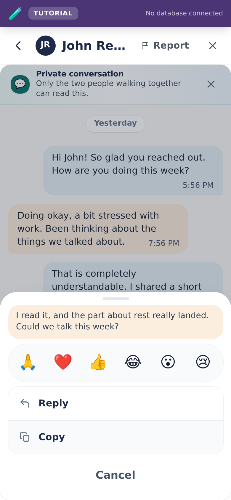
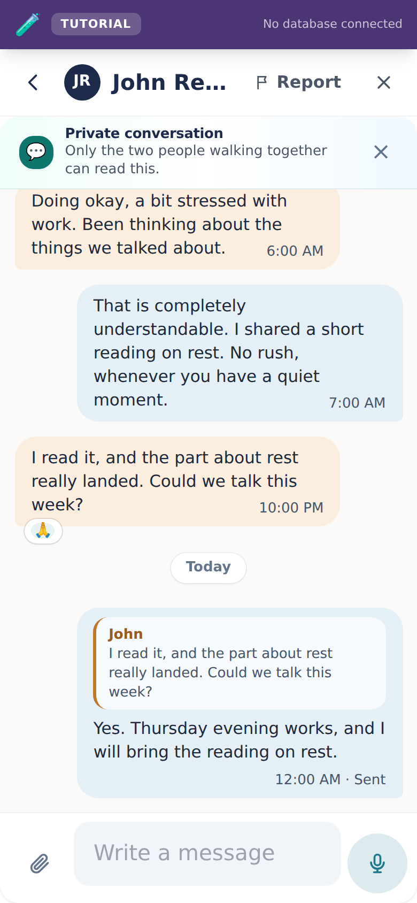

**Reactions.** Praying, love, like, haha, wow and sad, in that order. One each per message: choosing another replaces yours, and choosing yours again takes it back. They sit on the lower edge of the bubble; tapping them opens the same panel.

**Photos and files.** The paper clip beside the box sends one. A photo is made smaller and loses where it was taken before it leaves the phone (Part 9), and arrives as the picture: tap it for the full size, with **Save** in the corner. Anything else arrives as its name and size.

**Voice messages.** With nothing typed, the button beside the box is a microphone. Tap it to start; the browser asks for the microphone the first time, and only then. A red dot and a clock show it is recording; **the bin** throws it away and **the arrow** sends it. It stops at two minutes and waits for you; it never sends on its own. Tap, not hold, on purpose: holding a button for a minute is hard on an older hand, and a slipping thumb sends something half said. The microphone is let go of the moment recording stops, so the phone's microphone light goes off when it should.

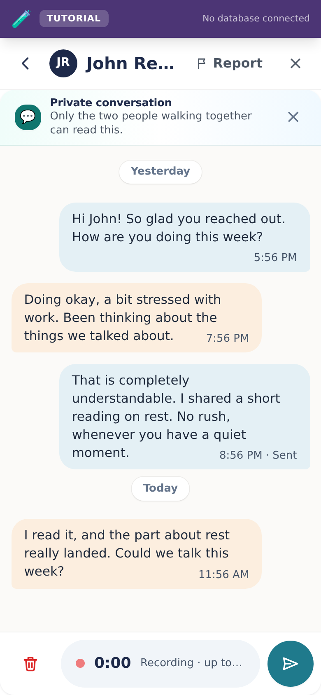

**It follows Text size.** Settings → General → **Text size** changes the conversation's words as well as every other screen's. Until 1 October 2026 the chat was drawn in fixed sizes and did not.

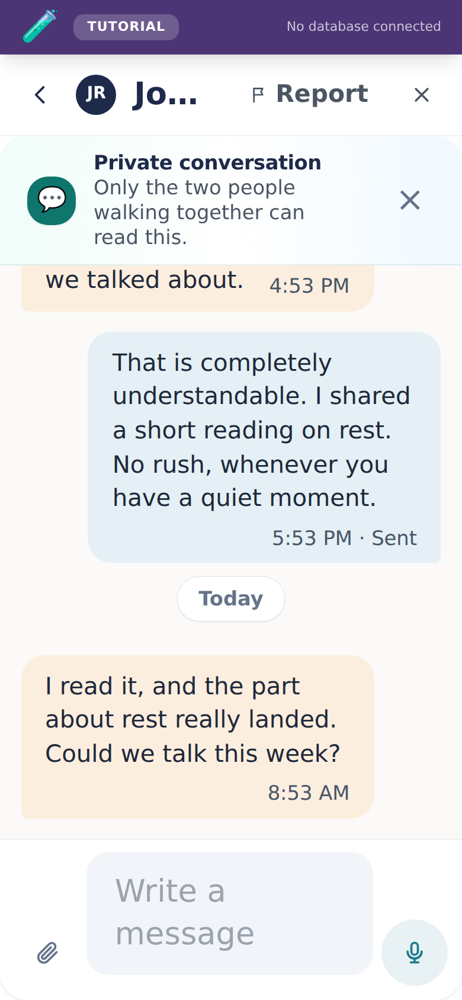

**The tutorial teaches it.** Both the Guide's walk and the Explorer's have a step that points at a message and asks for a reaction or a reply.

> **NOTE** · If Reply, reactions and the microphone are not there
>
> The church's database has not had the update that brings them (migration `20261001120000`). Nothing is wrong: the conversation keeps its words, photos and live refresh, and the three appear on their own once the update has run. See *When the code is newer than the database* in Part 9.

### Meetings

A Guide and an Explorer arrange a time together on the same card, and both see it. Either may propose one: a title, a date and time, and online or in person. The other person confirms it, and either can cancel. Nobody else in the church sees any of it.

**The card is the first thing you reach, on both sides.** A Guide's page for one Explorer opens on **Appointments**, and an Explorer's own screen has the card right after their Guide and the church's notices. Until 30 September 2026 the card sat under the conversation, so arranging a time meant scrolling past the whole thread; the conversation now lives in the **Talk** bubble, and **Message** on either screen opens it. The card has never lived under **Journey**, the one tab the Explorer never sees, and must not: it is a thing the two of them do *together*, not something the Guide does *about* them.

**In person asks where, and will not let you skip it.** Start typing a place and the box suggests where you might mean: places you two have met before first, then places from the map, each with its street, barangay, city and province. Type *jollibee imus* and you see each branch with its own street, so you can tell which one you mean. Tap one and it is pinned: the card says **Meeting here** with the name and address, and **Check it on the map** opens that exact spot before anybody is asked to go there. The other person's **Open in Maps** button opens the same spot in whichever map app they already use.

You can still type an address yourself, for example *Church cafe, 12 Rizal St, Cavite*, or paste a map link someone shared; the list offers **Use "…" as typed**. A place too small to be on the map, or a search that is not answering, never stops two people meeting.

> **NOTE** · What the place search sends
>
> Only the words typed, and the town you last met in rounded to about ten kilometres, go to the map search (Photon, over OpenStreetMap). They go from the church's server, not from the phone, so nobody's name, account or internet address goes with them, and nothing about the search is kept. The privacy notice says the same.

> **NOTE** · A link, never an embedded map
>
> An embedded map needs a Google Maps key, which means a billing account and a key that reaches every browser in the congregation. A link costs nothing, needs no account of ours, and opens the app people already use.

**Online asks for the link, and turns it into a button.** Paste a Zoom, Meet, Teams, Whereby, Jitsi, Messenger or Skype address and the card shows **Join on Zoom**, named after whichever service it recognises, so the person tapping it knows what is about to open. An address it does not recognise still works, and reads **Join the meeting**.

Before this, an online meeting had a title and a time and nowhere to put the address, so the link went into the conversation as a message and slid up out of sight, and the older the meeting, the further up it had gone.

> **CAUTION** · Only http and https become a button
>
> A meeting link is text one member types and another taps, which is the exact shape of an attack. Anything that is not an ordinary web address is shown as plain text and is not tappable, whatever it claims to be.

### The library, and who watches it

**Anybody in the church can put a link or a file in the library and share it.** A Guide and an Explorer both can, without asking a Director first. That freedom is the point: somebody who finds a reading worth passing on should be able to pass it on.

**A file is kept by the church, within the limits the app already had.** Drag it onto the Resources card, or tap **+ Add** and drag it into the box or choose it from the phone. Pictures, PDFs, Word, Excel and PowerPoint files, audio and text, up to 10 MB each; no video (put it on YouTube and add the link). It goes on the shelf under its own name, with nothing to fill in, and can be renamed under *Edit*. Only the person who added it can open it until they send it to somebody, and then that person can too. Nobody else can open it, and that includes the church's leaders. Deleting the resource deletes the file.

**Each resource shows what you can do with it: _Send to …_, _Edit_ and _Delete_.** *Send* opens a small panel with an optional line saying why, the people you walk with (anybody who already has it is ticked), and *Share outside the app* for WhatsApp, a text or anybody without an account. For a file, *Share outside the app* sends the file itself; on a computer that cannot do that, the file is saved so you can attach it. *Delete* asks first and says what goes with it. On something another person added, the red button says *Hide*: it takes the item off your own shelf and leaves it for everybody else. The rare settings sit inside *Edit* under *More options*: whether it shows as a video, music, a PDF, a picture or a document, and (for leadership) putting it on the church shelf. A row shows the site a link goes to (*youtube.com*), or a file's name and size, not a whole address.

**Adding a link asks for the link first.** The name and why it helps (optional) appear once the link is pasted. The app works out from the link whether it is a video, music, a PDF or a picture.

The card says what it is for where it appears: **Resources** in the Office, **Send John something** on one Explorer's page, and **Your resources** in an Explorer's own Study folder, which opens on what was sent to them and their studies before their own.

#### What a Director sees, and what an Executive Director sees

Freedom to share is not freedom from oversight, and the oversight is a record afterwards rather than a gate in front of every share.

| You are | You see the record for | You do not see |
| --- | --- | --- |
| A Director | Guides and Explorers in your church | Other Directors, or an Executive Director |
| An Executive Director | Directors | Guides and Explorers |

Each rank watches the rank below it and no further down, which is the same shape as the security audit. The record is in **Admin → Security**, under the audit, and shows who added or shared what, with whom, and when. Nothing from a conversation appears in it.

> **IMPORTANT** · The record is kept for 30 days and then deleted
>
> It is there to answer "what happened recently", not to be an archive, and a file of everybody's reading kept forever is a different and worse thing. **If something in it needs to outlast the month, raise a safeguarding report about it.** Those are never deleted, and that is the difference between the two.

#### Stopping somebody

A Director can **block a Guide or an Explorer** from sharing anything. An Executive Director can block a Director. Nobody can block themselves, and nobody can block upward or sideways; the database refuses it rather than the screen hiding a button.

Blocking takes away the library and nothing else. The person keeps their account and their conversation, and can be let back in with one press. It is the right answer for somebody misusing the shelf, and the wrong answer for somebody who needs a safeguarding report or a case.

### Prayer

An Explorer asks for prayer on their own screen, at the foot of it. It goes to the Guide walking with them and to nobody else. There is no audience to choose, and the choice to broadcast one was taken out on purpose.

**The Guide presses "I'm praying" and the Explorer is told.** Not that the request was read, and not the words of it: the Explorer sees *"Your Guide is praying for this"* with the date, on their own copy of the request.

The date is not decoration. "Somebody is praying about my mother" is worth knowing the day of, and an Explorer who wrote something hard and saw nothing change had no way to tell whether anybody had seen it at all.

**It runs both ways.** A Guide can ask the Explorers they walk with to pray for them: from the Prayer folder, choosing each person, or from one Explorer's **Care** tab. Every person asked gets their own copy and sees only their own, so nobody learns who else was asked, and a Guide's request never goes on the church wall. The Explorer finds it at the top of their Prayer folder, with a count on the tab, and presses *"I am praying for this"*; the Guide is told, by name. Only whoever asked can withdraw a request or call it answered: the other side can say they are praying, and nothing else.

Each side is told when the other asks, in a notification that never carries the words: a notification becomes a pop-up on a locked phone. And whoever a request was written **to** can report it from the request itself. The words are copied into the report, so a request withdrawn a moment later still reads in the Directors' queue, and every Director is told. The person reported is not.

> **NOTE** · What the notice does not carry
>
> The Explorer's own words are never repeated back to them in the notice, and nothing about the request leaves the two of them. If the person pressing the button is the person who asked, nothing is sent at all: nobody is notified about themselves.

A Guide's own screen puts the requests waiting for them at the top, before the roster, with a mark on each Explorer who has one open. The mark clears when they press it, which is what keeps it worth reading instead of becoming permanent furniture.

### Lesson studies

A Guide writes their own, in one form. Tap **+ New series**, give it a name, and write the studies underneath it: a title and the study for each, **+ Add another study** for the next, and handouts dragged into the box beside each study (or chosen from the phone). Then tap **Save and share** to put it on the church's shelf, or **Save as a draft** to finish later; a draft is only yours to see. A study left without a title is called *Study 1*, *Study 2* and so on. Anybody in the church can then open the series, read the studies and open the files.

**Simple or Advanced.** Every form for writing a study has a **Simple · Advanced** switch at the top, and it starts on **Simple**: the name, the studies, their handouts and drawings, and Save. **Advanced** adds the topic that groups the series on the shelf, the line shown under its name, and **Formatting tips** for bold or slanted text. The choice is remembered on that phone or computer, and switching back to Simple never throws away anything already typed.

**Draw a picture.** Under the handouts of every study being written is **Draw a picture**, which opens a drawing board (Excalidraw) over the whole screen: boxes, arrows, lines, a pencil and words in a hand-drawn style. **Save drawing** puts it on the study as a picture, which everybody reading the study sees under the words and can open full size. Whoever drew it can press **Change drawing** to carry on with the same shapes, or **Remove**. Leaving the board with changes that were not saved asks first. A drawing is kept like a handout, in the church's own storage, up to the same 10 MB. Photos cannot be put inside a drawing: add a photo as a handout instead, where it loses its location before it is sent.

**The shelf opens on the studies, not on a form.** A series row is just its name; tap it to open it. Inside, each study has **Mark as read**, and for writers **Edit this study**, which is also where you drag in more handouts or delete the study. Removing a handout deletes the file too. **+ Add a study** at the foot of a series takes its handouts in the same step. **Rename**, **Share with the church** / **Hide from the church** and **Delete series** sit at the foot of an open series. Deleting a series or a study asks first and says what it takes with it: until 25 September 2026 deleting a series, with every study in it, was one tap on a red word beside *Rename*.

On one Explorer's **Lessons** tab a Guide sees the studies the way that Explorer does, with how far they have read; writing and changing studies is in the Office, one tap away.

Directors keep the same control over everything, which is what running the church means. A Guide may edit and delete only what they wrote.

**This works on a phone, and for a while it did not.** The writing desk is in the Office, the Office was only ever linked from the left column, and the left column does not exist below the width of a laptop. So a Guide on a phone or an iPad held upright could read studies but never write one, with nothing on screen to suggest the room existed. Three rooms were in that state (Office, Publish and Cases) and the fix was to put them in the header row that a phone had at the time. Since 30 September 2026 every screen size steers by the bar at the bottom instead, and its **Menu** is the one list of rooms, so there is no second list for a room to be missing from.

### Publish

**Everything you write for other people to read is in one room**, and every role has it. Writing used to be scattered across the screens people *read*: the blog desk sat on an Explorer's journey, on a Guide's Office and inside a Director's admin tab, and the announcement composer sat on top of the church home screen, which is the page somebody opens to find out what the church has said.

Publishing is a task, and a task gets a room.

An **Explorer** writes a blog post here, which the whole church reads. They cannot pin an announcement, and the screen says so and points them at the blog rather than showing them a blank space. A room that is empty for a whole role reads as broken.

**Taking a notice down still happens on the church home screen**, beside the notice itself. Deleting is about the thing in front of you; writing is something you go and do.

### Announcements

A notice pinned where the church will see it: an icon, a title, a line of detail, and a free-text when, because "This Sabbath, 9:00 AM" and "Every evening this week" are what a church actually writes and neither is a date. Notices come down by being taken down, not by a clock nobody set.

**Guides, Directors and Executive Directors can write one.** Guides were left out at first, which meant a Guide arranging something for the five people they walk with had nowhere to pin it and sent the same message five times.

**Explorers cannot.** A notice sits above everybody's church screen, and pinning something there is an act of leading rather than of speaking. An Explorer with something to say to the church has Community Blogs, which is exactly that and does not sit above everyone else's.

**Every notice goes to the whole church, and there is no audience to choose.** A private option existed briefly and was taken out: a notice only part of the congregation can see is not a notice, and having the setting invites somebody to use it. The screen says so above the Post button, so nobody writes one assuming it will reach fewer people. Anything meant for fewer people belongs in a message or in Community Blogs.

**Anybody in leadership can take down any notice, and an author can take down their own.** A pinned notice reaches the whole church, and anything that reaches the whole church needs an off switch that does not depend on the person who wrote it being available.

**Where a notice appears depends on whose screen it is**, because the two jobs are different:

- **Guides, Directors and Executive Directors** see notices first, under the greeting. Their job is the church, and a Guide in particular carries the notices onward to the people they walk with.
- **An Explorer** sees them after their Guide's card and before **Message** and their appointments. An Explorer opening their journey is looking for their person, not for the church; putting the church's notices above that answered a question they had not asked.

Nothing is drawn at all when nothing is pinned, so an ordinary day costs no space on any screen.

### Community Blogs

**Anybody approved in the church can write a post.** Explorers, Guides, Directors and Executive Directors all have **Your blog** on their own screen. Before tonight only Guides and leaders could, and an Explorer who tried was shown an error from the database.

Three audiences, and the choice is made before publishing.

| Audience | Who reads it |
| --- | --- |
| **Everyone in the church** | Every approved member of your church. It appears in Community Blogs. |
| **Only the people I walk with** | For a Guide, their Explorers. For an Explorer, their Guide. |
| **Only the people I choose** | The people named on it, and nobody else. It only appears when there is somebody to choose. |

A post stays private until it is published, and **Make private** takes it back off without losing it.

> **CAUTION** · A church-wide post is signed
>
> Choosing **Everyone in the church** puts your name and your role on it, and the screen says so before you press publish. That is on purpose: a blog everyone reads where some posts are signed and others are anonymous is one nobody can hold to account. The narrower audiences follow the app's ordinary rule, which does not name an Explorer's role to people who have no reason to know it.

**Community Blogs** sits below the masthead on the church Home screen, and at the bottom of every other role's own screen, newest first. It is deliberately never the first thing anybody sees. On the church Home the order is the church's name, then the blogs, then the pinned notices; on a Guide's or an Explorer's own screen the blogs are last, because what a person came there to do belongs above what everybody else has written.

It draws nothing at all when nobody has published, rather than leaving an empty card on the screen.

Past three posts it gets a scroll bar of its own instead of growing down the page, and **Hide** folds it away entirely. Both are remembered on that device, so somebody who would rather not read the blogs shuts them once rather than scrolling past them every time. Folded, the heading still says how many posts are waiting, because a shut panel with no count looks like an empty one and nobody opens it again.

On an Explorer's **My Journey**, the first thing on the screen is their Guide's name. The whole design says the journey is a relationship, and an Explorer opening that screen is looking for their person.

**Directors and Executive Directors can delete any post in their church.** That is not tidying up; it is the reason an audience open to every member is safe to have at all. A church-wide megaphone with no way to switch it off is a problem waiting for a Sabbath morning. Anybody can always delete their own.

### The Guild Room

**A guild is a named group inside the church**, made by a Director: a Bible-study cohort, a campus, a language, a Sabbath afternoon team. A pairing is one Guide and one Explorer, which is the right shape for discipleship and the wrong shape for everything a church does in groups. Only Guides and Explorers are put into one; Directors run guilds rather than belonging to them.

Everybody in the church can see that a guild called *Palawan Campus* exists. **Who is in it is visible to Guides and leadership only**, because handing an Explorer a list of the other Explorers would turn a set of private relationships into a public roster of everybody being discipled here.

The **Guild Room** is that group's shared board: Guides and the Explorers in it, together. Four kinds of thing go on it: an **encouragement**, a **study note**, a **prayer**, or a way the guild can **care** for somebody. Anyone in the guild can say *Amen* to a post.

**It shows no names.** A post is signed *You*, *A Guide*, or *A fellow Explorer*, and nothing else. The board never publishes who is in the guild, which is what makes the room worth having: a group can talk without it becoming a roster of everybody's Explorers.

**The board updates on its own.** A post or an *Amen* from anybody in the guild appears on everyone else's screen within a second or two, with no refresh. This was the last room in the app that still needed one, and it was left until last because the obvious way to do it would have broken the paragraph above: making the posts readable by the browser would have handed over who wrote each one, which is precisely what the room exists not to do. Instead the app watches a separate signal that records only *that this guild's wall changed* — no author, no words, nothing about a person — and then re-asks for the board through the same route as always, labels and all. **Nothing about how little you are told changed; only how quickly you are told it.**

**Directors and Executive Directors are not in it.** A group talking honestly is what the room is for, and a Director reading over their shoulder is a different product. Guild membership itself is still managed by a Director, from the Church room.

**Anybody can report a post, and a Director can take it down.** That is the one way leadership sees into the room, and it opens only when somebody reports something:

- **Report this post** sits under every post that is not your own. It does not ask who wrote it, because you do not know and should not be told. The app works that out on its own and never shows you the name.
- The report lands in the same **Safeguarding** queue as everything else, and every Director is notified.
- **What the post said is copied into the report.** If the person who wrote it deletes it afterwards, which is exactly what somebody who has just been reported does, the Director still reads the words.
- A Director can **delete the post**, and that removal is written into the security audit before the post goes, so it cannot be lost.

> **CAUTION** · This room shipped without any of that
>
> For a day the board had no way to report a post, no way for a Director to see in, and nobody but the author could delete anything. Explorers are in these guilds and some Explorers are children. Every other place in Beacon where one person can be hurt by another has the same three things on the same screen: a way to report it, somebody whose job it is to look, and a record that outlives the person it describes. **Apply that test to any new room before it ships, not after.**

### Undoing a step

Advance stage is one tap, and taps go wrong. **Undo, step back** sits beside it and puts an Explorer back a level. It asks first, and it is recorded as a correction rather than erased, so the history stays honest. The Explorer is never shown their stage either way, so a correction is invisible to the person it is about.

### Numbers a Guide can see

The screen a Guide lands on opens with their own figures: how many Explorers they have, how many have **graduated**, how many are still walking, and the breakdown by level. Above that sits whatever is waiting today, which is usually short: prayer requests, and the next meeting with a name and a day.

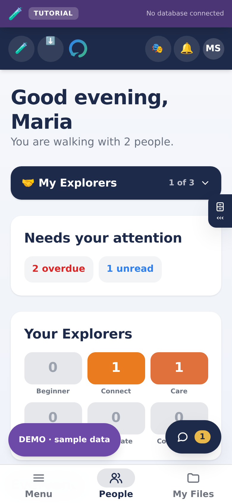

**Graduated** means reached Commission: walked the whole journey and now sent to walk with somebody else. It is the number the whole design exists to produce.

### Rooms and subrooms

**A room is a folder, and a subroom is a folder inside it.** Open a room and a drop-down at the top names the subroom you are in; tap it to see them all, and tap one to go in. Nothing else is drawn, so there is nothing to scroll past.

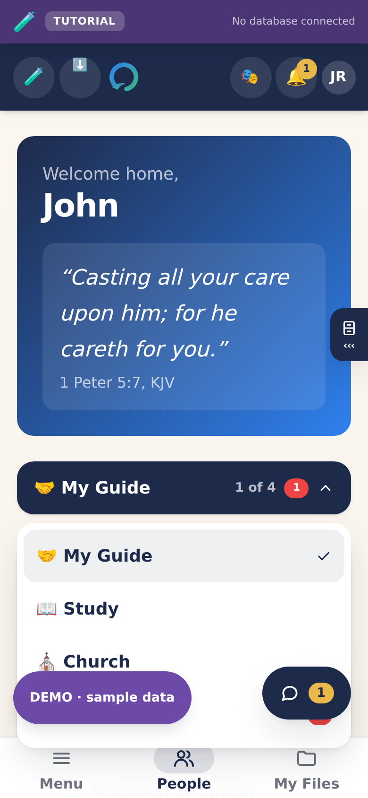

Six rooms work this way now. Measured on a phone, with the sample church in them:

| Room | Was | Now |
| --- | --- | --- |
| **The Library** | 11 screens of scrolling | 3 folders: Browse, Featured, On this device |
| **Settings** | 7 screens | 4 or 5 folders: General (installing, alerts, language, text size, the source code), Password, Admin Reports, Church for leadership, Help. The sample church has General, Help and, for leadership, Church |
| **My Journey**, an Explorer's own screen | 7 screens | 4 folders: My Guide, Study, Church, Prayer |
| **The Church** | 5 screens | 3 folders: Notices, Community Blogs, The numbers |
| **My Explorers**, a Guide's home | 4 screens | 4 folders: My Explorers, Follow-ups, Prayer, Church |
| **The Office** | 3 screens, and nine cards | 5 or 6 folders, below |

Publish, Cases, the Guild Room, Mail and Profile are left alone. They are one or two screens and mostly one thing; a list of choices above a single card is furniture, not navigation.

### The Office

Guides, Directors and Executive Directors have an **Office**, in the Menu on every screen. It holds the work: the numbers, the downloads, the studies you write, the Sabbath program and the shelf you stock. Its subrooms are:

| A Guide's subrooms | A Director's subrooms |
| --- | --- |
| Lesson studies, Sabbath program, Resources, Guides' room, Put a name forward, Numbers | Numbers, Reports, Lesson studies, Sabbath program, Library, Pairing requests, Guides' room |

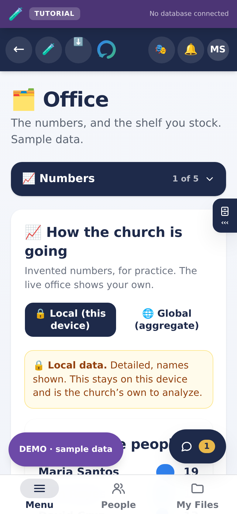

Three things about it are worth knowing:

- **It opens where your work is.** A Guide lands on Lesson studies, because writing is what a Guide comes here to do. A Director lands on the numbers.
- **It remembers where you were.** Somebody who lives in Lesson studies lands there tomorrow, and a Director's habit is their own rather than everybody's.
- **A link still beats the habit.** *Guides asking to pair* on the desk opens the Office already on Pairing requests, whichever subroom you were last in. Being sent to the right room and left to find the shelf is the same as not being sent.

The count beside **Pairing requests** is how many Guides are waiting on an answer. Without it a Director has to open the subroom to find out whether there is anything in it, which is the scrolling problem again with a tap on top.

> **NOTE** · Why this room needed it most
>
> It held nine panels down one page. A Guide who came here to write a study passed their numbers, the shelf, two pairing cards and a recommendation form on the way, every single time, and on a phone that is most of a minute of thumb. The Director's screen has worked in rooms since it was split up; the Office simply never got the same treatment, and neither had anywhere else.

> **NOTE** · Two things that did not move
>
> **An Explorer's way out of a conversation is on the same screen as the conversation.** The conversation is in the **Talk** bubble, and **Report** is in the bubble's own header, in words, at the top, far from Send, on both sides of every pairing.
>
> **A Guide still sees the church's notices before choosing a folder.** They sit above the row, not inside one, because a Guide carries the notices onward to the people they walk with and was told to see them first.

The split is by kind of work rather than by rank. A roster, a conversation, a case is about a person, and lives on that person's screen. Numbers, exports, writing and stocking a shelf are office work, and live here. Before this, a Guide's roster carried study-writing, library-stocking and a blog desk underneath the list of five people they walk with, and a Director's analytics sat three clicks inside an admin tab. The people screens were four screens long and the tools were hard to find.

Follow-ups and prayer requests stayed on the Guide's roster, because they are about the people on it.

**Explorers do not have this room**, and not because anything is hidden from them. None of it is theirs to do: no roster to report on, no shelf to stock, nobody to write studies for. A room that would be empty for them tells them they are missing something.

#### The Sabbath program

**Plan a Sabbath's order of service, then send it where people will read it: a Word file, a picture, text for a group chat, or a post your Explorers find on This Sabbath.** It is the **Sabbath program** folder in the Office, beside Lesson studies, for Guides, Directors and Executive Directors. Asked for on 2 October 2026, and widened the same day.

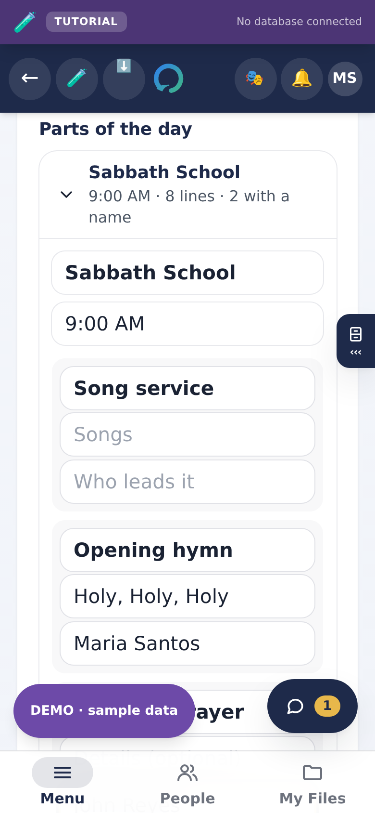

**A new program starts from the whole day**, for the coming Sabbath: Sabbath School, the Divine Service, the afternoon program (AY) and sunset vespers, each with the parts a Sabbath usually has (song service, opening hymn and prayer, mission story, sermon, benediction and the rest). Every line is three boxes: what happens, the details (which hymn, which passage, which title) and who leads it. Rename, add or remove anything. **Arrange lines**, under a part, shows arrows to move a line and a button to take it out; **Done** puts them away again, so the boxes keep the whole width of a phone while you type. One part of the day is open at a time. A part with nothing in it and no time is left off what gets printed.

**It says what is left to arrange.** Under the date, "16 lines still need someone to lead it" counts every line that names a part but nobody to lead it, and each program in the list says the same in short ("3 still to fill", or "everyone named"). It is the question a coordinator asks on a Friday.

**No hymn titles come with it.** Every church has its own hymnal; type the number and title you sing.

| Button | What it gives you |
| --- | --- |
| **Download Word file** | A .docx named for its Sabbath, such as `Sabbath-program-2026-10-03.docx`. It opens in Word, in Pages, and in Google Docs: upload it to Google Drive, or open it from the Google Docs app on a phone. |
| **Download picture** | A picture of the program (a PNG 1080 pixels wide, as tall as the program needs) for a group chat, a phone's gallery or Canva. It is drawn on the phone itself, so it works with no signal. |
| **Share the picture** | The picture, straight into Messenger, Viber, Drive or email through the phone's own share sheet. Shown only where the browser can share a file, which is most phones and few computers. |
| **Copy as text** | The program as plain text, ready to paste into a group chat. |
| **Post it** | Under **Share in the app**: the program as a post for the people you walk with, or for the whole church. See below. |
| **Reuse next week** | A copy for the following Sabbath with every part and name kept, because most weeks change only who does what. |

##### Sharing it with Explorers: This Sabbath

**Share in the app**, under the program, makes it a post. Choose **Who sees it**: **The people I walk with**, which is where a Guide's share goes unless they choose otherwise and which includes anybody paired with them later, or **Everyone in the church**, where a Director's or an Executive Director's goes, and which also puts it on the church home screen like any post for the whole church. Press **Post it**.

**It is an ordinary post, with your name on it, read by the rules every post follows.** So an Explorer a Guide does not walk with does not see that Guide's program, and nobody outside the church sees any of it. To take one down, open **Publish**, where the posts you have made are listed. Posting needs a signal; with none, the button says so and nothing typed is lost.

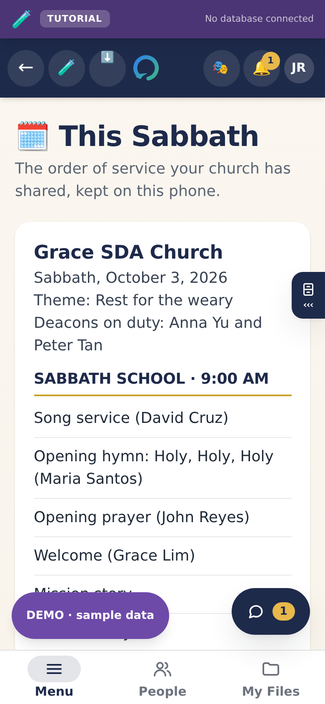

**Explorers find it on This Sabbath**, in the Menu. Guides and leadership have it too, with their own programs under the shared ones. The coming Sabbath's program is at the top with **Shared by** and the sender's name; earlier ones fold away under **Other Sabbaths**. It is shown as plain text and never as a web page, because it is something a person typed.

**It opens with no signal.** Each program shared with somebody is kept on their phone, the most recent 20, and the page itself is saved for offline use. Once they have opened This Sabbath with a signal after the program was posted, it opens in a church hall with none.

##### Advanced settings

Tick **Advanced settings**, above the list. The choice is remembered for that account on that device. Simple is the default, because most weeks need nothing more than names.

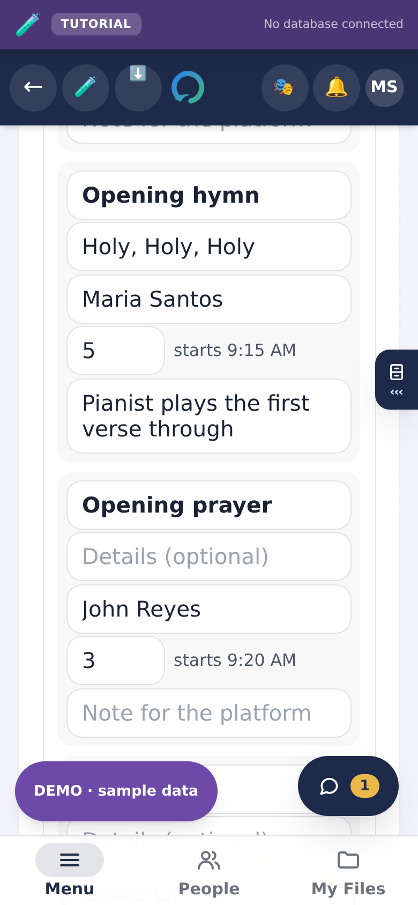

- **Minutes and start times.** Give a part of the day its start time and each line its minutes, and every line shows when it starts ("starts 9:20 AM"). If a part runs past the start of the next, the program says so in amber: "Sabbath School runs 20 minutes into Divine Service."
- **A note for the platform.** Each line can carry a note for whoever leads it, such as "Pianist plays the first verse through". Under **Take it away**, **Which copy** chooses between **For the congregation**, without times or notes, and **For the platform, with times and notes**, a Word file ending `-platform.docx` with a column for each line's start time and the notes under their lines. **The picture and anything posted are always the congregation's copy**, so a note never leaves the device that way.
- **Details of your own.** For anything the standard boxes do not cover: press **Add a detail**, give it a name ("Deacons on duty", "Offering for", "Flowers given by") and write what it says. Every detail with something written prints under the theme on every copy, the picture and the post included; one left empty is left off. Up to twelve.
- **Your own templates.** **Save as a template** keeps the parts, their times and minutes, and the names of your details, under a name such as "Communion Sabbath". **New program** then asks what to start from: **The standard Sabbath**, one of yours, or **A blank page**. A template never keeps who leads what, the hymns and passages, the notes, or what a detail said: they belong to one Sabbath. Up to ten.
- **Reminders.** Lists everybody named in the program with what they are doing and when. **Copy reminder** gives a message ready to paste to that person: "Hi Grace Lim. A reminder for Sabbath, October 3, 2026 at Grace SDA Church:" and their parts. The app sends nothing itself.

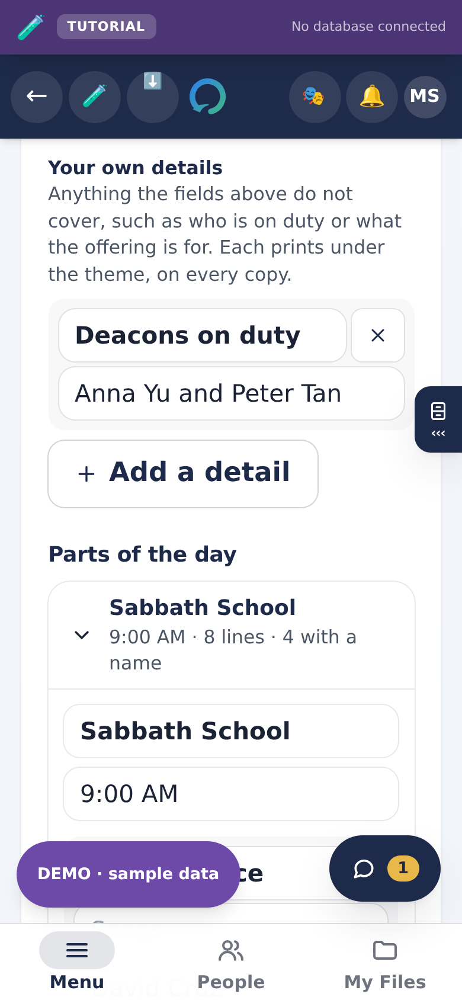

##### Designing it in Canva, for free

**A free Canva account is enough, and the app never talks to Canva.** In Canva choose **Upload** and add the picture or the Word file, then design from it. There is no account to connect, no key to keep and nothing to pay, and the privacy notice gains no new company. `docs/SABBATH-PROGRAM-RESEARCH.md` gives the reasoning, the three open-source tools the ideas came from and their licences. One thing in it is unconfirmed: that Canva's free plan imports Word files was read from search results quoting Canva's help page, because the page itself could not be reached from where this was built. Try it once before telling a church it works.

**Kept on this device, by the owner's choice.** A program is saved as it is typed, in the browser on the phone or computer where it was made, and nowhere else until somebody posts it or takes a file away. There is no table and no migration, so a church's app has it the day its code updates, database or not. Each account keeps its own list: a second leader on a shared office computer starts with their own, not the first one's names.

> **CAUTION** · What keeping it on the device costs
>
> A program made on a phone is not on the laptop, and two leaders do not see each other's drafts: they post it or pass the file round, the way churches already pass a program round. Clearing the browser's site data, or a private window closing, deletes the programs in it. If the browser refuses to save at all, the screen says so in red. Download the ones you want to keep.

#### Asking to walk with somebody

A Guide can see the Explorers nobody is walking with yet, and press **I have room** with an optional note. It goes to the Directors.

**It puts your name forward; it does not make the pairing.** A Director still creates it on the Pairings screen, where the limit of five is checked. A button that quietly created a relationship from a list of requests is how somebody ends up with six people.

**The Explorer is never told they were asked for.** Being wanted and not chosen is not something anybody should have to read about themselves.

> **NOTE** · This widens what a Guide can see, on purpose
>
> A Guide can normally read exactly two accounts: their own and the Explorer they walk with. You cannot ask to walk with somebody you cannot name, so a Guide now sees the **name** of any Explorer in their church who is waiting. Nothing else comes with it: no birthday, no contact details, no stage, no messages, no prayer requests, no notes.

#### The Guides' room

A place for Guides and their Directors to talk to each other. Explorers cannot see it. Every conversation in the rest of the app is one Guide with one Explorer, which is right for that relationship and leaves a Guide with a hard week entirely alone.

> **CAUTION** · A room, not private messages
>
> Everybody in the room reads everything in it, and that is what makes it safe to have rather than a limitation. Guide-to-Guide direct messages would be a second private channel with no oversight, in an app whose whole design is that private conversation happens in one place and can be reported. Anyone can delete their own message; Directors can delete any.

### Cases

**Cases have a room of their own**, in the Menu on every screen (for leadership, as **Admin Reports**; a Guide or an Explorer who is part of a case reaches it through Settings). A case is a formal proceeding about a person, sometimes about the person reading it, and it used to be a card partway down a dashboard: easy to scroll past on the one day it mattered, and sitting in the same visual rank as a study plan.

The link is always there, whether or not anything is open. A link that comes and goes is one nobody trusts is there, and its absence on a quiet day looks the same as it being broken. When there is nothing, the room says so.

An **Explorer** has the room too, and that matters most. An Explorer called into a case is the person in it with the least standing, and their answer has to be findable without anybody having to tell them where to look. They can write in it even while suspended: suspending somebody pending a hearing must not take away their side of it.

On a Guide's **Care** tab for one Explorer, prayer requests are always shown, even when there are none. The card used to disappear when empty, so the tab held only private notes and read as though a Guide could not see prayer requests at all.

A Director judging a case still works through it in **Admin → Safeguarding**, beside the reports the cases came from. That is a different job from answering one, and the screen tells the two apart by itself.

### Safeguarding

Anybody can report a conversation. When they do:

- Every Director of that church is notified at once.
- A Director can read the conversation in place, with what came before and after, rather than as a single quoted line.
- **The person reported is never told.** No message, no notification, nothing they could notice.
- The reporter's name is visible to Directors, because a Director cannot support them or tell a genuine concern from a grudge without it.
- Reports are never deleted, whatever is decided.

**A post on a guild board is reported the same way** and arrives in the same queue, marked *Guild Room post*, with the post quoted underneath. The Director can close the report as usual and can also **delete the post**. Only leadership of that church can take a post down, and the removal is recorded in the security audit.

The quoted text is a copy taken when the report was made, so it is still there after the post is gone, including when the author deleted it themselves.

### The security audit

**Admin → Security** is a plain list of things that happened to accounts: a name changed, a detail changed, a safeguarding report raised, somebody suspended, restored, removed, approved or disapproved, and a guild post taken down. Each line says who it was about, what happened, when, and how serious it is.

**It carries no conversation and no file.** Nothing anybody wrote to anybody else appears here, and the screen says so. It is a record of *administration*, not of speech.

Who sees whom follows rank, and only in one direction:

| You are | You see activity about |
| --- | --- |
| A Director | Guides and Explorers in your church |
| An Executive Director | The same, plus Directors |

A Director is not shown which *leader* acted on something, and those lines read *Church leadership*, because a Director reading a log of another Director's decisions is oversight pointing the wrong way. An Executive Director sees the names.

It lives inside Admin rather than as a room of its own, because it is a leadership tool and a door in the room list that only two roles can open is a door most of the church is invited to rattle.

### Reading the numbers

The Church screen opens with four headline figures: Explorers, Guides, Graduated, and how many are waiting for a Guide. Under them sit two charts, each answering one question a Director actually asks.

**Who is using it.** One panel for Guides and one for Explorers, each showing everybody on the roll for today, this week and this month. The blue part of the bar is the people Beacon recorded doing something; the brown part is the rest.

> **CAUTION** · What "active" does and does not mean
>
> **It is not a count of visits.** Beacon does not record when somebody opens the app, so a number claiming to be visits would be invented. Active means the app recorded them doing something: sending a message, a step on a journey, arranging a meeting, or writing a post or a study.
>
> An Explorer who met their Guide for coffee and wrote nothing down is in the brown part. That is not a failure and it should not be treated as one. What is worth acting on is a whole month of brown for one person, and *Waiting for a Guide* above zero.
>
> Today will almost always look low, and that is the day, not the church. Read the week and the month.

**Who is arriving.** Four small charts, one for each role: Executive Directors, Directors, Guides and Explorers. Choose the period from Daily, Weekly, Monthly, Quarterly or Yearly. All four share one scale, so a tall bar means the same number of people wherever it appears.

Somebody counts as arriving on the day they finished signing up, not the day their invitation was sent. An invitation that sat unopened for three weeks would otherwise land on the wrong week.

Underneath, in the same period, is what the church decided about people: how many were let in, turned down, suspended, had a suspension lifted, and removed.

> **NOTE** · Removed and deleted are one number
>
> In Hope Beacon, removing somebody from the church deletes their account. There is no separate state where a person has been put out but still has a login. The record of the removal survives them, which is the point of keeping it.

> **NOTE** · Average and middle period
>
> Both are shown because they disagree in the case that matters. One busy week after a quiet month pulls the average up; the middle week is closer to an ordinary one.

**Five ways to take the numbers with you**, and each says what it is for.

| Format | Use it when | Opens in |
| --- | --- | --- |
| **Sheets** | You want to work on the numbers yourself. Keeps both tables and their headings. | Excel, Google Sheets, Numbers |
| **Document** | You are sending it to somebody who will edit it. | Word, Google Docs |
| **PDF file** | You are sending it to somebody who should not edit it. Downloads straight away. | Anything |
| **Print** | You are handing round paper at a meeting. The dialog can also save a PDF, and lets you pick the paper. | Printer, or save as PDF |
| **CSV** | You are feeding it into another program. | Anything at all |

**Every file carries the same explanations**, not just the figures: what "active" means and does not mean, that "nothing recorded" is not the same as idle, and that removed and deleted are one number. A spreadsheet with a column headed *Active* and no definition beside it is how somebody decides that eleven of nineteen Guides are not working.

Every file also carries your church's name and the date it was made, and nobody's name is in any of them.

Every one of these numbers is a count. No name, no message and no prayer appears on this screen or in the file, and the part that counts messages runs inside the database and hands back only a total, so a Director reading "eleven Guides were active" is not reading anybody's conversation.

> **NOTE** · An Explorer does not see the church counted
>
> *Your church at a glance* — Guides, Explorers, waiting for approval, graduated, where people are on the journey — is on the Church screen for Guides and leadership, and not for Explorers. It names nobody and shows no conversation, which is why it was on everyone's screen at first. Safe is not the same as theirs: it is the church looking at itself, and an Explorer opening their church screen was shown a tally of how many people like them there are and how many had "graduated". Community Blogs and the church's notices are what that screen is for.

### The board report

Admin has a panel with the four numbers to read out at a board meeting, and a Print button. It names nobody. If a board member wants to know how one particular person is doing, the answer is to ask the Guide walking with them. The app will not show it.

## 5. Getting it onto a phone

Hope Beacon installs from the browser. There is no app store, no download, and no review process. Once installed it has its own icon, opens without an address bar, and keeps working when the signal does not.

> **IMPORTANT** · iPhone and iPad: only Safari can install
>
> Apple permits only Safari to add an app to the Home Screen. Chrome, Firefox, Edge and Opera on an iPhone cannot do it, and no amount of work on our side can change that. Neither can the browser inside Messenger, Facebook or Instagram.
>
> What we can do is make leaving take one tap instead of three steps, and that is what the app now does.

### If you are not in Safari: one tap

Open the app in Chrome, Firefox, Edge, or from a link inside Messenger or Facebook, and it says which browser you are in and offers a single button: **Open this page in Safari**. Tapping it reopens the page you are on, in Safari, with nothing retyped. From there, Share and Add to Home Screen work normally.

This matters most for somebody holding an invitation. The old advice was to switch to Safari, and people did that by opening Safari and typing the address, which loses the invitation link they were on. That is the version of the bug reported as "they switch to Safari and it still does not work". The button carries the exact page across.

> **CAUTION** · Honest about the limits of this
>
> The handoff uses a URL scheme Apple has never documented. Most browsers and most in-app browsers honour it. Some refuse, and when they do, *nothing happens and nothing says why*.
>
> So the written steps stay on the screen underneath the button, always, and there is a Copy link button for the person whose browser refuses both. It has been tested with simulated iPhone browsers in an automated test. It has **not** been tested on a physical iPhone.

### iPhone and iPad, by hand

1. Open the church's address **in Safari**. If you are in another browser or inside a chat app, use its **•••** menu and choose **Open in Safari**.
2. Tap **Share**, the square with an arrow coming out of it.
3. Scroll down and tap **Add to Home Screen**.
4. Tap **Add**, top right.

> **CAUTION** · If somebody installed before 26 August 2026
>
> What they have is a bookmark, not an app, and it will not convert itself. Older iPhones needed a tag the framework had stopped emitting, so Add to Home Screen produced an icon that opened Safari with the address bar showing. Nothing errored, which is why it was reported as "the install does not work".
>
> The fix is deployed. Those people must **delete the old icon and add it again**.

### Every other browser

**Settings asks which browser you are in and gives that browser's steps.** It guesses from the browser itself and opens on the right one, and the whole list is one tap away if the guess is wrong.

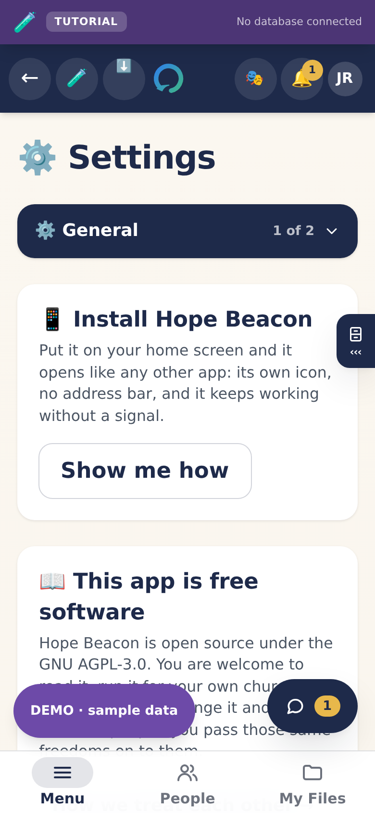

| Browser | Where | What to press |
| --- | --- | --- |
| **Chrome** | Android, Windows, Mac, Linux, Chromebook | Phone: **⋮** then **Add to Home screen**. Computer: the install icon at the right-hand end of the address bar. |
| **Microsoft Edge** | Android, Windows, Mac | Phone: **•••** at the bottom, then **Add to phone**. Computer: the install icon, or **•••** then **Apps** then **Install this site as an app**. |
| **Samsung Internet** | Samsung phones and tablets | **☰** at the bottom right, then **Add page to**, then **Home screen**. |
| **Opera** | Android, Windows, Mac | Phone: the menu, then **Add to**, then **Home screen**. Computer: the install icon in the address bar. |
| **Brave** | Android, Windows, Mac | Phone: **⋮** then **Add to Home screen**. Computer: the install icon, or **☰** then **Install Hope Beacon**. |
| **Vivaldi** | Android, Windows, Mac, Linux | The menu, then **Add to Home screen**. Computer: the install icon. |
| **Firefox** | Android only | **⋮** then **Add to Home screen**. |
| **Hola, and any other Chromium browser** | Android, Windows, Mac | Open the menu and look for **Install**, **Install app** or **Add to Home screen**. |
| **Safari** | iPhone, iPad | **Share**, then **Add to Home Screen**. The only one that works on Apple. |
| **Safari** | Mac | **File**, then **Add to Dock**. |

> **NOTE** · Why the list ends with a catch-all rather than every name
>
> Hola, Kiwi, Yandex, UC, DuckDuckGo and the rest are all built on the same engine as Chrome, so they install the same way and only the wording moves. Naming every browser that exists is a list that is wrong the week after it is written; **Install** or **Add to Home screen** is what to look for in any of them.
>
> Two things decided that the browser is *offered as a choice* rather than detected. **Brave does not put its own name in the identifier a browser sends**, so it cannot be recognised that way at all. And searching that identifier for "Hola" matches `Le Hola`, which is a **phone model**, not a browser: a member on that handset would have been told they were using something they have never installed. Both are checked by a test.

> **GOOD TO KNOW** · Firefox on a computer cannot install web apps
>
> Not a setting, and nothing to turn on. Use Chrome, Edge or Safari on a computer. Firefox on a phone is fine and is in the table above. The app says this plainly rather than offering steps that cannot work.

### Updates

Nobody reinstalls. When a new version ships, every open copy notices within seconds and offers to refresh. The app will not reload while a message is half written.

> **GOOD TO KNOW** · An update does not sign anybody out
>
> Signing in is stored in the browser, tied to the database project, and shipping new code does not touch it. Nor does the offline cache being rebuilt, nor the crash recovery, which clears caches only. There is a test that fails the build if that ever stops being true.
>
> **Two things do end every session, and both are in Part 7:** moving to a different database project, and changing the web address.

### Something to listen to

There is one player, in two sizes, and they are two views of the same thing rather than two players.

**The small one** sits in the right-hand column of every room. Shut, it shows what is playing and the volume. The **⋯** at its top right opens it, and it remembers which you chose on that device. Open, it has the same three tabs as the full one.

**The full one** is the first thing on **My Library**, and it is the only place it appears. It used to sit on My Journey and on a Guide's workspace as well, where it was the largest card on a screen meant to be about somebody's next step.

It is a real player, not a play button. Both sizes have:

- a **progress bar you can drag**, with the time so far on the left and the time remaining on the right;
- **previous** and **next** through whatever is queued;
- **back ten seconds** and **forward ten seconds**, which is what you actually want in a talk;
- **mute**, and a volume slider.

Pressing previous once restarts the track you are on, the way every player people already use behaves. Pressing it again goes back a track.

**Video plays too, with a picture.** A video's picture appears in whichever player you are looking at, and follows you: start one in the Library, go back to your room, and it keeps playing with its picture in the rail.

Three tabs, in the order most people want them.

- **Vault** is your own music and video, saved on this device. There is a search box over it, because a vault worth having is a vault too long to scroll, and a **Save music or video** button that puts more in. Files stay on the device and are never uploaded.
- **Playlists** are your own, saved on the device and never uploaded: name one, then add whatever is playing to it. A playlist can mix ambience and your own recordings, so rainfall behind a sermon is one list.
- **Ambience** is **made on the device as it plays**. There is no file to download, it costs no data, and it works with no signal. It has no progress bar, because it has no end; the player says so rather than showing a bar that never moves. It comes in **two groups, and the split is the point**: *Calm* (rainfall, distant surf, night wind) is made to sit with while you read, and *White noise* (soft hush, plain hush) is brighter and flatter to cover the people talking around you. They used to be one list of three, and people looking for something restful kept landing on the flattest thing in it and reporting that the sound was unpleasant. Each one now says what it sounds like underneath its name, including the honest warning on the harshest.

Both sizes drive the same element, so starting a track in the Library and walking back to your room keeps it playing.

What somebody listens to while they read is nobody else's business, which is why the vault and the playlists stay on the device rather than in the church's database.

### How you get around: Menu, People, My Files

On a phone, an iPad and a computer alike, a bar along the bottom of the screen has three words on it, and it **is** the navigation:

- **Menu** lists every room you have, written out: Home, your own screen, **This Sabbath**, My Files, **Publish**; the **Study Room** for Explorers; the **Office** for Guides and leadership; and **Admin Reports** for leadership. Your profile is at the top; Settings is under **You**; the way out (Sign out) is at the bottom. The sample church also has **Mail** under You, a pretend inbox; a church's own app does not.
- **People** opens your own people: a Guide's Explorers, an Explorer's Guide, a Director's Admin.
- **My Files** opens your own files.

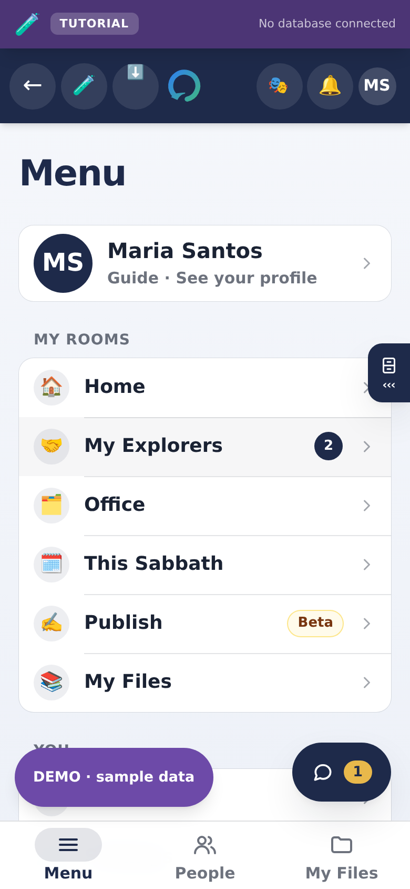

Six of those rooms have **subrooms** inside them, offered as **one drop-down** at the top when you open one. Closed, it names the subroom you are in, says how many there are (*2 of 4*), and shows a count when something is waiting in another one; tap it and every subroom is listed. It is a drop-down on every screen size, because people did not know to swipe the row it replaced. The sections of one person's page (Appointments, Journey, Care and the rest) open the same way. See *Rooms and subrooms* in Part 4.

> **IMPORTANT** · There is no left column any more
>
> Until 30 September 2026 a laptop had a column of rooms down the left side, and a phone had a row of small icons under the header instead. Two lists of the same rooms drifted apart: Office, Publish and Cases were added to the column and never to the row, so for several weeks they could not be reached on a phone. Now there is one list, and the Menu draws it at every size. There is a check that fails the build if the Menu stops drawing it.
>
> **The conversation is a bubble**, the round **Talk** button in the corner of every screen, with a number on it when somebody has written. On a phone or an iPad it opens to the whole screen; on a computer it opens beside the page. **Report** is at the top of it.
>
> **Your desk** (the study timer, your note, the pocket, the player) sits beside the page on a wide screen. On a phone or an iPad it is a drawer: tap the small cabinet with **‹‹‹** on the right edge, or swipe in from that edge, and it slides in; tap **›››** to put it away.

**Tutorial, What's new and Feedback are cards inside Settings**, not rows in the Menu. On a live church that was half true for a while: only the tutorial made the move, so What's new and Feedback existed in the sample-data build and nowhere else. Both are now on a **Help and feedback** card in Settings, on both. They were rows for a while, put there because each had been reported as missing when it was only reachable by scrolling Settings. That fixed the wrong half: it made the column six entries long for three things somebody uses about once a month, and the column is what people look at all day. The unread mark for a new release sits on Settings itself, so it is still visible from every screen.

### On the desk

The right-hand column carries a panel for Guides, Directors and Executive Directors: what is **coming up**, and what is **waiting for you**.

Coming up is the next three meetings, with the day and the time; pressing one opens the conversation it belongs to. Waiting for you is everything somebody is waiting on you for: unread notifications, prayer requests, people awaiting approval, Explorers with no Guide, open safeguarding reports, and Guides asking to be paired with somebody.

**Every line goes to the exact card, not the top of a page.** *Prayer requests waiting* opens the prayer card itself; *Waiting to be approved* opens Admin already on Approvals rather than on whichever tab you last used; *Guides asking to walk with somebody* opens the Office at that card. The card is marked briefly when you arrive, so you can see which one answered the press. *Unread notifications* is the one exception and it is not a link: the bell is in the header of every screen, so pressing that line opens the bell where you already are.

Lines disappear when the work is done, so an empty panel means an empty desk.

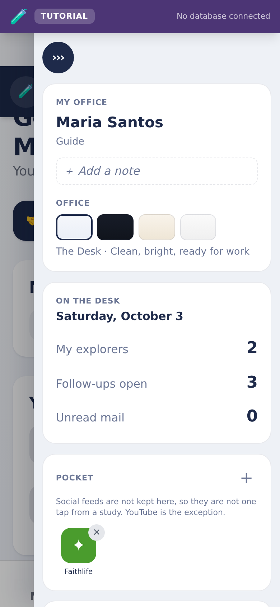

> **NOTE** · This is what "it doesn't go to the feature" was
>
> The lines were links, but they pointed at pages. Arriving at the top of a long screen and having to find the thing you just pressed is the same as not being sent — and pressing an `/admin` line while already on Admin did nothing at all, because the address changed and the screen did not. The desk rail is drawn on the page it links to, so that was the usual case rather than an unlucky one.

**Explorers get the study timer here instead.** An Explorer has no queue of work, and giving them a "waiting for you" panel would invent one.

> **NOTE** · This panel used to be empty always
>
> It was passed a hard-coded empty list, so every signed-in person was told "Nothing waiting. A good place to be." whatever was actually waiting. It looked like a considered empty state and had never been connected to anything.

### Pop-ups on a phone held upright

Every panel that opens over the page (the bell, the account menu, the player's menu, the share sheet, the install card) is measured against the screen the phone actually has, and is pinned inside it.

Three things were wrong, and all three showed up only in portrait:

- **A panel was measured against the wrong screen.** The unit used for "most of the height" is the page's idea of the viewport, which on a phone is the height with the address bar hidden. Held upright, a panel asking for 90% of that was taller than the screen and its bottom was unreachable.
- **A panel anchored to a button near the right edge ran off the side**, because it was positioned from that button rather than clamped to the screen. In landscape there was room and nobody saw it.
- **Anything pinned to the bottom sat under the home indicator** on a modern iPhone, which reserves about 34 points that a fixed offset knows nothing about.

They are all one component now, so a new panel gets the behaviour instead of somebody having to remember it.

### Waiting

**Opening the app shows one screen while it signs you in**: the app's own mark with a halo breathing behind it, the name, and a bar that travels without pretending to know how far along it is.

There were three waiting states and the app showed the plainest of them. The designed one existed and nothing ever drew it; what people saw was a second, flatter screen written inside the live shell, with a lighthouse drawn by hand rather than the app's actual logo. So somebody saw one mark while waiting and a different one for the rest of the session. The church app this grew out of had already found that and fixed it, and this is the same fix.

Anywhere the app is fetching something smaller, it shows the same mark turning with a word for what it is waiting on, rather than the word "Loading" on its own or nothing at all. A screen that is still fetching and a screen that has finished and found nothing used to look identical, so people pressed the button again.

A device set to reduce motion gets the same message without the spin.

### Movement

**Things move a little, quickly, and never for their own sake.** A panel unfolds from the button that opened it and folds back into it; a new subroom fades in where the old one was; a conversation slides in. Every movement in the app uses one of three lengths, 160, 220 and 280 thousandths of a second, so nothing drifts.

**Reduce motion turns all of it off.** Phones have that setting for people whom movement on a screen makes dizzy or sick, and the app honours it everywhere: nothing slides, fades or bobs, and panels simply appear. A check fails the build if any animation in the app cannot be stilled.

### Notifications

The bell in the header holds both the list and its switch. Alerts in the app are **on by default**.

**Pressing one opens what it is about.** A safeguarding notice opens the Safeguarding room for a Director and the Cases room for anybody who has been called to one; a prayer notice opens the prayer card; an approval opens Approvals. It also marks the notice read, which it always did — before tonight that was *all* it did, so the bold went away and the person was left on whatever screen they were already on with no idea where to go.

**They pop up on the device, not only in the list.** Tap **Turn on device alerts**, allow it when the browser asks, and one appears straight away so you can see it worked. After that, anything new reaches the notification tray on your phone or computer while Beacon is open in a tab or installed, and tapping it opens the app on the right screen.

At most three pop up at once. Somebody coming back to eleven unread things needs to be told, not buried, so the rest stay on the badge.

**You are told when you arrive, not only while you are watching.** Signing in, or coming back to the app after being offline, checks what is waiting and says so. Before this, an alert only ever appeared if you happened to be looking at the app the moment it was created, so somebody who closed their laptop on Friday and opened it on Sunday was greeted by a silent screen with a number on a bell they had no reason to look at.

If several things arrived while you were away, you get one line saying how many rather than a stack of pop-ups.

> **NOTE** · What is not built
>
> A notification when Beacon is **completely closed** needs a push service and a signing key held on a server, which this church does not have set up. The app is ready for it: the service worker already handles a push and a tap. Until those keys exist, alerts arrive while Beacon is open in a tab or running as an installed app, which for a phone with the icon on the home screen is most of the time.

Device alerts are the browser's to grant: the panel offers to ask once, and if a browser has already refused it says where to change that rather than offering a button that would do nothing. Once granted, the panel says so, because the only other way to know it worked was to wait for one.

## 6. Email, end to end

Two providers, deliberately, because they fail in different ways and one must not be able to take the other down.

| What | Sent by | Why |
| --- | --- | --- |
| Invitations | **Brevo** | Three different messages, one per role, composed in the code and kept under version control. |
| Password resets | **Supabase**, over Brevo's SMTP | Only the auth system can mint a recovery link, so this one cannot move. |

### Why not Supabase for invitations too

Supabase Auth has exactly one "Invite user" template with no way to branch on a role. The moment three roles needed three different invitations, that template could no longer do the job. There is also a hard ceiling: the built-in mailer sends **two emails an hour for the whole project**, which one Director inviting three people on a Sunday afternoon would exhaust.

### Setting up Brevo

**Step 1.** **Verify your sending domain.** In Brevo, go to *Senders, Domains & Dedicated IPs* and add your domain. Brevo gives you DNS records to publish; add them at whoever sells you the domain and wait for Brevo to show the domain as authenticated.

**Step 2.** **Create an API key.** *SMTP & API* → *API keys* → *Generate a new API key*. It begins with `xkeysib-`. Copy it once; Brevo will not show it again.

**Step 3.** **Create an SMTP key** as well, on the same page. This is a different key for a different job, and the password reset needs it.

**Step 4.** **Check the IP restriction on both.** Brevo can limit a key to named IP addresses, and it is two separate switches: one for API keys, one for SMTP keys. Our server has no fixed address, so a key restricted this way is refused every time and Brevo's log shows nothing at all.

**Step 5.** **Store the API key in Supabase**, never in the website's settings. See Part 8 for exactly where.

> **CAUTION** · Two Brevo traps that cost a morning each
>
> **Not every key works with the API.** Keys created for other Brevo integrations are a different type, and the sending endpoint answers "Key not found" for them, which reads as a wrong key rather than a wrong kind. Create the key from *SMTP & API → API keys* and nowhere else.
>
> **IP restriction is on by default in some accounts.** Turning it off is a real reduction in protection, and it is the owner's call. The compensating control is that the key lives in the database where only the server can read it, and rotating it takes under a minute.

### Setting up the password reset

In Supabase: *Project Settings → Authentication → SMTP Settings*. Enable custom SMTP and enter Brevo's host, port `587`, your Brevo login and the **SMTP key** as the password. Set the sender to an address on the domain you verified. This also lifts the two-an-hour ceiling for everything Supabase sends.

### How an invitation is actually sent

Worth understanding, because almost every email failure has been a misunderstanding of this.

1. A Director presses Send. The request reaches a small server function, the only piece of the system holding the key that can bypass the security rules.
2. It refuses if the address already belongs to a member who has finished signing up.
3. It creates or refreshes the one invitation row for that address.
4. It mints a one-time link, composes the message for that role, and hands it to Brevo.
5. If Brevo will not take it, and only then, it produces a link the Director can pass on by hand, and says why the email did not go.

> **IMPORTANT** · The rule that broke every invitation for a week
>
> An account has **one slot** for an invitation link, not a collection. Minting a second link overwrites the first, and the first stops working immediately. The function used to mint a spare link after sending the real one, which quietly destroyed the link that had just gone into somebody's inbox. Every invitation arrived dead and the error message said the link had expired.
>
> Never mint a link after a send. Anything that calls the mint function must do it before the send, or only when the send has failed.

### What the invitation actually says now

The message leads with **how to install Hope Beacon**, with the steps for Safari on an iPhone or iPad and the steps for any other browser, and the **Accept your invitation** link sits at the foot of it rather than at the top.

That order is deliberate. The link is one-time: opening it, glancing at a sign-in screen on a browser they will not keep using, and closing it again is how somebody burns their invitation before they have the app. Reading how to install first, then accepting, is the path that works.

Each role is also told which room to open first, so the first screen after joining is not a guess.

### Changing the wording of an invitation

The three messages live in the repository at `supabase/functions/invite/email.ts`. Edit them there, in plain TypeScript, and redeploy the function. A test renders all three and checks the link appears twice, the church name is escaped, and no placeholder survives into the message.

Brevo templates are supported as an alternative but not recommended: they put the words a congregation reads behind a dashboard with no version control, and somebody must build three by hand before a single invitation can go out.

## 7. Moving to a new project

### A church's own copy, from GitHub

**Anybody can copy this app and run it for their own church, and the copy is the whole app.** The repository is public, and copying it ("forking") gives a church or a developer:

| What | Where it is |
| --- | --- |
| Every feature in this handbook, Explorer to Executive Director | The code |
| The whole database: every table, every security rule, the conversation's replies, reactions and voice | `supabase/migrations/`, 138 files that build an empty database from nothing, in order |
| The server functions: invitations, notifications to phones, place suggestions | `supabase/functions/` |
| A setup guide that assumes no technical knowledge | `docs/START-HERE.md` |
| Four ways to run it: on a computer with no accounts, on Vercel and Supabase, on a computer with a real database, and on other hosts, plus moving off Supabase entirely | `docs/DEPLOY-ANYWHERE.md` |
| A tutorial mode with invented people, which needs no setup and no database at all | Built into the app |
| Proof it still works: every change to the repository builds an empty database from those files and runs the checks against it | `.github/workflows/`, and `npm run verify` on any computer |
| Three research agents to review a change for security, design and licences, with any AI tool | `.claude/agents/`, explained in `docs/agents/README.md` |

**None of this church's people come with it.** Nothing about a member is in the repository, and checks fail the build if a key, a password or the live project's own address is ever added to it. A migration file is a blueprint: it tells an empty database what tables and rules to make. The copy starts empty and invites its own people.

**Updating a copy later** is `git pull` for the code and `npx supabase db push` for the database, in either order. A site that updates before its database keeps working: anything new that needs the database is simply not offered until the database has it (Part 9).

> **IMPORTANT** · The one thing the licence asks
>
> The app is free software under the AGPL-3.0-only. Run it unchanged and you owe nothing. **Change it (renaming it counts) and let your congregation use it, and you must offer them the source of your version.** The app already does that from Settings → General and from its front page; point both at your own repository by changing `SOURCE_URL` in `lib/brand.ts`. The same card in Settings → General links **Code from other projects**: the licence of every open-source package inside the app, written at each build, which those packages ask for and you do not have to do anything about.

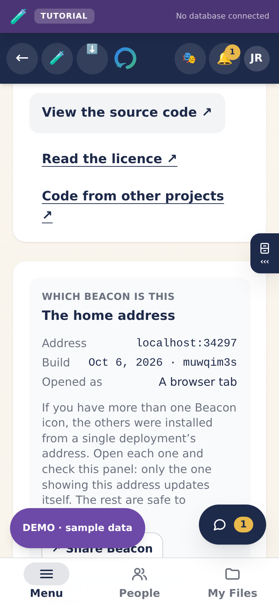

### Moving the project you already run

This is the part to read twice. Moving the app means moving three separate things, and they have different consequences for the people already using it.

| What moves | Effect on people already using it |
| --- | --- |
| **The code** (a new repository, a new deploy) | None. Nobody is signed out and nothing is reinstalled. |
| **The database** (a new Supabase project) | **Everyone is signed out, and their accounts do not come with it** unless you deliberately carry them over. |
| **The web address** (a new domain) | **Everyone is signed out, and every installed icon is stranded for good** on a copy that can never update. |

> **IMPORTANT** · The address is the one you cannot undo
>
> A browser identifies an installed app by its web address. Change it and every phone that installed the old one keeps a copy that can never receive another update, and no amount of work on our side reaches it. The only fix is to ask every person to delete the icon and add it again.
>
> So: decide the final address *before* more people install, or accept that one day you will send that message to everybody. There is no third option. If you do move, announce it before the switch, not after.

### Why a new database signs everybody out

Being signed in is one entry stored in the browser, and its name contains the database project's own identifier. A different project means a different name, so the browser looks for the old one, finds nothing, and shows the sign-in screen. The accounts themselves live inside the old project and do not travel with the code.

Two honest ways forward. Choose deliberately.

|  | A. Start clean | B. Carry the accounts over |
| --- | --- | --- |
| **What you do** | Run the migrations on the new project and invite everybody again. | Copy the database, including the authentication tables, into the new project. |
| **Passwords** | Everybody sets a new one. | Survive the move. |
| **Signed out** | Yes. | Yes, unavoidably. |
| **Risk** | Low. Nothing to go subtly wrong. | Higher. Needs direct database access and careful ordering. |
| **Right when** | A demo, a pilot, or a church small enough to re-invite in an afternoon. | A congregation with real history worth keeping. |

### The migration checklist

In this order. Each step is checkable, and a step that cannot be checked has not been done.

**Step 1.** **Create the new Supabase project.** Note its URL and its publishable (anon) key from *Project Settings → API*. The anon key is not a secret and ships to every browser by design; the service role key never leaves the server.

**Step 2.** **Run every migration, in filename order**, from `supabase/migrations/`: 138 files as of 1 October 2026. They build on one another, so the order is not optional. `npx supabase db push --db-url "<the connection string>"` runs them all in order and remembers which ran (`docs/START-HERE.md`, Step 3); pasting each into the SQL editor in filename order works too.

   *Check:* the `profiles`, `pairings`, `invites` and `app_settings` tables exist, and row level security is on for all of them.

**Step 3.** **Deploy the edge functions.** `supabase/functions/invite` is required: it sends every invitation. `notify` (alerts on a phone when the app is closed) and `places` (place suggestions for a meeting in person) are optional, and each has its step in `docs/START-HERE.md`. `invite` and `notify` run with the service role key, which Supabase hands to every function on the server; it never leaves the server.

   *Check:* the function appears in *Edge Functions* and its version is the one you just deployed, not an older one that happened to be there.

**Step 4.** **Put the Brevo key in `app_settings`.** In the SQL editor:

```sql
insert into app_settings (key, value) values
  ('BREVO_API_KEY',     'xkeysib-your-key-here'),
  ('BREVO_SENDER',      'hello@your-domain.org'),
  ('BREVO_SENDER_NAME', 'Your Church')
on conflict (key) do update set value = excluded.value;
```

   That table has row level security on and no policy granting anybody access, so only the server can read it. It is not in the repository and never will be.

**Step 5.** **Set the sign-in redirect.** *Authentication → URL Configuration*. Set *Site URL* to your address, and add `https://your-address/join` to the redirect allow list. Get this wrong and invitations arrive but land nowhere.

**Step 6.** **Turn on custom SMTP** for password resets, as in Part 6.

**Step 7.** **Point the website at the new project.** On the host, set `NEXT_PUBLIC_SUPABASE_URL` and `NEXT_PUBLIC_SUPABASE_ANON_KEY`, then **redeploy**. Changing a setting alone does nothing: these are read at build time, so a saved setting with no redeploy leaves the old project connected.

**Step 8.** **Create the first account by hand.** There is no public sign-up, which leaves the first account a chicken and egg problem. In *Authentication*, add a user with your email and a password. Then in the SQL editor find that person in `profiles`, set their role to `executive` and their approval to true.

**Step 9.** **Prove the rules before real names go in.** Sign in as somebody with the least access, an Explorer, and try to reach what they should not: another person's conversation, the member list, the admin screens. The rules are enforced by the database rather than by the screens, so this is a real test. `docs/examples/prove-the-rules.sql` does the same thing faster.

**Step 10.** **Send one real invitation to yourself** and complete it end to end: receive it, choose a password, get approved, land in the app. Only then invite anybody else.

> **GOOD TO KNOW** · What "working the same" means, concretely
>
> After step 10, all of this should be true on the new project: an invitation arrives within a minute; the three roles get three different messages; a password reset arrives; an Explorer cannot see another Explorer; a Guide cannot take a sixth Explorer; deleting an account frees the address; and the app installs on an iPhone from Safari. If any one of those is false, stop and fix it before the next step rather than after.

## 8. Every setting, in one place

### On the website host

| Name | What it is | Required |
| --- | --- | --- |
| `NEXT_PUBLIC_SUPABASE_URL` | Your project's address. Public by design. | Yes |
| `NEXT_PUBLIC_SUPABASE_ANON_KEY` | The publishable key. Public by design; the security rules are what protect the data. | Yes |
| `CANONICAL_HOST` | The address the app treats as its real home, comma separated if there is more than one. What lets the app warn somebody who installed from a temporary address. | Recommended |
| `NEXT_PUBLIC_VAPID_PUBLIC_KEY` | Only if you add push notifications later. | No |

> **IMPORTANT** · Never
>
> The service role key must never appear on the website host, and never in anything whose name begins `NEXT_PUBLIC_`. That key bypasses every security rule in the database. It belongs in the invite function and nowhere else.

### In the database, in `app_settings`

| Key | What it is |
| --- | --- |
| `BREVO_API_KEY` | The API key. Without it, invitations fall back to Supabase and its two-an-hour ceiling. |
| `BREVO_SENDER` | The address invitations come from. Must be on a domain Brevo has verified. |
| `BREVO_SENDER_NAME` | The name people see, for example your church's name. |
| `SITE_URL` | Where invitation links point, if it differs from the site's own idea of itself. |
| `BREVO_INVITE_TEMPLATE_ID_DS` | Optional. A Brevo template for Explorers, instead of the built-in message. |
| `BREVO_INVITE_TEMPLATE_ID_DM` | Optional. The same, for Guides. |
| `BREVO_INVITE_TEMPLATE_ID_ADMIN` | Optional. The same, for Directors. |
| `BREVO_INVITE_TEMPLATE_ID` | Optional. One template for every role, used only when no per-role template is set. |

Any of these may instead be set as a secret on the invite function; the function checks its own secrets first and the table second. The table is easier to change without a redeploy.

### In the edge functions' secrets

*Edge Functions → Secrets* in Supabase. `SUPABASE_URL`, `SUPABASE_ANON_KEY` and `SUPABASE_SERVICE_ROLE_KEY` are put there by Supabase itself.

| Name | For | What it is |
| --- | --- | --- |
| `BEACON_ALLOWED_ORIGINS` | `invite`, `places` | Your site's address. Both functions then refuse requests from any other site. Recommended. |
| `VAPID_PUBLIC_KEY`, `VAPID_PRIVATE_KEY`, `VAPID_SUBJECT` | `notify` | Only for alerts on a phone when the app is closed. The public key also goes on the website host as `NEXT_PUBLIC_VAPID_PUBLIC_KEY`; the private one never does. |
| `PLACES_NEAR` | `places` | Optional. A point near the church, `latitude,longitude`, so nearby places come first. |
| `PLACES_USER_AGENT` | `places` | Recommended. Your app's name and a contact address, so the place search knows who is asking. Without it every copy of the app sends the same name, and one heavy user could get that name refused for all of them. |
| `PLACES_PHOTON_URL` | `places` | Only for heavy use: the `https://` address of your own Photon server instead of the public one. |

### In the code

| Where | What |
| --- | --- |
| `lib/brand.ts` | `APP_NAME` and `APP_SHORT_NAME`, the app's name everywhere a member reads it; `SOURCE_URL`, where its source is, which the licence requires a changed copy to offer (Part 7). |

### DNS, at whoever sells you the domain

| Purpose | What to add |
| --- | --- |
| The website | The records your host gives you when you add the domain to the project. |
| Email authentication | The DKIM and SPF records Brevo gives you when you add your sending domain. Without them, invitations land in spam. |
| DMARC | Optional but worth it once the two above are verified. |

## 9. The database and its rules

Every privacy promise this app makes is kept by the database, not by the screens. That distinction is the whole security design: a screen can be bypassed by anybody who opens the developer tools, and a database rule cannot.

### The rules that must never break

| Rule | Kept by |
| --- | --- |
| Nobody can change their own role. | A trigger that rejects the change, and a saved profile that always writes back the role it read. |
| An Explorer sees only themselves. | Row level security on every table, scoped by church and by pairing. |
| A Guide sees only the Explorers paired with them. | The same. |
| A Guide carries at most the church's own number of Explorers. | A trigger that counts, because a limit across rows cannot be a constraint. |
| The Head Executive Director cannot be removed. | The discipline check, refused before anything happens. |
| A removal is always recorded. | A log written before the deletion, which outlives the person it describes. |
| A change to somebody's details is visible to their Guide. | An append-only table with no write policy at all, filled by a trigger. |
| Nothing new is readable by a signed-out visitor. | A check that fails the build if any table grants anything to anonymous. |
| Only an approved, unsuspended member can publish a post. | The write rule on the posts table, which also pins the author to whoever is signed in and the church to their own. |
| A Director may take down any post in their church. | The delete rule, scoped to churches that Director actually leads. |
| Counting messages never exposes one. | The counting runs inside the database and returns totals. No message, and no name, ever leaves it. |
| Only members of a guild can read or write its board. | A definer function that checks membership and refuses anybody else. The tables themselves grant nothing to anybody. |
| A guild board never publishes who is in the guild. | The function returns *You*, *A Guide* or *A fellow Explorer*, and no identifier at all. |
| Reporting a guild post never reveals its author. | The browser sends a post, not a person. The author is resolved inside the database and never returned. |
| A reported post survives being deleted. | Its text is copied into the report when the report is made. |
| Only leadership of that church can take a post down. | `leads_church`, which also covers an Executive Director set over several congregations. |
| The security audit is leadership only. | A definer function that refuses anybody else. The table has row-level security on and every grant revoked, so the function is the only way in. |
| An unapproved account cannot approve itself. | The same trigger that pins roles. The one exception it allows, claiming an invitation, cannot set approval, only church and role, and only from an unexpired invitation addressed to that account's own email. |
| A reply can only quote a message from the same conversation. | A key on a message and its conversation together, so the database itself refuses a quote from anywhere else. |
| Nobody sends a message already marked edited, read or deleted, or a file with a made-up time. | Column grants: a browser may write only the columns the app writes. Everything else is set by the database. |
| Only the two people in a conversation see its reactions, and nobody writes one directly. | Row level security on `message_reactions`, no write grant at all, and `react_to()` checking the person, the conversation and the six in one place. |
| Taking a reaction back tells only the two people. | It empties the row rather than deleting it: the live feed sends a deletion to every signed-in subscriber in every church, and an update only to the two. |
| A file's stored path cannot become a different request. | The database accepts only `<conversation>/<random id>`, and `lib/live/storage-path.ts` refuses an unsafe path in the browser before any link is made. |
| Nobody sends more than ten files, or changes thirty reactions, a minute. | Pace rules inside the database, beside the forty-messages one. |

> **IMPORTANT** · The last six rows come with migration `20261001120000`
>
> A database without it does not have them, and that includes this church's own database, by the owner's choice on 1 October 2026. Its conversation does not offer replies or reactions, so those rows have nothing to protect there yet. Three of the six do matter on it: the columns a browser may write, the shape of a file's path, and the ten-files ceiling. The path is the serious one, and it is still covered on that database, because the browser's own check ships with the code rather than with the migration. The other two are not, until the migration runs. Running it moves no data: it adds empty tables and rules.

### The blog error, and what it actually was

Worth writing down, because it was diagnosed wrongly twice and each wrong fix looked plausible.

Publishing a post failed with `new row violates row-level security policy`, which reads exactly like a refusal to write. It was not. The app saves a post and asks for its id back in one statement, and the database applies the **read** rule to the row it is about to hand back. The read rule called a helper that looks the post up by its id, and that helper runs on a snapshot of the database taken before the row existed. So it looked for the post, could not find it, and refused to return to the author the very row it had just accepted from them.

The fix is to answer the author's own case from the row itself rather than by looking it up: the post is yours if its author is you, which needs no lookup and is true for a row nothing can see yet.

Two things made this hard to see. The message names the write, and the same insert works perfectly if you do not ask for the id back. It was proved by doing exactly that, and by widening the write rule to allow everything and watching it fail anyway.

### Deleting an account, and why it used to fail

Worth stating because it is the kind of bug that hides for months. The `profiles` table hangs off the authentication table, and deleting a profile does *not* delete the account behind it. A cascade only runs one way.

So a removed person kept a working login that resolved to nothing, and their email address could never be invited again, because the check that refuses a duplicate invitation looks at the authentication table, which still held their row. Only deleting there frees the address, and that is what the app now does everywhere a member can be removed.

### Migrations are named by time now

The early files are numbered `0001` to `0049`. Everything since is named `YYYYMMDDHHMMSS_`, and new ones must be too.

This is not tidiness. Migrations run in filename order, and `0050_` sorts **before** `20260829…`. A migration numbered today would run before the tables it depends on. On a machine where the database already exists nothing at all would happen; a database built from scratch would fail. There is a check that refuses a `00NN_` file above the closed series.

Two more things about migrations, both learned here:

- **Never edit one that has already been applied.** Editing the file changes nothing in the database and quietly makes a fresh environment differ from production. Add a corrective migration instead. (Editing one that failed on a syntax error and never ran is fine, because nothing has it yet.)
- **The version recorded in the database does not match the filename.** Migrations applied through the tooling are stamped with the time they were applied. Do not read the two as if they line up; check whether the objects exist instead.

### Photographs, and what they carry

A photo from a phone is two to four megabytes, and a conversation shows it a few hundred pixels wide. Every one of those megabytes is paid for twice, once to store and again on **every single view**, because a private file is fetched through a fresh signed link that no cache will keep.

So a photo is made smaller before it is sent: sixteen hundred pixels on its longest edge, which nobody can tell apart on the screen it is read on. Measured in a real browser on a real 4032-pixel photograph: **82% smaller**. Fifteen of the sixteen files a real church had sent each other were photographs averaging 2.3 MB, so this is most of the storage bill and most of the traffic.

> **IMPORTANT** · It also removes where the picture was taken
>
> A phone writes the exact coordinates into a photograph, usually somebody's home. Sending a picture of a Bible page to a Guide should not tell them where you live. Re-drawing the image keeps the pixels and drops every tag, so the privacy fix and the saving are the same line of code. The conversation says so above the message box, and so does the privacy notice.

> **IMPORTANT** · And from PNG and WebP pictures too, since 1 October 2026
>
> A small picture is not worth re-drawing, so until then a PNG or WebP under 400 KB went out exactly as it was, location and all. Their metadata is now cut out at the byte level, whatever their size, and the picture itself is untouched (checked by opening a stripped picture in Chromium). A HEIC photo still goes as it is. Safari on an iPhone is thought to convert one to JPEG before sending, which would remove the location, but that has not been checked here; what to do about HEIC is one of the owner's open decisions.

**A photograph is shown, not named.** A picture sent into a conversation draws as the picture, tappable for the full size; a voice note draws as a player. Anything else is a filename, which is right for a study sheet. The sample side had done this for months and the live conversation had not, so somebody who learned the app in the tutorial signed in, sent their Guide a photo, and got `20260901_110714.jpg`.

Pictures further up a thread are not fetched until they are scrolled to, and a voice note downloads nothing until it is played. That is not politeness: a private file is fetched through a signed link no cache keeps, so a conversation with thirty photographs in it would otherwise download all thirty to show today's message.

> **NOTE** · Why there is no video
>
> Video cannot be sent today. A minute of it is about four hundred shrunk photographs, and it is paid for again on every view. Put it on YouTube and share the link; the composer says so.
>
> **This is under review and the cost has been worked out.** At this church's size video turns out to be affordable, and it stops being affordable at about ten churches sharing one instance. [What it costs](./WHAT-IT-COSTS.md) has the numbers, the three arguments against that are not about money, and the recommendation: allow it with a short cap, and measure for a month before widening it.

**Files reach the server in three places, all within the same 10 MB limit and none of them video:** a **conversation**, because the two people are rarely holding their phones at the same moment and the file has to wait somewhere; a **study handout**; and, since 25 September 2026, a **resource**, because the owner asked for files in Resources to be easy to add and easy to share. A file saved under *On this device* in My Files still never leaves the phone that saved it, unless its owner shares it through the phone's own share sheet.

**A voice message is a file like any other**, kept in the same private store under the same rules, and recorded in the first of `.m4a`, `.webm` or `.ogg` that the browser can make. A phone that cannot play the format it arrives in, such as an older iPhone given a `.webm`, is offered the file instead.

### When the code is newer than the database

The website and the database are updated separately. A push reaches the site in minutes; the database changes only when somebody runs the new migration, and a church may choose not to. So **a screen that needs something new from the database must keep working without it.**

The conversation is the example. Without migration `20261001120000` it keeps its words, photos and live refresh exactly as before, and Reply, reactions and the microphone are not offered, rather than offered and refused. Once the migration has run they appear by themselves. `lib/live/not-yet.ts` tells "that table is not here yet" apart from a real failure such as a dropped signal, which is still reported, and `tests/the-chat-works-before-its-database-update.mjs` holds it.

This church's own database has not had that migration, by the owner's choice on 1 October 2026; the code went out so that every copy of the app gets the whole thing. A copy built from the repository has it from the start.

### Backups

Two scheduled jobs live in the repository. Both are free on a public repository, and both need their secrets set before they do anything:

- **Keep awake** pings the database daily, so a free project is never paused for inactivity.
- **Backup** takes an encrypted copy weekly.

> **IMPORTANT** · Two things about backups
>
> **A backup nobody has restored is a rumour.** Restore one into a scratch project once, before you need it. The job has never been proved by a real restore.
>
> **Never let an unencrypted dump reach the repository.** Files attached to a job on a public repository can be downloaded by anyone on the internet. Encrypt before upload, or do not produce the file.

### The signed-out role holds nothing

Supabase gives the anonymous role every privilege on every new table, and Row Level Security is what takes it back. An audit on 1 September found thirteen policies written with no `TO` clause, which means they applied to everybody including a visitor who has not signed in, and about twenty tables still carrying the default grant.

**Nothing was leaking.** Every table was probed as that role and every one returned nothing, because each of those policies compares something against `auth.uid()`, which is empty when nobody is signed in. But that is safety by arithmetic rather than by design: the anonymous key ships inside the JavaScript that every visitor downloads, and the next policy written as `using (is_published)` would have opened its table to the internet while looking perfectly reasonable in review.

So the signed-out role now holds no table privilege at all, every policy names the roles it is for, and an event trigger takes the grants off any table created from now on, in the same way one already locks down new functions. A new table arrives with Row Level Security on and no grants.

### The bytes get the same boundary as the rows

Two storage rules matched on the folder name alone, so any signed-in account could list and download every lesson file and every avatar in the instance, whatever church it belonged to. The table describing those files was correctly scoped by church the whole time; only the files were not. Both are now scoped through `can_access_church`, which still lets an Executive Director see the churches they oversee.

**A path one person writes must not become a request in another person's browser.** To show a photo, the viewer's app asks the file store to sign the file's path, with the viewer's own sign-in, and the storage library puts that path into the address as it is. The path is written by whoever sent the file. Until 1 October 2026 nothing checked it, so a crafted path such as `../../auth/v1/logout` could have signed the other person out of every device each time they opened the conversation. The security review of that day found it. The database now accepts only the shape the app writes, and every link the app makes to a stored file, in every bucket, refuses a path that a browser would read as anything more than a name.

> **IMPORTANT** · A deleted account and its pictures
>
> Deleting a row from `storage.objects` does **not** delete the image. Supabase refuses direct deletes from that table on purpose, because the row is only metadata and removing it strands the file rather than removing it. A first attempt at this shipped as a database trigger, which could never have worked and reported success anyway. Clearing somebody's files has to go through the Storage API, from the app, **before** the account is deleted, because afterwards nothing can say which church the files belonged to.

## 10. What it costs

Worked out from the live systems rather than estimated, and it produced two
surprises worth stating here.

**This app is not on a free plan.** The Supabase organisation is on **Pro**, and
there are **two projects** on it: the live one, and the predecessor with nine
accounts that nobody uses. That is about **$35 a month, roughly ₱2,030**,
against a stated budget of ₱2,000. Pausing the old project brings it to about
**₱1,450**, and is the single cleanest saving available.

Every document in this repository said "free plan", including this handbook, and
that error was informing decisions.

**Storage will not be a problem this decade.** Sixteen days in, with 63 members,
the database is 16 MB of an 8 GB allowance and the files are 34 MB of 100 GB.
Traffic is the meter that moves, because a private file is downloaded again on
every view.

**The bill does not multiply as churches join**, because the plan is per
organisation and the app is already multi-tenant. Ten churches on one instance
is about ₱145 each. Ten separate projects would be ten times the compute for the
same work.

[docs/WHAT-IT-COSTS.md](./WHAT-IT-COSTS.md) has the measured figures, the video
question costed both ways, and the list of what could not be seen from here.
Chief among it is the Vercel account that actually serves the site, which is the
one number that could still put the church over budget.

## 11. Data protection

Somebody will eventually ask what the law requires of a church running this, and the answer starts with one fact.

**This app holds sensitive personal information.** Under the Philippine Data Privacy Act (RA 10173) a person's **age**, **marital status** and **religious affiliation** are all sensitive, and this app records a birthday, a life status, and the whole of somebody's participation in a church. Membership is a religious affiliation, so every row is sensitive whether the column looks it or not.

That raises the standard in four ways: consent has to be **express** rather than implied, a **Data Protection Officer** is expected, the church must **register with the National Privacy Commission** once it passes a thousand members, and the penalties for getting it wrong are higher.

**[docs/DATA-PROTECTION.md](./DATA-PROTECTION.md) is the map**: every table that holds anything about a person, why it is there, who can read it, how long it stays, and which company holds it. It also lists what is still missing, and the list is the point of the document.

### What the conversation added, 1 October 2026

- **A voice message** is a recording, kept and protected exactly like a photo in the conversation: only the two people can play it, and it goes when its sender removes it. The microphone is asked for only when somebody taps to record, and released when they stop.
- **A reaction** is seen by the two people, like the conversation itself.
- **Playing a shared YouTube or Facebook video** loads that company's player, and only when Play is tapped. From that tap the company sees the browser play the video, as on its own site. The privacy notice now says so, and `docs/DATA-PROTECTION.md` lists them as separate controllers rather than processors.

### The Sabbath program, 2 October 2026

- **A program leaves the device it was made on only when its maker chooses**: in a file or picture they download or share, or when they press **Post it**. Nothing else sends it anywhere, and a check fails the build if the tool itself ever talks to the database or the network (`tests/a-sabbath-program-is-a-word-file.mjs`).
- **A posted program is an ordinary post**: a row in `posts`, with the sender's name, for the audience they chose, read by the same rules as every other post and taken down the same way, from Publish. It needed no new table and no migration.
- **Notes for the platform never leave the device by the app's own hand.** The picture and every post are the congregation's copy, which has no notes; the same check proves it of the picture by recording every word it draws.
- **A program shared with somebody is kept on their phone**, the most recent 20, so This Sabbath opens with no signal. It is what the post already showed them, kept under their own account.
- **The file names the program, not its author.** Its author field says the app's name, because a program gets forwarded.
- **A shared computer keeps each account's list apart.** Signing out does not delete them; clearing the browser's site data does.

### Asking for a copy of your own information

Anybody signed in can download everything the app holds about them, from **Profile → A copy of your information**. No reason is needed and nobody has to approve it. The file is JSON, which is the form both laws ask for so it can be carried somewhere else.

**It is built from what that person could already read.** There is no privileged path assembling "everything about member X", because that is one mistake away from handing somebody a stranger's conversation, and the file would look the same either way. Proved against the live database: reading every message as one Explorer returned three, all theirs, and none from a conversation they are not in.

**Three things are deliberately left out, and the file says so on its front page:** a safeguarding report about them, a Guide's private notes, and the record of approvals and removals. A report names whoever raised it, and this app promises that person the one they reported is never told; handing it over would break that promise and could put somebody at risk. Both laws allow an access request to be limited where answering it would identify another person who has not agreed.

The file names each exclusion, gives the reason, and says to write to the Data Protection Officer, who can weigh a particular case. That is the difference between an omission somebody was told about and one they were not.

The two largest gaps today:

1. **The privacy notice is a draft.** `/privacy` in the app is written and reachable from Settings, with the church's name, the DPO's contact, the hosting region and the retention periods marked as blanks. They cannot be guessed, and a notice with a plausible wrong name on it is worse than one that admits it is unfinished.
2. **Nobody has decided the retention periods.** Everything except the 30-day library record is kept because nothing deletes it, not because a period was chosen. The privacy notice has a blank waiting for the answer.

> **CAUTION** · This is the factual half, not a legal opinion
>
> An engineer can say what the app collects and who can see it. Whether that satisfies a regulator is a question for a lawyer, and neither the document nor this section is legal advice. What they do is give a lawyer the map they cannot produce themselves.

## 12. When something breaks

| What you see | What it usually is | What to do |
| --- | --- | --- |
| "This invitation link has expired or has already been used" | A newer invitation was sent to the same address, which switches off the older one. Or somebody already opened it. | Ask them to use the newest email. If unsure, press Re-send and tell them to use only what arrives after that. |
| "Wrong e-mail or password" with the password from the invitation | The password in an invitation works for seven days after it was sent (since 29 September 2026). After that it is replaced with one nobody knows, on purpose, so an old e-mail cannot be used to get in. | They tap **Send me a link to set my password** on the sign-in page and choose their own. If they never signed in at all, you can also press Re-send. |
| The invitation email arrives empty | A template using a field the mail system cannot resolve. It abandons the whole message and sends a blank one, and nothing anywhere reports an error. | In a Supabase template, keep to `{{ .SiteURL }}` and `{{ .TokenHash }}`. Never `{{ .ConfirmationURL }}`: it points at Supabase's verify endpoint, which spends the token on any GET, so a mail scanner burns the link before the reader taps it. |
| No invitation arrives at all, and Brevo's log is empty | The key was refused before a send was recorded. Almost always the IP restriction, occasionally a key of the wrong type. | Check the IP setting on *both* API and SMTP keys. Then confirm the key was made under *SMTP & API → API keys*. |
| "one message per address per minute" | Working as intended. A second message to one address inside a minute is held back. | Wait the number of seconds shown, then press Send once. |
| Two invitations arrive and the second looks blank | Gmail collapses a later message that resembles an earlier one in the same thread behind "Show quoted text". | Expand the quoted text. The three roles now have three different subject lines, which prevents most of this. |
| "already has a Hope Beacon account" | That address finished a sign-up before, possibly at another church. | If they are in your church, change their role from the member list. If they have genuinely left, delete the account, which frees the address. |
| The install button does nothing on an iPhone | Not Safari. Chrome, Firefox, Edge and in-app browsers cannot install on iOS. | Tap **Open this page in Safari** on the card, then Share, then Add to Home Screen. If that button does nothing, the browser refused the handoff: use its ••• menu instead. |
| The icon opens Safari with an address bar | What was added is a bookmark from before the fix. | Delete the icon and add it again from Safari. |
| A Sabbath program has gone, or is not on another device | Programs are kept in the browser where they were made, under the account that made them. Another phone, another browser, another account, a private window or cleared site data each start with none. | Open the same browser on the same device, signed in as the same person. Keep the ones that matter by downloading them. |
| An Explorer cannot see a program their Guide posted | It went to the people that Guide walks with, and this Explorer walks with somebody else; or it is still a draft in Publish. | Post it again for **Everyone in the church**, or ask their own Guide to post one. |
| This Sabbath is empty with no signal | The phone keeps a program once it has opened This Sabbath with a signal after the program was posted. | Open This Sabbath once with a signal, the day before. |
| "This program is too long to post" | A post holds 20,000 characters. A whole day with long announcements can pass it. | Shorten the announcements, or share the Word file or the picture instead. |
| A note is missing from the Word file | The Word file was made **For the congregation**. | Under **Which copy**, choose **For the platform, with times and notes**, then download again. |
| "This copy can never update" | It was installed from a temporary preview address. | Open the real address, install from there, then delete the old icon. |
| A setting was changed and nothing happened | The two settings beginning `NEXT_PUBLIC_` are read when the site is built. | Redeploy. Saving alone changes nothing. |
| Everybody was signed out at once | The database project changed, the web address changed, or the project's signing secret was rotated. A code deploy does not do this. | See Part 7. If the address changed, people must reinstall as well. |
| "Your account is not ready. JWT expired." | Fixed on 26 August 2026. A sign-in lasts one hour unless the app trades its refresh token for a new one, and nothing did, so everybody was signed out an hour after signing in. | Nothing to do. A session now lasts until somebody signs out, and coming back to the app re-checks it. |
| A stage was advanced by mistake | Advance is one tap. | **Undo, step back** beside it. Recorded as a correction, and the Explorer never sees their stage either way. |
| A Guide cannot take another Explorer | They are at the church's limit, five by default. | Pair with another Guide, recruit one, or raise the limit in Church settings. Do not raise it to solve a shortage of Guides. |
| The whole left column is invisible on a dark theme | Fixed on 26 August 2026. The page background was not being themed, so light text landed on a light page. | Nothing to do. |
| A Guide cannot be given another Explorer | They already have five. The database refuses a sixth. | Pair with a different Guide, or recruit one. Do not raise the cap to solve a shortage of Guides. |
| "permission denied for table *something*" | **Not** a permissions rule that needs loosening. A rule that refuses somebody shows them nothing; it does not produce this message. This one means the request reached the database with nobody signed in. | Sign out and back in. If it keeps happening, it is the session, not the rule. See the row below. |
| Signed out after switching tabs, or after opening the app on a second device | Fixed on 28 August 2026. Two copies of the app raced to renew the same session, the loser was told no, and it threw the good session away rather than looking again. | Nothing to do. Signing in now lasts until somebody signs out on that device. |
| A blank box where an icon should be, on an Android phone | Fixed on 28 August 2026, and again on 31 August. A character that looks like an emoji but comes from a symbol block is drawn only if the phone's font happens to include it. Apple's does; Android's does not. | Nothing to do. Controls are drawn as pictures now, and a check refuses the characters. |
| A pop-up runs off the bottom or the side, but only in portrait | Fixed on 28 August 2026. | Nothing to do. |
| An invitation was accepted but the person never appeared in Approvals | Fixed on 29 August 2026. Somebody who already had an account got a recovery link instead of an invitation link, and a recovery link does not carry the church and role across. They existed with no church, visible to nobody. | Nothing to do for new ones. Anybody already stuck in that state was repaired when the fix was applied. |
| "You do not have permission to do that" when adding to the library | Fixed on 1 September 2026, and it was never about permission. The app saved the resource and asked the database for it back in the same breath, and the read rule could not recognise a row that did not exist a moment ago. It is the same fault as the blog error in Part 9. | Nothing to do. Anybody in the church can add a link now, Explorers included. |
| A card I used to scroll to has disappeared | Nothing was removed. Six rooms now open in folders, and the card is in one of them: the drop-down at the top of the room lists them all. | Tap the drop-down and choose the folder it belongs to. The room remembers your choice, so it will open there next time. |
| A link took me to a room but not to the card I pressed for | Fixed on 31 August 2026. Links that pointed at a card by name were pointing at something a folder might not be drawing. | Nothing to do. Those links now name the folder as well, and old ones are translated. |
| A study cannot be written on a phone or an iPad | Fixed on 28 August 2026. The Office was reachable only from the left column, which does not exist below laptop width. | Nothing to do. Office, Publish and Cases are in the Menu, on the bar at the bottom of every screen. |
| Reply, reactions and the microphone are not in the conversation | The database has not had migration `20261001120000`. Working as designed: the conversation keeps everything else. | Nothing, or run that migration to switch them on (Part 9). |
| No microphone, on a database that does have the update | The browser cannot record here: the page is not on its real `https://` address, or the browser is too old to record. | Open the real address in a current browser. Typing still works, and so does attaching a recording. |
| "The microphone is switched off for this app" | The browser was once told no, and remembers. | Allow the microphone for this site in the browser's settings, then tap the microphone again. |
| "You are reacting faster than the app allows" or "sending faster than the app allows" | A pace rule: thirty reaction changes, ten files or forty messages a minute. Set to stop a script, not a person. | Wait a minute. |
| A voice message offers a file instead of playing | It was recorded in a format this phone cannot play, such as a `.webm` on an older iPhone. | Open the file, or update the phone. |

### Where the code lives

Written down because a church that cannot hand this to somebody else owns a liability rather than an app.

| Looking for | Open |
| --- | --- |
| The signed-out door: home, sign-in, sign-up, joining by invitation | `components/live/DoorPages.tsx` |
| The Director and Executive Director screen | `components/live/AdminPage.tsx` |
| A Guide's roster, and one Explorer's page | `components/live/GuidePages.tsx` |
| An Explorer's own journey | `components/live/ExplorerPage.tsx` |
| The conversation, and the small parts screens share | `components/live/shared.tsx` |
| Everything that talks to the database | `lib/live/data.ts` |
| The rules that keep the promises | `supabase/migrations/` |

All of those live screens were one file of three thousand lines called `LiveCorePages.tsx` until they were split by screen. That file still exists and re-exports them, so nothing that imported it had to change; new code should import from the file that holds the screen.

> **NOTE** · Two checks went quiet during that split, and that is the lesson
>
> They read `components/LiveCorePages.tsx` by name, so when the screens moved, ten assertions stopped testing anything while still reporting nothing wrong. One of them was a safeguarding placement check. They read every live screen now, so the next move cannot switch them off. **A check pinned to a file name is a check a refactor can silently delete.**

## 13. For an AI tool continuing this

Read this section before making a change. It states what is true, what must stay true, and the mistakes already made here so they are not made twice.

> **IMPORTANT** · `AGENTS.md` in the repository root is the working brief
>
> It is longer than this section and it is the one to open first: the two halves of the app, the product rules that outrank a request, how authorisation is arranged, migrations, the verify gate, the phone rules, and the protocol for two agents sharing one branch. This section is the summary; that file is the map. `CLAUDE.md` points at the same place.

### The shape of it

- Next.js App Router, TypeScript, Tailwind. Supabase for database and authentication. Three edge functions: `invite` and `notify`, which run with the service role key on the server, and `places`, which needs none.
- The app runs with **no backend at all**, on sample data in the browser. That is not a fallback, it is a supported mode with tests that fail if it breaks. Never write code that requires the database to exist.
- The security model lives in `supabase/migrations/`. Contracts evolve by adding a migration, never by editing one that has already been applied. **New files are named `YYYYMMDDHHMMSS_`; the `00NN_` series is closed at 0049 and a new number in it would sort first and run before the tables it needs.**
- Anything privileged is a `security definer` function in the `private` schema doing its own check, with a thin `public` wrapper, every grant revoked from `anon`, and the table itself carrying row-level security **and** no grants at all. The function is the only way in.
- The code and the database are updated separately, and a screen that needs a new table keeps working until it exists (`lib/live/not-yet.ts`, Part 9).
- `.claude/agents/` holds three read-only reviewers, for security, design and licences; `docs/agents/README.md` says how to run them with any tool. Their first run, on the conversation, is recorded in `docs/CHAT-RESEARCH.md`.

### Invariants you must not break

1. No screen may let anybody set their own role. There is no `setMyRole`, and saving a profile always writes back the role it read.
2. The service role key never reaches the browser and never appears in a variable named `NEXT_PUBLIC_*`.
3. Never mint an invitation link after sending one. An account has one slot and the second mint destroys the first.
4. Removing a member goes through `remove_member_by_leader`. Deleting the profile row alone leaves the account behind and locks the address out for good.
5. Nothing in the update path may clear the browser's stored session.
6. Text a member reads carries no em dashes, calls a Guide a Guide, and does not reach for the cadences a machine reaches for.
7. `select('*')` never appears in `lib/live/data.ts`. The column list is the access control: it is what stands between a birthday and an Explorer's browser, and the return type must have no field for what you did not ask for.
8. Every room where one person can be hurt by another carries all three: a way to report it on the same screen, somebody notified by name whose job it is to look, and a record that outlives the person. Reports have no delete policy at all, deliberately.
9. A control drawn from Miscellaneous Technical or Geometric Shapes is a blank box on Android. Controls are inline SVG in `components/Glyph.tsx`. Emoji are fine; those blocks are not.
10. `dvh` for anything measured against a phone's screen, with a `vh` line beneath it for old browsers, and `env(safe-area-inset-bottom)` on anything pinned to the bottom.
11. A panel lives in exactly one subroom, and the first subroom in the list is what the room is for, because that is the one that opens when nothing is remembered. Never move an Explorer's report control out of the folder holding the conversation, and never put a Guide's church notices inside a folder.
12. One full-screen waiting state, `BeaconSplash`, drawing the app's own mark. A second one written next to the screen that needs it is how this app ended up with three.
13. A stored file path becomes part of an address only through `safeStoragePath()` or `isSafeStoragePath()` in `lib/live/storage-path.ts`. The path was written by somebody else.
14. Reactions are written only through `react_to()`, and taken back by emptying the row, never by deleting it.
15. No file carries an invisible character that reverses or hides text. Write them as `\u` escapes; `tests/no-hidden-characters.mjs` refuses the real thing.
16. A dependency under a licence not on the allowlist in `tests/dependency-licences.mjs` fails the build until somebody has read it. The third-party notices are written at each build and never committed.
17. A screen that needs a new table, column or function keeps working without it, until the migration that adds it has run.
18. The Sabbath program never touches the database or the network itself. It is kept per account in the browser (`lib/sabbath-program.ts`) and leaves only through the `share` its page hands it, as an ordinary post. Every property in its Word file is written in the order Word's schema gives; `tests/a-sabbath-program-is-a-word-file.mjs` holds both.
19. Whatever leaves the device by the app's hand, a post or a picture, is the congregation's copy: no platform notes. A shared program is read back as plain text, never as markup. The same test holds both.

### Prove it before you claim it

```
npm run verify        # 166 checks: types, build, security, privacy, licences,
                      # copy, email, install, phones, sessions, safeguarding
npm run verify:all    # the same, plus 63 browser walks: 229 in all
npm run build         # must pass before anything is pushed
```

CI runs the same command on **Ubuntu, macOS and Windows**. A green run on Linux alone is not a green build: one suite here read files with a Unix `find` and quietly checked nothing at all on Windows, and another could not start a process because `npx` is `npx.cmd` there.

> **CAUTION** · A test that passes first time has proved nothing
>
> Every check here was written alongside a negative control: break the thing deliberately, watch the test fail, then restore it. Two checks in this repository passed cleanly over the exact bug they existed to catch, and only the negative control found that out. One reported "all OK" when it had not been able to look at anything at all.
>
> If you add a test, break the code and watch it fail before you believe it.

### Mistakes already made here

- **Quoting a count without fetching first.** A stale local copy produced a number four times too large, and it reached a decision.
- **Presenting a blocked network as a design choice.** If something could not be done, say that plainly, then give the reasoning for the fallback separately.
- **Calling unverified work verified.** Pushing is not deploying, and deploying is not observing. Say which of the three happened.
- **Grepping the output of a script for "FAIL" only.** A script that crashed before printing anything looked exactly like a pass.
- **Writing a rule as a list of the cases that existed that day.** The destructive-button check held eight exact button labels, so the ninth was never looked at; its label reader allowed only letters and spaces, so every confirmation that names a person was invisible to it, and those are exactly the presses that carry out a removal. Match the thing, not the list.
- **Shipping a room before asking who is protected in it.** The guild board went out with no report route, no leadership visibility and no way for anyone but the author to delete a post, in a room that includes children. Nothing about it looked wrong on screen.
- **Trusting a filename.** The version a migration is recorded under in the database is not the name of the file it came from, and a `00NN_` name added today sorts before every timestamped one.
- **Editing a migration that had already run.** It changes nothing in the database and makes a fresh environment differ from production. Add a corrective migration.
- **Running only the checks you think are relevant.** The first full run on 1 October 2026 failed three checks. One reads committed files only, so it could not see a new migration until it was committed; the other two had simply not been run. Stage the change and run every check.
- **Trusting a tool with characters you cannot see.** Writing the code that strips text-reversing characters from file names, the tool turned the `\u` escapes into the characters themselves, and did it again in the test written to forbid them. Check the bytes.
- **Writing down how a platform behaves without checking.** A migration comment said the live feed would apply the read rule to a deletion. It does not, and a reaction taken back would have been announced to every church.
- **Treating a value one person writes as safe in another person's browser.** A file's path was checked for who may read the row, never for what the path would make the other person's app do.
- **Planning around a word the owner uses differently.** "Migration" meant *copies of the app get everything* to the owner and *change the live database* to the plan. Ask what outcome is wanted before planning steps around a term.

## 14. What is not finished

Stated plainly, because a plan that hides its gaps is worse than no plan.

| Item | Status |
| --- | --- |
| Whether the latest deploy is live | Unverified from here, and it has been unverified for every push. The sandbox cannot reach the site or the hosting dashboard. Needs a person with a browser: open `/version.json` on a phone and check the date. |
| The iPhone install fix on real Safari | The missing tag is confirmed in the built page. It has not been tested on a physical iPhone. |
| A restored backup | The job runs and its failure paths are tested. No restore has ever been performed. |
| Non-English wording | Eleven translations still use the old words for Explorer and Guide. Whether those names translate at all is a decision per language. |
| The guided tutorial | **Fixed.** The spotlight really was landing on nothing, on a phone, for the Guide's and the Explorer's walks: the panel reserved its clear space on the wrong side, a placement that left the target off screen still counted as done, and the ring could be drawn past the right edge of a 412px screen. All four walks now finish at 393, 412, 768 and 1280 wide. |
| The tutorial at 375px | The Executive Director's walk still mis-points at one step, and only at iPhone SE width. Director, Guide and Explorer pass at every size. |
| Three photographs of deleted people | Three avatars belong to accounts that no longer exist. No rule can reach them, so no user can see them, and no rule can delete them either. They need removing from the Storage dashboard by hand. |
| Creating a new church without a developer | Possible in the database, not yet possible from a screen. |
| Bulk invitations | **Built**: pasting a list, and dragging a spreadsheet onto the screen. Suggested pairing after a batch is the part still to do. |
| The Sabbath program's Word file in Word, Google Docs and Pages | **Built**, and opened here by LibreOffice Writer and two other readers, and held to the order Word's schema gives. It has not been opened in Microsoft Word, Google Docs or Pages, and **Share the picture** has not been tried on a real phone. |
| Sharing a Sabbath program inside the app | **Built**, as an ordinary post, and walked in the sample church: a Guide posts, the Explorer they walk with reads it on This Sabbath, with the network off too, and an Explorer they do not walk with does not see it. Not yet done from a church's own app with a real sign-in, and This Sabbath's no-signal page for a real account has not been seen. |
| The Sabbath program in Canva | The way in is Canva's own Upload, on a free account. That Canva's free plan takes the Word file comes from search results quoting Canva's help; nobody has tried it on a real Canva account. |
| Safari and iOS behaviour | Checked at iPhone sizes in Chromium, which is not WebKit. WebKit itself is covered by `safari.yml`, which runs every suite on a real macOS machine on each push. Nothing in this app has been seen running on a physical iPhone. |
| A picture on most Guides' profiles | Almost none have set one, so the card meant to show an Explorer a real person falls back to initials. The app asks them; somebody has to follow it up. |
| Guild boards in use | The room, the report route and the take-down are built and were proved against the live database. Nothing has yet been posted on one by a real member. |
| The one-tap Safari handoff on a real device | Tested against simulated iPhone browsers. Never run on a physical iPhone. |
| Publishing a post, from a real sign-in | The rules were proved against the live database as a real Explorer, Guide, Director and Executive Director, including that a draft never reaches anybody else. It has not been done through the app by a person with a password. |
| "Active" as a count of visits | Not built and deliberately so. Beacon does not record when somebody opens the app, and the screen says what the number does mean instead of implying otherwise. |
| Reply, reactions and voice on this church's own site | Built and shipped. Switched off here, because this church's database has not had migration `20261001120000`, by the owner's choice; every copy built from the repository has them. |
| The conversation without its update, on the live site | Held by tests. Never seen running from here, because this sandbox cannot sign in to the live site. |
| The new conversation on a real iPhone, and with a screen reader | Not tried. Checked in Chromium at phone and computer sizes, with a pretend microphone. |
| What else other open-source chats do well | A "New messages" line, "Not sent: try again", an offline line and more, each traced to the file it would change, in `docs/CHAT-RESEARCH.md`. |
| Nine decisions for the owner | Keeping removed files for safeguarding, a daily size cap, HEIC photos, read-only ended pairings, lock-screen previews, a copyright line, the sample church's name, a trademark search on "Sentry", and AI-written code. Listed with reasons in `docs/CHAT-RESEARCH.md`. |

### Bulk invitations, as built

Inviting twenty-five people one form at a time is not a workflow. The design was three stages so each could ship on its own; the first two are done and the third is not.

| Stage | What it does | The rule it must not break |
| --- | --- | --- |
| **1. Paste a list**, built | Paste any number of addresses, choose one role for the batch, see every row parsed in a preview, then send. Each row reports its own result. | Nothing is sent until the Director has seen the preview. Duplicates, malformed addresses and people who are already members are flagged before sending, not after. |
| **2. Drop a file**, built | Drag a spreadsheet onto the screen. The app finds the email, name and role columns and shows what it found. | Detection is always shown and always correctable. A mis-read role column would invite twenty-five people as Directors, and that is not a mistake you can take back. |
| **3. Suggested pairing**, not built | After a batch of Explorers, propose which Guide takes whom, and show the whole proposal for approval. | The cap of five is respected, and nobody is ever paired silently. A pairing is a relationship between two people, not a row in a table. |

> **NOTE** · The one sentence to keep
>
> The app's limit is not servers, it is Guides. Everything about running this well follows from that: recruit a Guide, train them, pair them with up to five people, and watch the number of Explorers waiting for one.

Open Sentry Beacon is free software under the AGPL-3.0-only. This handbook contains no keys, no passwords and no member details, and is safe to share.
