# How to use Hope Beacon

**An illustrated walk through the app, for the people using it**

Every picture here is the real app, photographed on a phone-sized screen. Nothing
is drawn or mocked up. The sample names you will see (John, Maria, Pastor Ramos)
are the demo's own people, not anybody in your church.

If you only read one page, read **Part 2**. That is the whole app for most
people.

---

## Part 1 — Getting it on your phone

Hope Beacon is a website that behaves like an app. There is nothing to find in
the App Store or Play Store, and nothing to pay for. You open a link once and
then keep it on your home screen.

### The link, and what you see first

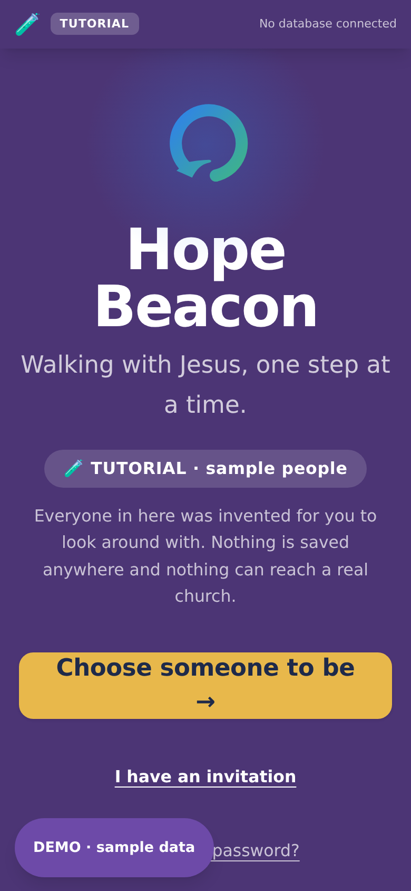

### Install it, so it opens like an app

Installing means the app gets its own icon, opens without the browser's address
bar, and remembers you. It is the same app either way, only tidier.

**On an iPhone or iPad (Safari)**

1. Open the link in **Safari**. It has to be Safari; Chrome on an iPhone cannot
   install a web app.
2. Tap the **Share** button at the bottom of the screen (the square with an
   arrow coming out of the top).
3. Scroll down the list and tap **Add to Home Screen**.
4. Tap **Add**. The icon appears with your other apps.

**On an Android phone (Chrome)**

1. Open the link in **Chrome**.
2. Tap the **three dots** at the top right.
3. Tap **Add to Home screen**, then **Install**.

**On a computer**

Chrome and Edge show a small install icon at the right-hand end of the address
bar. Safari on a Mac has **File → Add to Dock**.

> **If you are asked to sign in again after installing**, that is normal once.
> The installed copy starts its own session. It will remember you afterwards.

Everything to do with installing also lives inside the app, under Settings, so
nobody has to keep this page to hand:

### Bigger words

If the writing is too small, open **Settings**, stay in **General**, and choose a
larger **Text size**. The preview below the sizes shows it first; when it reads
well, press **Apply**, and every screen follows it, conversations included.

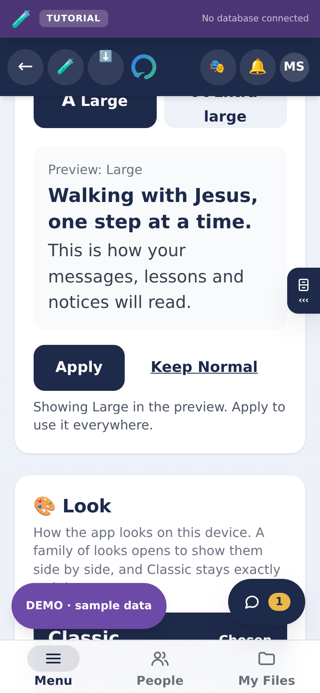

Just below it is **Look**, with **Classic** chosen. On a computer, and on a
large iPad turned sideways, Classic has your rooms down the left side and a
light bar across the top; on a phone or a smaller tablet, the bar along the
bottom. If new looks are added, you can pick one there.

### Signing in

You need an invitation from your church. When you have one, you pick who you
are and the app takes you to your own part of it.

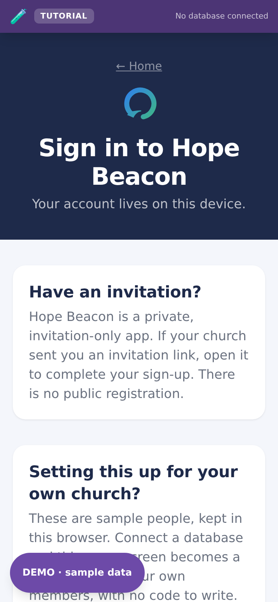

### Finding your way

Along the bottom of every screen are three words. **Menu** lists every place you
can go, written out. **People** opens the people you walk with. **My Files**
opens your own files.

Some screens hold several **folders**. The button at the top names the one you
are in and how many there are; tap it to see them all, then tap one to go there.

---

## Part 2 — If you are an Explorer

An Explorer is somebody the church is walking with. You have one Guide, and the
app is built around that one relationship.

Your screen has four folders: **My Guide**, **Study**, **Church** and
**Prayer**. Tap the button at the top to go straight to one. You never have to
scroll a long page looking for something.

### My Guide

Your Guide, and anything waiting from them. Your conversation with them is the
round **Talk** button in the corner of every screen, with a number on it when
they have written. It is private between the two of you. Church leaders cannot
read it.

### Talking with your Guide

Type in the box at the bottom and press the arrow. The paper clip sends a photo
or a file.

**Tap a message** to react to it or reply to it. Holding it does the same.

- **React** with one tap. The praying hands come first, because that is the one
  people reach for most. Tap the same one again to take it back.
- **Reply** to answer one message in particular. Your answer carries a quote of
  it. Swiping a message to the right does the same.

**Say it instead of typing it.** When the box is empty, the button beside it is
a microphone. Tap it once and speak; the phone asks for the microphone the first
time. Tap the arrow to send, or the bin to throw it away. It stops at two
minutes and never sends on its own.

> **If you do not see Reply, the reactions or the microphone**, your church has
> not switched them on yet. Everything else in the conversation works the same.

### Study

The lessons your Guide has sent you, in the order they sent them. There is no
schedule and nothing you are behind on. Open one, read it, and mark it done when
you have finished.

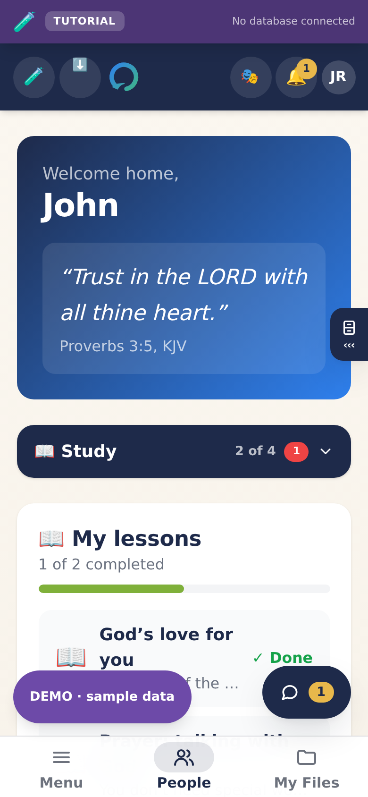

### Church

What the whole church is saying: notices, and anything the Guides have written
for everybody. You can read it without owing anyone a reply.

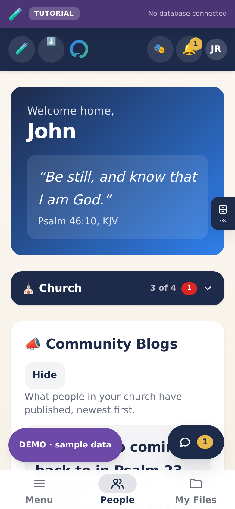

### Prayer

Ask for prayer. By default your request goes to your Guide alone. If you tick
the box, the whole church can pray for it, and **your name is never shown when
they do**.

Your Guide can ask you to pray for them too. It shows at the top of Prayer.
Press **I am praying for this** and they are told. If something in it worries
you, **Report** is on the same card.

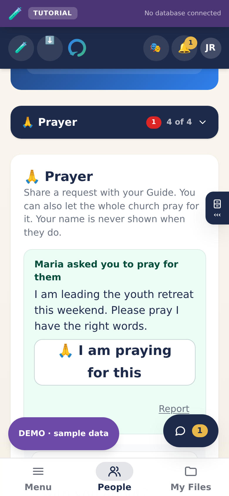

### Your shelf

Eight things to read and watch, in the order we would hand them to you. A Bible
you can read on a phone, then Jesus, then a way into studying for yourself, and
then what this church teaches.

Nothing is hidden. Everything your Guide can see, you can find too. This is
simply where we would start.

Tap the heart on anything to keep it on your own device, so it opens with no
signal.

---

## Part 3 — If you are a Guide

A Guide walks with up to the number of Explorers the church has set. It is a limit the app enforces, not a
suggestion: somebody carrying forty names is not walking with anybody.

### Your desk

Everyone you walk with, and what needs you today.

### Talking with somebody

Open a person and press **Message**, or use the round **Talk** button in the
corner. It is private between the two of you. You can attach a photograph or a
file, and photographs are made smaller and have their location removed before
they are sent. Replying, reacting and voice messages work as they do for an
Explorer (Part 2).

Prayer runs both ways. On a person's **Care** tab you can read what they asked
and tell them you are praying, and ask them to pray for you. Only they see what
you ask, and you see when they are praying for it.

### Moving somebody along

The Journey tab is where you record where somebody has reached, and send them
the next lesson.

### The Office

Everything that is your work rather than your conversation: lesson studies,
the Sabbath program, evangelistic meetings, resources, the Guides' room,
putting a name forward, and your progress report.
Each is a subroom, so you tap once and you are there.

### Your progress report

**Reports**, in the Office, shows how the Explorers you walk with are doing,
for this month, last month, this quarter or last quarter. Choose one under
**Period**.

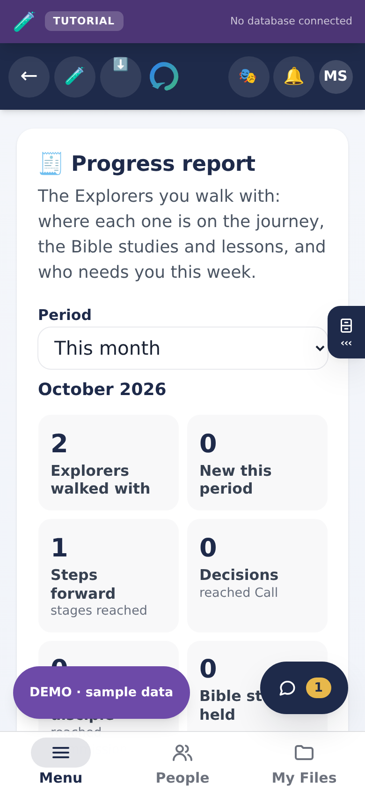

- The numbers at the top: how many you walk with, who is new, the steps
  forward, decisions, Bible studies held, lessons finished and follow-ups
  done.
- **Each Explorer**: where they are on the journey and what this month held.
  Anybody who needs you comes first, with the reason in words, such as
  "1 follow-up overdue" or "No Bible study for 35 days".
- **Your notes for this report**: what the numbers miss, such as an answered
  prayer. They stay on your phone and go into the Word file.
- **Download Word file** or **Copy as text** to hand it in.

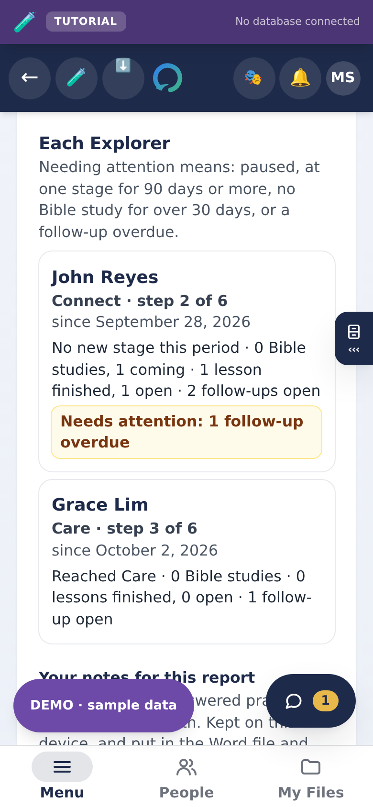

### The Sabbath program

The **Sabbath program** folder in the Office plans a Sabbath's order of
service. Press **New program**. It starts with Sabbath School, the Divine
Service, the afternoon program and sunset vespers, ready for names. Type who
leads each part, and the hymn or passage if you like. Tap a part of the day to
open it. Under the date it says how many lines still need somebody.

- **Download Word file** gives you a file that opens in Word, in Pages, and in
  Google Docs (upload it to Google Drive, or open it in the Google Docs app).
- **Download picture** gives you a picture of the program for a group chat.
  On a phone, **Share the picture** sends it straight to Messenger, Viber or
  email.
- **Copy as text** is for pasting into a group chat.
- **Post it**, under **Share in the app**, puts it in the app for the people
  you walk with, or for everyone in the church. They find it on **This
  Sabbath**, in the Menu.
- **Reuse next week** starts next week's program from this one, names and all.
- **Arrange lines**, under a part, is for moving a line or taking it out.
- **Folder** keeps programs in order: type a name such as "Quarter 4", and
  the list groups them.
- **Add to calendar** puts each part of the day that has a time on your phone's
  calendar.

**To design it in Canva**, a free account is enough. In Canva, choose
**Upload** and add the picture or the Word file. The app does not connect to
Canva.

**Advanced settings**, a tick box above your programs, adds more:

- **Minutes** for each line, so each line shows when it starts. If one part
  runs into the next, the program tells you.
- **A note** on any line, for the people on the platform. Choose **For the
  platform, with times and notes** before you download to get a copy with
  them. The copy for the congregation, the picture and the post never have
  the notes.
- **Your own details**, for anything the boxes do not cover, such as
  "Deacons on duty". Press **Add a detail**, give it a name, and write what it
  says. It prints under the theme.
- **Save as a template**, to start next time from your own layout.
- **Reminders**: everyone named, each with a message ready to copy and send.

Your programs are saved on your phone or computer as you type, and work with
no signal. In your church's app they also follow you to any phone or computer
where you sign in. Nobody else sees them until you post them or download them.
Directors have the same folder.

### Evangelistic meetings

The **Evangelistic meetings** folder in the Office plans a series of meetings
your own way. Press **New meetings**, choose the first night and how many
nights, then **Start with a plan** or **Start blank**. The plan gives each
night from 5:30 to 9:00 PM: children's time (songs, a Bible story, craft
making), health time, Bible study, and snacks, plus a team and a to-do list.
Change any of it.

- Tap a night to open it. Give it a date, when it starts and ends, and a
  topic.
- **Add a block** puts a program, a team, a schedule, a list, a paragraph or a
  checklist on a night or on the whole series. **Arrange blocks** moves them.
- A list's **Columns** lets you name its columns yourself, up to six.
- **Copy to a new night** makes the next night from this one.
- **Its look** chooses a colour, a heading style, and where the name sits, for
  the Word file and the picture.
- Tick **Team only** on anything that is not for the public. It stays out of
  the picture and anything you post.

- **Folder** keeps many series in order, such as "Youth Week".

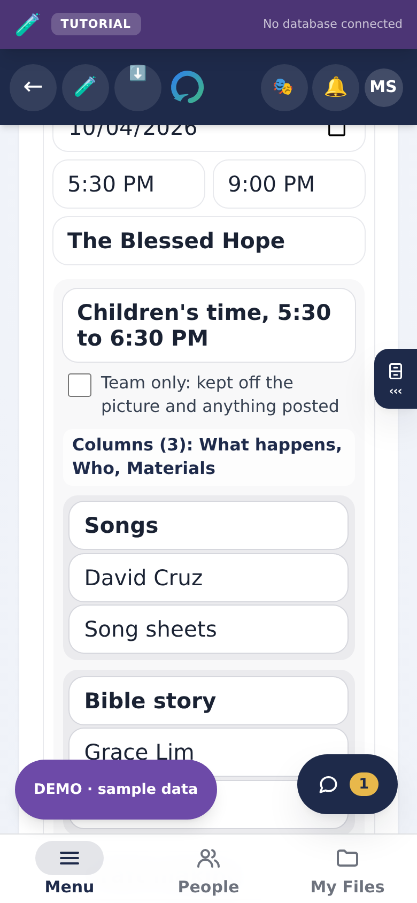

Under **Take it away**, choose the whole series or one night, then download a
Word file or a picture, or **Post it** for the people you walk with or the
whole church.

### On your calendar, and on your other devices

**Add to calendar** downloads a calendar file. Open it and your phone or
computer adds every night (or each part of a Sabbath program that has a time).
On an iPhone it is one tap. On a computer, Google Calendar takes it under
**Settings**, **Import**. If you change a night, download it again.

**Google Calendar** appears when you choose one night: it opens Google
Calendar with that night filled in, ready to save.

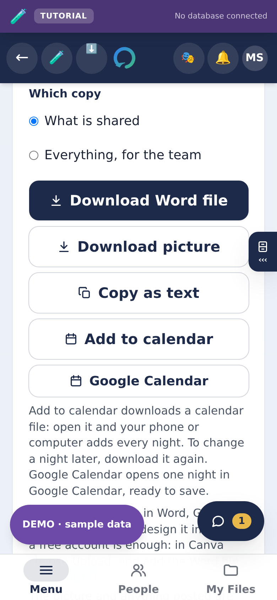

**On another phone or computer**, sign in with the same account and open the
Office: in your church's app, your programs and meetings are there. Under
**Saved** it says whether they have reached your account yet. With no signal,
they wait on the phone and go up by themselves when the signal comes back.

### This Sabbath

**This Sabbath**, in the Menu, shows the Sabbath program your Guide or your
church has posted, with who shared it, and any evangelistic meetings they have
posted. Once you have opened it with a signal,
it opens again with none, so you can read it in a church hall without signal.

### Your desk drawer

On a phone, your desk is a drawer. Tap the small cabinet on the right edge, or
swipe in from that edge: the date, what is waiting, a note to yourself, and a
pocket of links. Tap **›››** to put it away.

---

### Writing for the church

Open **Home**, then the folder button at the top, and choose **Blog**. The
writing box is already open: give it a title, write, and press **Publish**.
Everybody in the church reads it, with your name on it. Tick **Advanced
settings** to send it only to the people you walk with, or to people you choose,
or to **Save as draft**.

To pin a notice at the top of everybody's Home, choose **Announcements**
instead: a title, the words, **Pin it**. **Advanced settings** adds when it
happens, such as "This Sabbath, 9:00 AM". Take a notice down from **Notices**,
beside the notice itself.

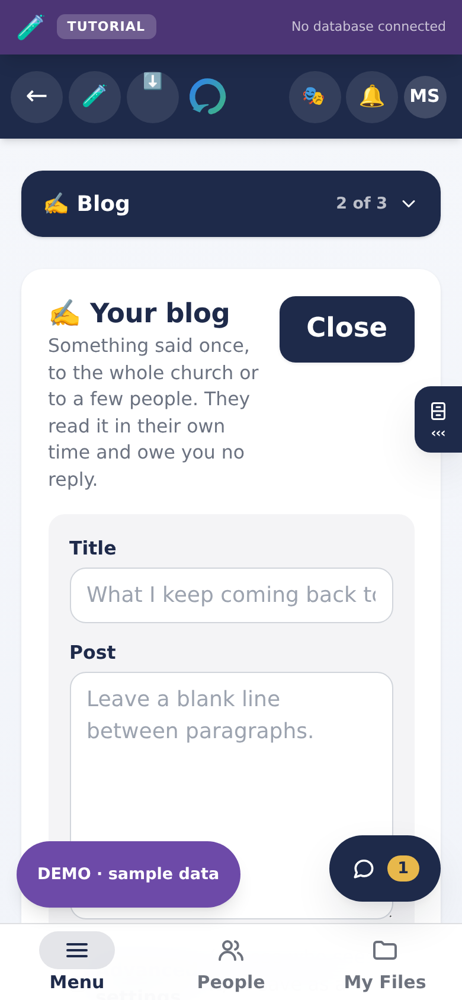

## Part 4 — If you are a Director

Directors run the church's account: who gets in, and who walks with whom.

### Who is waiting

The single most important screen in the app. **An Explorer with no Guide has no
app**, so anything above zero here is somebody being ignored.

### The church home

Notices, your **Blog**, **Announcements**, the prayer wall, and the numbers.

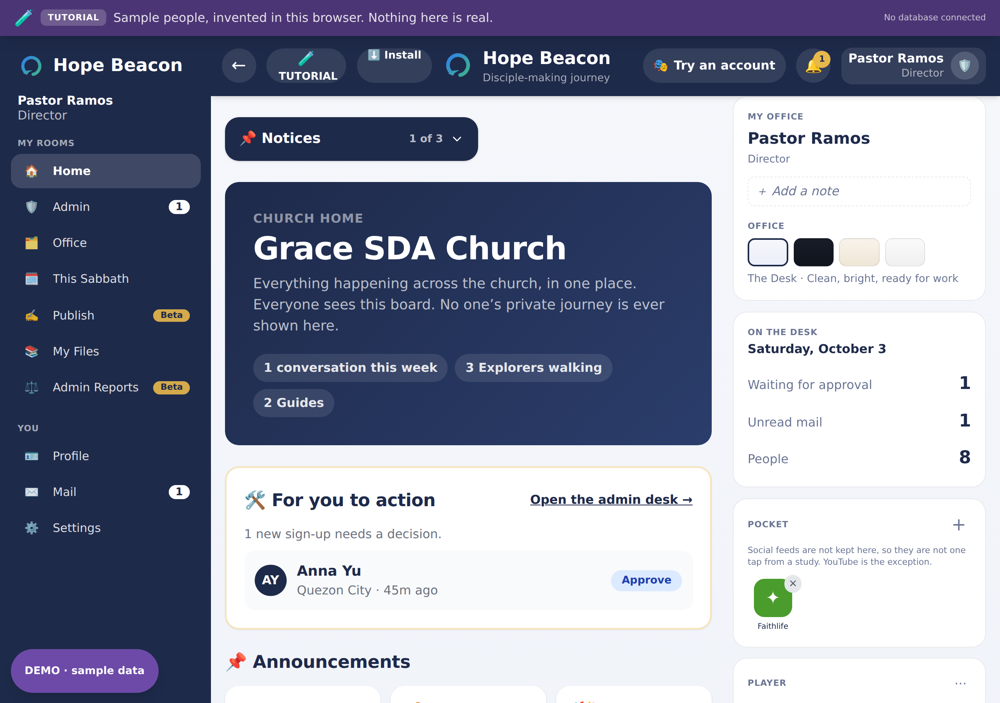

**Four questions, once a week, five minutes:**

1. Is anybody unpaired?
2. Is any Guide at their limit of five while Explorers wait?
3. Is any guild flagged "Needs a look"?
4. Is there anything in the trial room?

Without that rhythm the numbers are decoration.

### The progress report

**Reports**, in the Office, shows every Explorer in the church by stage and by
Guide, for a month or a quarter, with who needs somebody to look. Bible
studies, lessons and follow-ups stay between each Guide and Explorer, so they
are in each Guide's own report, not yours. Ask a Guide for theirs.

---

## Part 5 — The guided walk

If you would rather be shown than told, the app will walk you through your own
part of it. Pick who you are on the front door and follow the highlight. It
points at the next thing to tap, and explains what it is before you tap it.

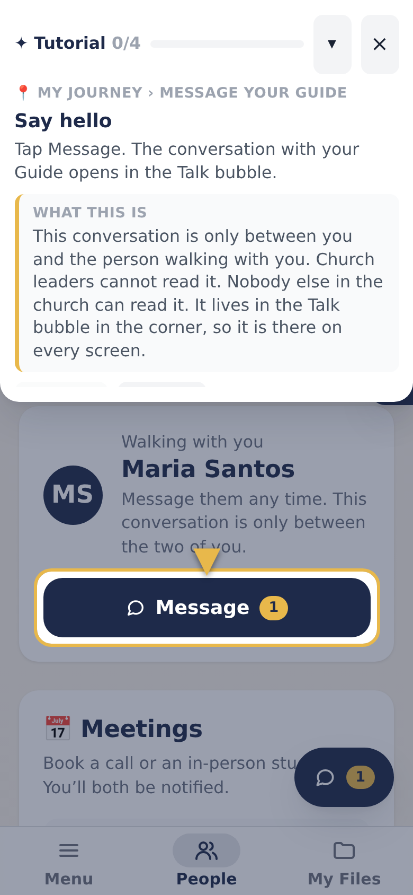

It takes two or three minutes, uses safe sample data, and nothing you press
reaches a real person.

---

## If something looks wrong

- **A blank screen, or something out of place after an update.** Close the app
  fully and open it again. It checks for a new version each time it starts.
- **You cannot find a button somebody told you about.** Check which folder you
  are in. Tap the button at the top of the screen; what you want may be in
  another folder.
- **The app says your invitation is not valid.** Invitations expire. Ask your
  church for a new one.
- **You changed your profile picture and the old one is still showing.** Close
  and reopen the app once.

Anything else, use **Send feedback** at the bottom of the front door. It takes a
sentence.
