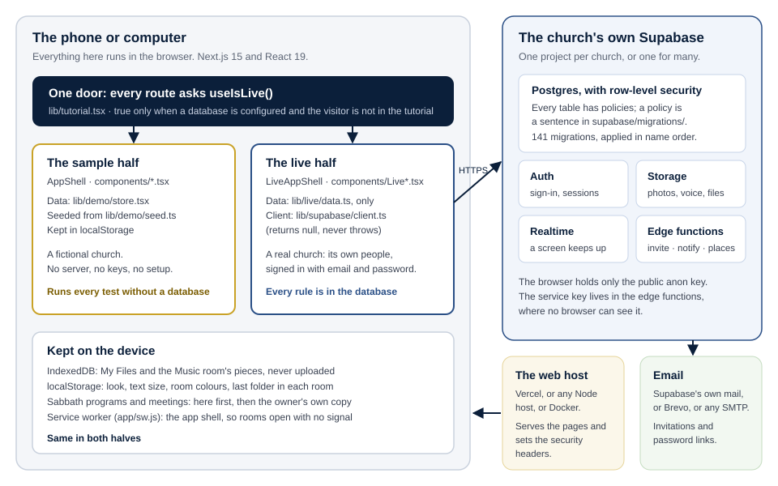

# The builder's overview

Hope Beacon is one Next.js application that is really **two applications
behind one door**. Clone it with nothing set up and it runs a sample church
entirely in the browser: no database, no keys, no server of its own. Give it
two settings that point at a Supabase project, and the same addresses draw a
second set of screens that talk to that church's own database instead.

That shape is the most important fact in the codebase. Everything else follows
from it.

## Why two halves

- **A church can try the whole app before deciding anything.** The sample
  church is not a demo video; it is the real app, every room and every role,
  with invented people.
- **Every test runs without a database.** The gate builds the app and walks it
  in a browser on any laptop or CI runner, with nothing to stand up.
- **The live half is only a different place for the same data.** The sample
  half's whole data layer is one React context (`lib/demo/store.tsx`); the live
  half's is one file (`lib/live/data.ts`). No screen fetches anything itself.

The cost is discipline: **a change to one half is usually a bug in the other.**
Somebody learns the app on the sample side and then signs in to the real one; a
room that exists in one and not the other teaches them a layout that does not
exist. The checks hold the two halves together where they can.

## The stack, and why each piece

| Piece | What it is | Why this one |
| --- | --- | --- |
| **Next.js 15, React 19, TypeScript** | The application | One codebase for every device; installs as an app from the browser; server rendering for a fast first screen |
| **Tailwind CSS** | Styling | Small output, and one vocabulary of sizes and colours across both halves |
| **Supabase** | Postgres, sign-in, file storage, realtime and edge functions | One project holds everything a church needs; row-level security puts every permission in the database, where a request that skips the screens still meets it |
| **Vercel**, or any Node host, or Docker | Serving the pages | Builds from `main` on every push; *Run it anywhere* covers the alternatives |
| **Supabase mail, Brevo, or any SMTP** | Invitations and password links | Nothing to set up by default; a provider when a church sends more |
| **Playwright** | Browser walks | Walks every room on Chromium in the gate, and on WebKit for Safari |

Runtime dependencies are few and pinned exactly. Each one has a licence that has
been read, and the gate fails if a new one arrives under a licence nobody has.
The full list, generated from `package.json`, is in the reference at the back.

## The five rules that shape every change

These are the rules a reviewer looks for first. Each has a chapter, and most
have a check that fails the build.

1. **The repository is public.** No real member, no secret, no working attack,
   in any file or commit.
2. **Authorisation lives in the database.** A hidden button is a convenience;
   the row-level security policy is the boundary. A screen never decides who
   may read what.
3. **Both halves, always.** A room, a folder or a flow added to one is added to
   the other, from the one list of rooms (`railGroupsFor` in
   `components/RoomRails.tsx`).
4. **It is used on a phone, and mostly not a new one.** Every screen fits a
   390-pixel phone at the largest text size, works with no signal once seen,
   and stays light enough for an old Android.
5. **The owner sees it before it ships.** Nothing reaches `main`, which is what
   the host builds for production, without the owner seeing what would change,
   what passed and what was not verified.

## What happens when somebody opens the app

1. The host serves the page with its security headers: a content security
   policy that allows scripts only from the site itself, no `eval`, the camera
   off and the microphone for this site only.
2. A small script at the very top of the page applies the device's chosen look
   before anything is drawn, so a dark look never flashes white.
3. The service worker (`app/sw.js`) keeps the app's shell, so the rooms open
   again with no signal, and checks quietly for a newer build.
4. Every route asks `useIsLive()` (`lib/tutorial.tsx`): is a database configured,
   and is this visitor outside the tutorial? The answer picks `LiveAppShell` or
   `AppShell`.
5. On the live half, the shell restores the session, reads the person's profile
   and role, and refuses a room the role is not allowed (`allow={[...]}`) by
   sending them to their own home.
6. The room's screens call `lib/live/data.ts`, which calls Supabase, where
   row-level security decides row by row what this person may read or write.

## The words used in the code

The app's words for people changed over time; the code kept some of the old
ones, because renaming a database role is a migration and a risk with no
benefit to anybody using the app.

| On the screen | In the code and the database |
| --- | --- |
| Explorer | `ds` (and *seeker* in older comments) |
| Guide | `dm` (and *missionary* in older comments) |
| Director | `admin` |
| Executive Director | `executive` |
| Room | a route under `app/`, listed in `railGroupsFor` |
| Folder | a *subroom*: an entry in the `rooms` list given to `useRoom()` |
| Sample church, tutorial | the *demo* half: `lib/demo/`, `AppShell` |
| A church's own app | the *live* half: `lib/live/`, `LiveAppShell` |

## Where to go from here

- To **run it** today: *Set up your own Hope Beacon*, then *The simple path*.
- To **understand it**: *Architecture*, then *A tour of the code*.
- To **change it**: *Proving it works*, then *Recipes*.
- To **review a change**: *The database and its rules*, *Security* and
  *Lessons already learned*.
