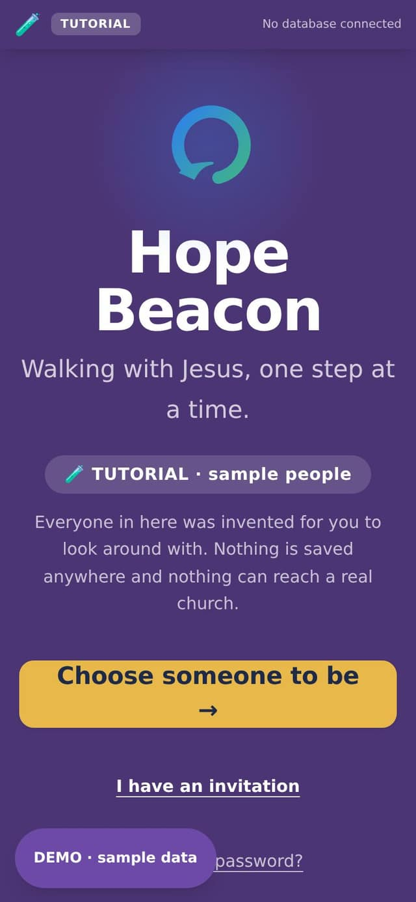
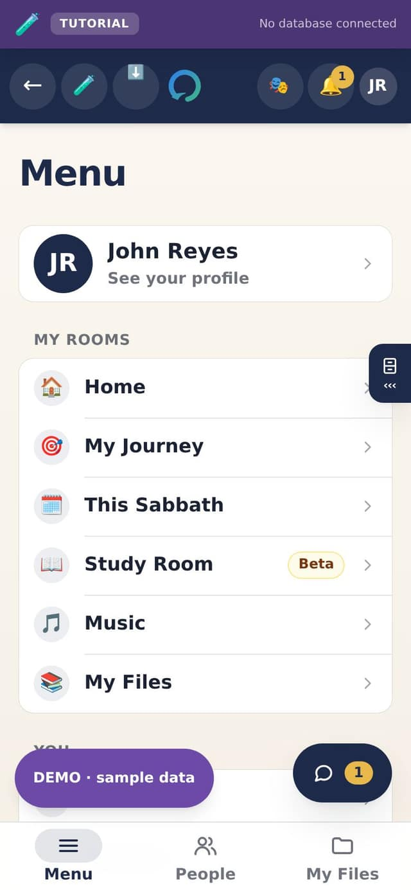
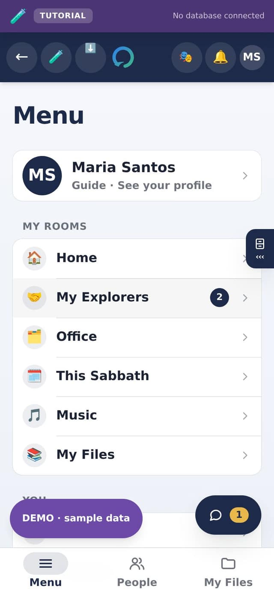
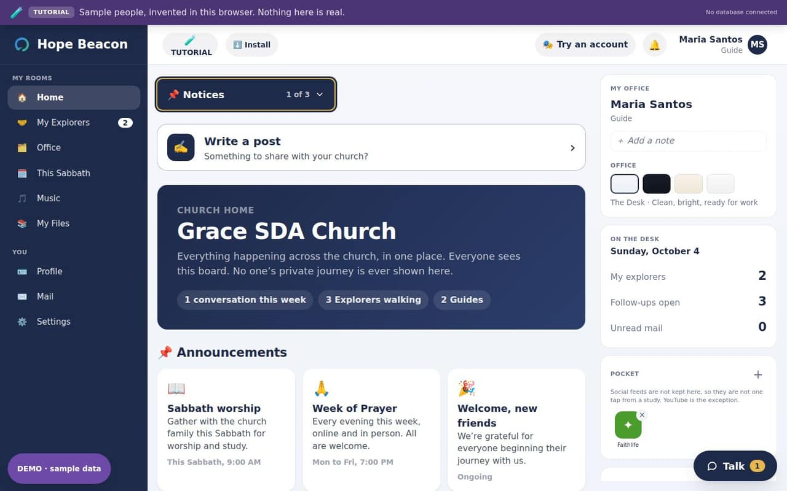

# Hope Beacon in one look

Hope Beacon is a private app for a church to walk with people one at a time.
Somebody who is exploring faith is paired with one person from the church, a
**Guide**, and the app is built around that one relationship: a private
conversation, the lessons the Guide sends, prayer in both directions, and
nothing that turns a person into a number on somebody else's screen.

Around that relationship sits what a church needs to run it: inviting people,
pairing them, the Sabbath program, evangelistic meetings, a church home with
notices and a blog, a music room for the choir, and the numbers a leader needs
without any of the private detail.

 

## What it is, and what it is not

| It is | It is not |
| --- | --- |
| **Invitation only.** Nobody can sign up on their own; the church invites them. | A public social network. There is no profile anybody outside can find. |
| **One Guide per Explorer.** A conversation belongs to the two people in it. | A group chat. Leaders cannot read conversations, except the part somebody reports. |
| **A website that installs like an app**, on any phone or computer, with no app store. | Something to buy or download from a store. |
| **Your church's own copy**, with its own database and its own people. | A service run by somebody else who holds your members' details. |
| **Open source.** Anybody may read how it works, and a church may change it. | Finished. The last chapters say plainly what is still being built. |

## The four roles, at a glance

Everybody in the app has one role. It is chosen by the church when they are let
in, and **nobody can change their own role**: that rule is kept by the database
itself, not just by the screens.

| Role | Who they are | What they mainly do |
| --- | --- | --- |
| **Explorer** | Somebody the church is walking with | Talks with their Guide, reads what they send, asks for prayer |
| **Guide** | A church member walking with a few Explorers | Talks, sends lessons, records each step, plans the Sabbath |
| **Director** | Runs the church's account | Invites, approves, pairs Explorers with Guides, reads safeguarding reports |
| **Executive Director** | Oversees one or more churches | Everything a Director does, across every church they oversee |

The chapter *The four roles* says exactly what each can and cannot see.

## The rooms each role has

The **Menu** lists every room a person has. These are the rooms in a church's
own app; the sample church also has a **Mail** room for everybody, to show what
the app would send.

| Room | Explorer | Guide | Director | Executive Director |
| --- | :---: | :---: | :---: | :---: |
| **Home**: notices, blog, prayer wall | ✓ | ✓ | ✓ | ✓ |
| **My Journey**: my Guide, study, church, prayer | ✓ | | | |
| **My Explorers**: the people I walk with | | ✓ | | |
| **Admin**: approvals, pairing, safeguarding | | | ✓ | ✓ |
| **Office**: numbers, lessons, Sabbath program, meetings, reports | | ✓ | ✓ | ✓ |
| **This Sabbath**: the program the church has shared | ✓ | ✓ | ✓ | ✓ |
| **Study Room**: my own notes while I read | ✓ | | | |
| **Music**: player, tuner, conductor, pieces | ✓ | ✓ | ✓ | ✓ |
| **My Files**: my own files on this device | ✓ | ✓ | ✓ | ✓ |
| **Admin Reports**: reports and the record | | | ✓ | ✓ |
| **Profile** and **Settings** | ✓ | ✓ | ✓ | ✓ |
| **Mail**: invitations still open | | | ✓ | ✓ |

A Guide or an Explorer who is part of a report reaches it through
**Settings**, so it is never out of reach for the person it concerns.

## Three words along the bottom

On a phone and a tablet, three words sit along the bottom of every screen:

- **Menu**: every room you have, written out.
- **People**: the people you walk with. For an Explorer, that is their Guide.
- **My Files**: your own files, on this device.

On a computer the rooms run down the left-hand side instead, and the same three
words are not needed. The round **Talk** button in the corner is your
conversation, on every screen and every device, with a number on it when
somebody has written.

 

## Rooms and folders

Most rooms hold a few **folders**. The button at the top of the room names the
folder you are in and how many there are, such as *My Guide, 1 of 4*. Tap it,
and the list of folders opens; tap one to go there. The app remembers the last
folder you used in each room, so it opens where you left it.

Nothing in the app is a long page to scroll looking for something. If you
cannot find a button, it is almost always in another folder of the same room.

## Where your information lives

- **Conversations, lessons, prayer, the church's notices and accounts** are kept
  in your church's own database, behind rules that decide who may read each
  row. The chapter *Your information, and how it is protected* says what is kept and for how long.
- **My Files, the Music room and your settings** are kept on the device you are
  holding. They are never uploaded, and they are there with no signal.
- **The Study Room** keeps an Explorer's pages in the church's database, under
  rules that let only that Explorer read them: not their Guide, not a Director,
  not the person who set up the app.
- **The Sabbath program and evangelistic meetings** are kept on the device as
  you type, so they work with no signal, and in a church's own app they also
  follow you to every device where you sign in.

## Working with no signal

Hope Beacon keeps working in a church hall with no signal. The rooms you have
opened before open again, This Sabbath shows the last program you saw, your
music plays, and anything you write waits on the phone and goes up by itself
when the signal returns. The app updates itself the same way: quietly, the next
time it starts, with nothing to press.

## Where to go next

- **New to the app?** *Getting it on your phone*, in Part II.
- **An Explorer?** *If you are an Explorer*, in Part III.
- **A Guide?** *If you are a Guide*, in Part III.
- **A Director?** *The four roles* and *Onboarding a church*, then *If you are
  a Director* and all of Part IV.
- **Looking for one screen?** Part V shows every one of them.
