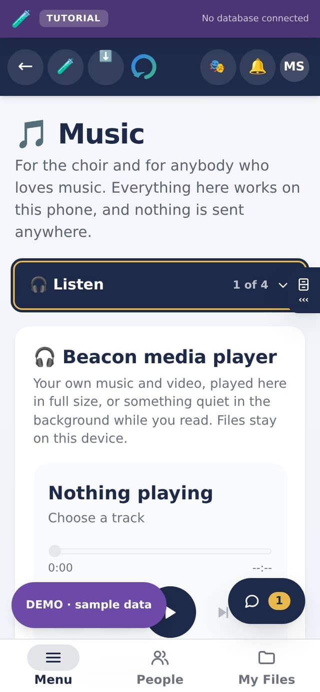
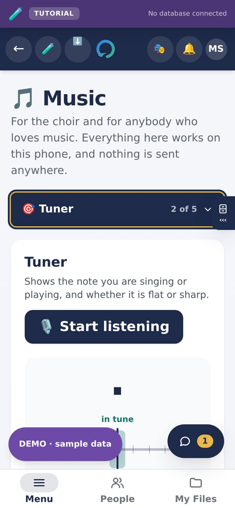
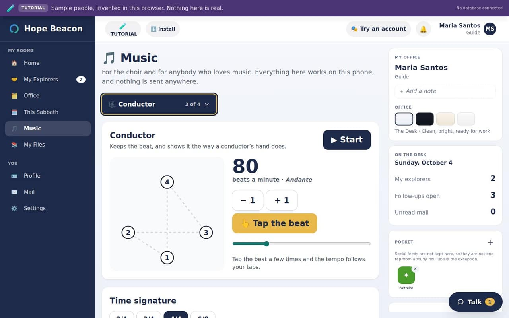

# The Music room, in full

**Music** is a room for everybody: the choir, its director, the person who
leads the singing on Sabbath, and anybody who simply loves music. It is in
every Menu, between *This Sabbath* and *My Files*.

Two promises hold for the whole room:

- **Nothing is sent anywhere.** Everything in it is worked out on the phone or
  computer you are holding. It never talks to the church's database, so it
  works the same in a church's own app and in the sample church.
- **It works with no signal.** Once the room has been opened, all five of its
  folders open again in a church hall with no connection.

Every folder opens simple. At the end of the Tuner, the Conductor, a score and
Play there is a tick box, **Advanced settings**, that opens the rest. It is off
until you tick it, the phone remembers it, and unticking it puts that folder
back exactly as it was.

 

## Listen: your music, your playlists, calming sounds

**Listen** is the full player. It has three tabs.

- **Vault**: your own music and video, saved on this device. Tap **Save music
  or video** to add files from your phone or computer. A search box sits over
  the list, because a good vault soon becomes a long one.
- **Playlists**: your own lists. Name one, then add whatever is playing to it.
  A playlist can mix calming sounds with your own recordings, so rainfall behind
  a sermon is one list.
- **Ambience**: calming sounds made on the device as they play. There is no
  file to download, so they cost no data and work with no signal. *Calm*
  (rainfall, distant surf, night wind) is for sitting with while you read;
  *White noise* (soft hush, plain hush) is brighter and covers voices around
  you.

The controls are the ones every player has: a progress bar you can drag, the
time so far and the time left, previous and next, back ten seconds and forward
ten seconds (which is what you want in a talk), mute and volume. Videos play
with their picture, and keep playing when you walk to another room.

> **GOOD TO KNOW** · Your music stays yours
>
> What somebody listens to is nobody else's business. The vault and the
> playlists live on the device and are never uploaded. Music you add here is
> also listed in **My Files**, where each file has its own Play button.

## Tuner: which note, and is it in tune

1. Open **Tuner** and tap **Start listening**.
2. The first time, your phone asks whether the app may use the microphone. Say
   yes; it is asked only once.
3. Sing or play a steady note. The tuner names it (such as *A* or *C♯*) and its
   octave, and a needle leans **left when you are flat** and **right when you
   are sharp**. It says so in words as well, so nobody has to read a dial.
4. Tap **Stop listening** when you are done.

**Starting note** plays a note for two seconds, like a pitch pipe, so a choir
can find its first note. It shows the frequency it will play.

### Concert pitch: where the choir's A sits

Concert pitch is the A that every other note is tuned from. 440 Hz is the
standard most choirs, pianos and recordings use. An older organ, a baroque
group or an orchestra may use another, and then everything else should follow
it: the tuner should call a note in tune when it matches that instrument, and
the starting note should sound like it.

1. Tap one of the common pitches: **415 Hz** (Baroque), **432 Hz**, **440 Hz**
   (Standard) or **442 Hz** (Orchestra). Or move it one hertz at a time with
   **− 1** and **+ 1**. Every change plays the new A, so you hear it.
2. Read the line under it. It says what the change does to every note, such as
   *2 Hz above the standard 440: every note sounds about 8 cents higher*. A
   hundred cents is one semitone, one key on a piano.
3. Tap **Compare with 440** to hear the standard A and then yours, one after
   the other.

**To match an instrument**, ask the organist or pianist to hold an A, tap
**Listen for the A**, and hold the phone near it. Once the A has been steady for
a moment, the app says what it heard, such as *The A you played is 441.6 Hz*,
and offers **Use 442 Hz**. Nothing changes until you tap it, and nothing is
recorded.

The phone remembers your concert pitch until you change it.

### Advanced: your voice as a line, a drone, and your instrument's notes

Tick **Advanced settings** under the starting note and three more cards open.

- **Your voice, the last 10 seconds.** While the tuner listens, your voice is
  drawn as a line across the notes. A flat line is a steady note; a wave is a
  wobble; a slope is a slide into the note. It is the quickest way to see what
  your voice does on a long note. Only the last ten seconds are drawn, and they
  are forgotten when you leave the Tuner.
- **Drone.** One note held for as long as you like, to sing against. Choose
  the note and the sound (soft voice, organ or flute) and tap **Start the
  drone**. When your voice drifts you hear it rub against the drone. With the
  tuner listening at the same time, wear headphones, or the tuner hears the
  drone instead of you.
- **Your instrument.** A clarinet or trumpet, an alto saxophone or a French
  horn reads its music higher than it sounds. Choose yours and the tuner shows
  the note you would read, with the note it sounds underneath: a concert A on
  a B♭ clarinet reads *B*.

> **IMPORTANT** · What the microphone does, and does not do
>
> The tuner listens only after you tap **Start listening**. It measures the
> sound on the phone and throws it away: **nothing is recorded, kept or sent**.
> It lets go of the microphone when you tap **Stop listening**, when you leave
> the Tuner, and when the phone locks or another app comes to the front, so the
> phone's own recording light goes off.

## Conductor: a steady beat, and the conductor's hand

1. Open **Conductor** and choose the beats in a bar: **2**, **3**, **4** or
   **6**. The drawing shows the pattern a conductor's hand makes, numbered
   where each beat falls.
2. Set the tempo, from 30 to 240 beats a minute. Its Italian name (*Largo*,
   *Andante*, *Allegro*) is shown beside it.
3. Tap **Start**. The clicks sound and the hand falls into each beat.

To set the tempo by feel, tap **Tap the beat** four or five times in time with
the music in your head; the tempo follows your taps. To follow the hand in
silence, during a rehearsal say, untick **Sound the clicks**. The screen stays
on while the conductor runs.

### Advanced: clicks between beats, quiet beats, a count-in, a speed trainer

Tick **Advanced settings** under **Sound the clicks**.

- **Clicks between beats.** *2 to a beat*, *3 to a beat* (for triplets) or
  *4 to a beat* adds quieter clicks between the beats, for fast notes.
- **Each beat.** Tap a beat to make it **Loud**, **Normal** or **Silent**. A
  silent beat still moves the hand. Beat one starts loud and the rest normal.
- **Count in, then silent.** One bar of clicks to start the choir, then the
  hand keeps time without a sound.
- **Speed trainer.** For learning a hard passage: it starts at the tempo you
  set and gets a little faster as you go. Choose how much faster, how often
  (every so many bars), and the tempo to stop at. It never goes past that.
- **Saved tempos.** Give the tempo a name, such as *Hymn 100*, and tap
  **Save**. One tap on the name brings back its tempo and its beats in a bar.
  Kept on this phone.

## Pieces: the choir's music, on the phone

**Pieces** keeps the music your choir sings, in two kinds.

**A printed page, made clean.**

1. Tap **Scan a page** and choose a photo of the printed page.
2. Drag the four dots onto the four corners of the paper.
3. Tap **Make a clean page**. The page is straightened, cropped to the paper,
   and turned black on white, even with a shadow across it.

Only the clean page is kept, never the photo, so nothing the camera wrote into
the photo (such as where it was taken) is kept either.

**A score that plays.**

1. Tap **Open a score file** and choose a MusicXML file (`.musicxml`, `.xml` or
   a compressed `.mxl`). MuseScore, Sibelius, Finale and Dorico all save them.
2. Choose **Your part**. It plays louder than the others; any part can also be
   silenced.
3. Slow it down to learn it, and tap any note to start from there.

The score is drawn as notes on a strip, higher notes higher and longer notes
longer: what a singer learning a part needs. It is not printed notation.

**Advanced, for a score.** Tick **Advanced settings** under the parts.

- **Transpose**: move every part up or down, a semitone at a time (up to an
  octave each way), to suit your voices. The strip moves with it.
- **Loop a passage**: choose the first and last beat and it plays them over
  and over, to learn them.
- **I sing my part**: your part goes silent and is drawn faintly, so you sing
  it against the others. Choose **Your part** first.
- **Sound**: a soft voice, an organ or a flute.

Above the strip it says what it will play, such as *Looping beats 1 to 2, up 2
semitones*. Unticking Advanced plays the score as written again.

> **NOTE** · A scanned page does not play
>
> Turning a photo of printed music into notes that play needs either a server
> to send the photo to, or software the app's security rules do not allow on a
> phone. The project decided to leave it out for now: scanned pages are for
> reading, and scores play from MusicXML files.

## Play: a keyboard, chords and your own beat

**Play** is for making music, not only practising it.

**The keyboard.** An octave of piano keys. Press and hold a key and it sounds
for as long as you hold it; several fingers play several notes. **Lower** and
**Higher** move the keyboard an octave at a time. It plays at your concert
pitch.

Tick **Advanced settings** and three more cards open.

- **Sound**: a soft voice, an organ or a flute, for the keyboard and the
  chords.
- **Chords**: choose a key, and the six chords most songs in it are built from
  are a tap each (in C: C, Dm, Em, F, G and Am). Tap them in time to accompany
  a tune.
- **Beat maker**: three drums (bass drum, snare, hi-hat) in rows of sixteen
  squares, each square a quarter of a beat. Tap squares to turn them on, then
  **Play the beat**; it goes round and round, lighting each square as it
  plays, and the tempo can change while it plays. **Start from** a ready-made
  beat (*Steady four*, *Rock*, *Ballad*, *Praise*) or an empty grid, and save
  your own with a name. Kept on this phone.

Leaving Play, or locking the phone, stops every sound.

## For a choir director: a rehearsal with the room

1. Before the rehearsal, ask a section leader to export each piece from
   MuseScore as **MusicXML** and send it round. Each singer opens it in
   **Pieces** and chooses their own part.
2. At the start, use **Starting note** in the **Tuner** to give the first note,
   and **Tuner** itself for anybody unsure of their pitch.
3. Run the hard passages with the **Conductor**, slow at first; untick **Sound
   the clicks** once the choir has the tempo, and keep the hand on a screen
   everybody can see.
4. For the printed copies, **Scan a page** turns a photo of each into a clean
   page that is easy to read on a phone.

## What it keeps, and where

| What | Where it is kept | Who can see it |
| --- | --- | --- |
| Your music, video and playlists | On this device | Only you, on this device |
| Your clean pages and scores | On this device, in the Music room's own store | Only you, on this device |
| Concert pitch, the conductor's settings, saved tempos and beats, and which folders have Advanced open | On this device | Only you |
| Sound from the microphone | Nowhere: measured and thrown away | Nobody |

Because it is all on the device, a new phone starts with an empty Music room.
Keep your score files somewhere you can open them again.
